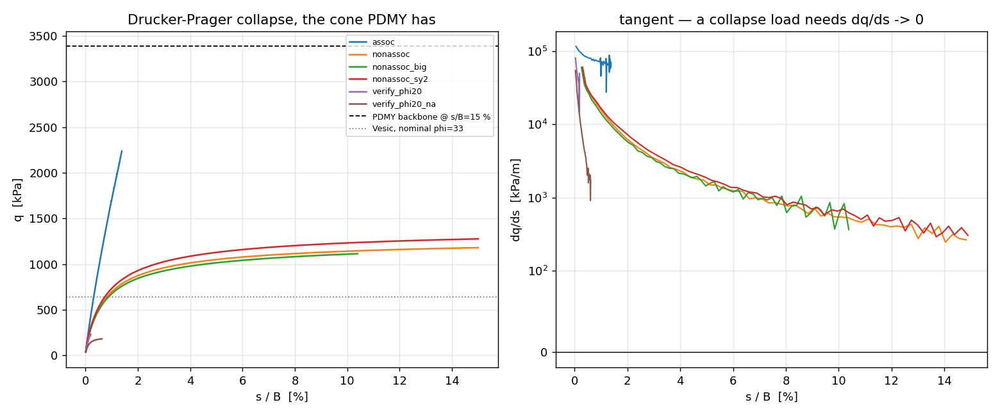

# The numerical collapse load of the benchmark footing, on the cone PDMY has

*ADR-79 follow-on, 2026-07-30. Companion to `RESULTS.md` (the geometry-ladder
campaign) and to `cone_probe.py` (which measured the failure surface).*

> **State of the runs.** Every number below is read off `dp_analyze.log` at the
> point that file was written. The legs that carry the verdict are complete
> through the settlement they are quoted at: `nonassoc` and `nonassoc_sy2` both
> ran to the full s/B = 0.15 target and plateaued there, `nq20_nonassoc` ran to
> its full s/B = 0.25 target, and the refinement series is complete. Still in
> flight when this was written, and quoted as the truncated lower bound it is:
> `assoc`, which has no collapse load to report in any case. Re-run
> `dp_analyze.py` to refresh the tables.

## Verdict

`cone_probe.py` closed the bearing campaign with a hypothesis: since PDMY's
failure surface is a Lode-independent Drucker–Prager cone (α = 0.2436)
calibrated in triaxial compression, and Vesić's `N_γ` is a Mohr–Coulomb
formula, the right anchor is Vesić at the cone's **plane-strain equivalent**
φ = 53.72° — 10.8 MPa of γ-term against the 207 kPa the project quotes, a
factor of **52**, which would put the benchmark at ~31 % of its own capacity
and dissolve the "9.3× over-strength" anomaly.

That estimate does not survive being measured.

1. **The anchor is wrong by ≈ 2.4×, not 52×.** The plane-strain matching
   assumes *associated* flow; this PDMY set is non-dilatant. Applying Davis's
   reduction for ψ = 0 after the matching gives φ* = 38.87° and a square-footing
   `q_u` of **1525 kPa** against the quoted 637.5 kPa.
2. **The measured collapse load agrees with that anchor, not with 26.7 MPa.**
   The 3D square footing on the actual cone, non-associated and unlocked, on a
   domain large enough that the mechanism is demonstrably CONTAINED, reaches
   **1108 kPa at the s/B = 10 % ultimate criterion and 1152 kPa at s/B = 15 %**,
   where it plateaus at 0.7 % of its initial tangent — 0.73–0.76 of the Davis
   anchor, and **1/23 of what the Chen–Han route predicted**.
3. **So the over-strength is NOT dissolved.** The benchmark's PDMY backbone
   delivered 3384 kPa at s/B = 15 %: **2.2× the correct anchor and 2.9× the
   measured collapse load of its own cone.** Re-anchoring removes a factor of
   2.4 from the 5.31× the campaign reported; it does not remove the anomaly.
   Locking, large-strain embedment and mesh coarseness still have to account
   for the remaining ~2.2× — boundary confinement is now measured and is only
   2.3–2.8 %.

## The anchor ladder

Vesić `q_u = q₀·N_q·s_q + ½·γ'·B·N_γ·s_γ` for the 2 × 2 m square footing,
q₀ = 10 kPa, γ' = 9.81 kN/m³:

| basis | φ | N_q | N_γ | q-term | γ-term | **q_u** |
|---|---|---|---|---|---|---|
| nominal φ = 33° — *what the project quotes* | 33.00 | 26.1 | 35.2 | 430.4 | 207.1 | **637.5** |
| cone, triaxial-compression equivalent | 31.51 | 21.9 | 28.1 | 353.1 | 165.2 | **518.3** |
| cone, plane-strain equivalent (Chen–Han) — *the 52× route* | 53.72 | 673.1 | 1836.6 | 15 900 | 10 811 | **26 711** |
| **cone, plane-strain THEN Davis ψ = 0** | **38.87** | **55.0** | **90.3** | **993.5** | **531.5** | **1525.0** |

Three independent things are wrong with the third row, each measured rather
than argued:

**(a) The matching is unstable at this cone.** It inverts as
tan φ = √(9α²/(1 − 12α²)), so it has a pole at α = 1/√12 = 0.28868 — above
which a cone has *no* plane-strain Mohr–Coulomb equivalent at all. The measured
cone sits at **84.4 %** of that pole, where the map is nearly vertical:

| α vs measured | φ_ps | N_q | N_γ | q_u |
|---|---|---|---|---|
| −6 % | 48.45° | 240.7 | 545.4 | 8 333 |
| −2 % | 51.87° | 458.5 | 1 171 | 17 320 |
| **measured** | **53.72°** | **673.1** | **1 837** | **26 711** |
| +2 % | 55.68° | 1 045 | 3 065 | 43 796 |
| +6 % | 60.02° | 3 231 | 11 205 | 154 277 |
| +10 % | 65.18° | 18 421 | 79 669 | 1 051 456 |

A ±2 % move in α — comfortably inside `cone_probe`'s own 3.9 % txc-vs-txe
spread — swings the answer by a factor of 2.5. The "52×" was never a number the
matching could carry.

**(b) It assumes associated flow.** Davis (1968) gives the closed-form
correction for exactly that assumption: tan φ* = cos ψ · sin φ / (1 − sin φ sin ψ),
which at ψ = 0 is tan φ* = sin φ. For φ_ps = 53.72° that is φ* = 38.87°, taking
N_q from 673 to 55 — a factor of **12.2** on its own.

**(c) Its coefficients are far outside their calibration range**, and this
model says so directly. Sweeping the numerical cohesion measures the collapse
load's sensitivity to c at **53.7 kPa per kPa of σ_y**. Vesić's `c·N_c·s_c` at
φ_ps = 53.72° (N_c = 493, s_c = 2.36) predicts **565** — **11× too large**.

## The instrument

PDMY cannot deliver a collapse load: 20 nested surfaces approach the envelope
asymptotically, and 11 h of pushing reached s/B = 0.15 still hardening. So the
material is replaced by an **elastic–perfectly-plastic Drucker–Prager sharing
the same failure surface**. By the limit theorems a collapse load is a property
of the failure surface and the flow rule, not of the hardening path to them.

Everything else is the campaign's model unchanged: same graded 2816-hex mesh,
same 2 × 2 m smooth footing driven on 25 nodes, same 10 kPa surcharge with the
same tributary areas and the same closed-form reaction correction. Drained, so
the u-p element is dropped for a 3-DOF `LadrunoBrick` carrying γ' = 9.81 kN/m³
as a body force — the campaign established the u-p model carries buoyancy in
the pore-pressure field with σ'_zz = γ'z + q₀, and global vertical equilibrium
here is exact (35 392.00 vs 35 392.00 kN; 742 320.00 vs 742 320.00 on the large
domain). `-formulation bbar` is primary: non-associated flow at ψ = 0 is
exactly isochoric, the locking-prone case.

Conversion: OpenSees `DruckerPrager` yields at ‖s‖ + ρ·I₁ − √(2/3)·σ_y, so
**ρ = √2·α = 0.344531** and the √J₂ cohesion intercept is σ_y/√3. σ_y is a
numerical apex regularizer, not a soil property, and is swept.

### The surrogate is the same cone — verified, not asserted

`dp_cone_check.py`, two independent probes:

| probe | measured α | vs target 0.24362 | Lode spread | plateau drift |
|---|---|---|---|---|
| strain-controlled (true plateau) | 0.24407 | **+0.18 %** | 0.40 % | 1e-16 |
| stress-controlled (`cone_probe`'s own) | 0.24361 | **−0.01 %** | 0.39 % | — |

The +0.18 % is not scatter: at p = 86.6 kPa the σ_y = 0.2 kPa apex offset
predicts +0.000444 in α and the measured offset is 0.00044.

The second row is a bonus result. **`cone_probe.py`'s stress-controlled
instrument is unbiased** — 0.00 % against a surface whose truth is known
analytically. `RESULTS.md` blamed the 1.5° gap between PDMY's measured
txc-equivalent (31.51°) and its supplied φ = 33° on "the price of locating a
perfectly plastic surface from just inside it". That excuse is now unavailable
to the probe; any residual belongs to PDMY's asymptotic approach to its own
envelope.

## Validation against an exact answer

A plane-strain strip footing on **weightless** soil under a surcharge is the
Prandtl–Reissner problem, `q_u = q₀·N_q`, for which the limit-analysis upper
and lower bounds coincide — no shape factor, no `N_γ`, no empirical fit. It is
a true oracle, and `dp_strip.py` runs it on a tensor-graded plane-strain mesh
(14.5 B clearance, 10 B depth, u_y = 0 on every node, generated in-script).

**At a mild cone (φ_txc = 20°, φ_ps = 27.47°, N_q = 13.9) the non-associated
leg holds 139.2 kPa against the exact 138.9 — a ratio of 1.0020 — with
dq/ds = 0, all the way out to the full s/B = 0.25 target.** The machinery
measures collapse loads correctly.

Two things that check is worth keeping:

- **Associated legs never plateau.** `nq20_assoc` walls out 10–12 % *above* its
  own exact answer while still hardening. Dilatancy at ψ = φ must push the
  surrounding soil aside and a bounded mesh resists that, so an associated leg
  keeps stiffening instead of collapsing. Non-associated — which is also the
  physical match to PDMY's `dil1 = dil2 = 0` — is the well-behaved rung. This
  is why the headline number is the non-associated one and the associated leg
  is reported as a non-result.
- **A verification cone must be checked against the initial state.** The first
  attempt used φ_txc = 20° at PDMY's own moduli, where the elastic K₀ = 0.507
  puts the 1-D state at **m = 0.950 of yield before the footing moves at all**.
  That leg measured nothing but its own initial condition and is reported void.
  Raising ν to 0.45 (K₀ = 0.818, m = 0.268) fixes it, and is legitimate because
  a collapse load does not depend on elastic constants. At the real cone
  m = 0.579 at PDMY's own ν, which is safe.

### This check is now a standing gate — `tests/test_r3_prandtl_collapse_gate.py`

The TIMs / APE campaign (ADR 63 R3, vault note 71) re-ran this exact leg on its
own driver and turned the single 1.0020 point into a **refinement sequence**:
`LadrunoBrick -formulation bbar` reads **1.0842 / 0.9938 / 0.9513** of the exact
138.91 kPa at h₀ = 1.0 / 0.5 / 0.25 (200 / 390 / 782 hexes), every one a genuine
plateau — textbook convergence *from above*. Two calibration findings came with
it, and both are encoded in the gate:

- **A flat accuracy tolerance is the wrong gate.** The coarse mesh is 8.4 %
  above exact and is *correct* there; a 5 % band would fail it for being right.
  The gate therefore carries a band **per resolution** and asserts the shape of
  the sequence — monotone decrease under refinement, plateau at every rung.
- **The subdivision budget was masking the answer.** At D16's default of 24 the
  h₀ = 0.25 leg read **0.8988 still hardening** (tail 5.75 % of initial), which
  reads as a sequence turning over — i.e. exactly the "loss of reach" this
  document diagnoses below for the *real* cone. Raising the budget to 80 and
  changing nothing else, the same mesh plateaus at **0.9513** (tail 0.02 %). The
  0.899 was the stepping controller, not the mesh. The gate pins the budget as a
  named constant: *a convergence study whose termination criterion binds before
  the mechanics do measures the criterion.*

A third finding was folded in when the gate was built, and it sharpens the
plateau test this document relies on throughout. **A curve can flatten because a
mechanism formed, or because the run seized** — a step floor reached just as the
curve rolls over presents as a flat tail too. So the gate classifies each leg on
three clauses and calls it a *capacity* only if all three hold: plateau, an
admissible termination mode (reached the target, or spent the pinned budget as a
**named** allowance — a step floor, a wall-clock stop or a truncated curve are
seizure), and **free advance** (the step over the final tenth stayed ≥ 100× the
floor). The clauses separate by three orders of magnitude here: the gate legs end
at tail 0.001–0.017 % with 800–2500× step headroom, the associated control at
tail 38.9 % with **1.6×** — it seizes rather than plateaus.

The **associated** leg is run as the falsification control (it must NOT be a
capacity, per the bullet above), and `ops.ladrunoBuild()` is stamped into the
output so a number can be re-attributed to an engine build. The surcharge step is
checked twice: this document's `Σ R_z = q₀·ΣA_trib` identity is kept, but it is
**structurally blind to load-distribution error**, so it is paired with the exact
1-D elastic stress patch (σ_zz = −q₀, σ_xx = σ_yy = −K₀q₀ at every Gauss point);
measured 2.7e-15 and 1.0e-14 respectively.

Measured on build `1db3394b8`: **1.0849 / 0.9977 / 0.9514** — +0.06 / +0.39 /
+0.01 % from the campaign's numbers — control 1.1139, not a capacity. 11 tests,
**61.1 min**. Zone A but slow-tier (opt-in):
`pytest --runslow -m slow tests/test_r3_prandtl_collapse_gate.py`.

## Results — square footing, the campaign mesh



| leg | flow | form | s_end/B | q_max | q(s/B=10 %) | dq/ds end | /initial | verdict |
|---|---|---|---|---|---|---|---|---|
| `nonassoc` | ψ = 0 | bbar | **0.1500** | 1179.1 | **1140.1** | 302 | 0.006 | collapse, full target |
| `nonassoc_sy2` (σ_y = 2.0) | ψ = 0 | bbar | **0.1500** | 1275.6 | 1230.7 | 351 | 0.006 | collapse, full target |
| `assoc` | ψ = φ | bbar | 0.0139 | 2236.2 | — | 68 716 | 0.592 | no limit point |
| `assoc` (pre-ladder run, kept) | ψ = φ | bbar | 0.0244 | 3425.4 | — | ~70 000 | ~0.5 | no limit point |
| `nonassoc_std` | ψ = 0 | std | 0.0031 | 437.6 | — | — | — | cannot be pushed |
| **`nonassoc_big`** (14.5 B, contained) | ψ = 0 | bbar | **0.1500** | **1152.0** | **1108.2** | 354 | 0.007 | **collapse, mechanism contained** |
| `verify_phi20`, `verify_phi20_na` | — | — | — | — | — | — | — | **void**, m₀ = 0.950 |

(`dpcollapse_assoc__noladder.csv` is the associated leg's first run, before the
algorithm ladder existed. It is kept because it reached *twice* the settlement
the ladder run had covered when this was written, and it makes the same point
more strongly: 3425 kPa at s/B = 2.4 %, tangent still ~70 000 kPa/m.)

The tangent decay on the headline leg is monotone and spans two orders of
magnitude:

| s/B window | 0–0.5 % | 0.5–1 % | 1–2 % | 2–3 % | 3–5 % | 5–7 % | 7–9 % | 9–11 % |
|---|---|---|---|---|---|---|---|---|
| dq/ds [kPa/m] | 41 432 | 19 087 | 8 669 | 4 299 | 2 219 | 1 200 | 771 | 605 |

and continues 451 (11-13 %) -> 302 kPa/m (13-15 %), i.e. **0.6 % of its
initial value** at the full target.

It decays as a **power law in settlement**, dq/ds ∝ s^−1.48, rather than to
zero at a finite s. That is a punching signature, not general shear — the same
qualitative behaviour the campaign saw on PDMY, now reproduced by a *perfectly
plastic* material, which rules out hardening as its cause. So two numbers are
reported: q at the s/B = 10 % settlement criterion conventional for punching,
and the tail extrapolation q_inf = q_ref + C·s^(1−p)/(p−1) = **1362 kPa**,
which is an extrapolation off a two-decade fit and is quoted as a bracket.

Against the Davis-reduced anchor of 1525 kPa:

| | kPa | × anchor |
|---|---|---|
| measured, contained domain, q at s/B = 10 % | **1108.2** | **0.727** |
| measured, contained domain, q at s/B = 15 % | **1152.0** | **0.755** |
| measured, campaign mesh, q at s/B = 10 % | 1140.1 | 0.748 |
| **PDMY benchmark backbone at s/B = 15 %** | **3384.0** | **2.219** |

**The numerical-cohesion regularizer is cheap.** With both legs at the full
s/B = 0.15: q_max = 1179.1 kPa at σ_y = 0.2 and 1275.6 at 2.0 → **53.7 kPa per
kPa**, so σ_y → 0 gives **1168.3 kPa** and the base leg is inflated by
**0.92 %**. Vesić's `c·N_c·s_c` at φ_ps = 53.72° predicts 565 kPa per kPa —
**11× the measured slope**.

**Locking cannot be measured at collapse here, and that is itself the result.**
`std` elements with isochoric plastic flow cannot be pushed: the leg walls out
at s/B = 0.0031 even with the algorithm ladder. Over the span both formulations
share, std/bbar runs 1.063 → 1.150 across s = 1 → 6 mm and is still growing.
Note this *inverts* `RESULTS.md` §"locking legs" item 3: there `bbar` cost reach
against `std` on a hardening PDMY model; on a perfectly plastic cone `std` is
the formulation that cannot get anywhere.

**The domain IS engaged at collapse.** Both non-associated legs ran to the full
s/B = 0.15 and their fully-mobilised zones (m > 0.99, ~30 % of the mesh)
**reach the roller sides** — 20 and 16 of the 352 elements in the outermost
column are at yield. The base is clear (0 of 256 in the deepest row), so the
mechanism spreads laterally, not downward.

The ASSOCIATED leg is a different animal: 1820 of 2816 elements (**64.6 %**)
at yield, 88/352 of the outer column AND 60/256 of the base row — a
domain-filling plastic state, which is what dilating at ψ = φ = 53.7° inside a
fixed box produces, and why that leg has no limit point to report.

> This corrects the runner's own first verdict, which said "contained". The
> test was a fraction of the domain extent (centroid within 90 % of 10 m), and
> the mesh is *graded* — its outermost hex is 3.1 m wide with its centroid at
> |x| = 8.45 m, i.e. touching the roller while passing a "< 9 m" test. The
> check is now element-column membership, in both `dp_collapse.py` and
> `dp_analyze.py`.

How much does that cost? The control mesh answers it outright. On 14.5 B
clearance and 10 B depth (identical near-field, `build_mesh_big.py`, 8064
hexes) the same leg runs to the full s/B = 0.15, plateaus at 0.7 % of its
initial tangent, and its yielded zone is **fully contained** — **0 of 672** in
the outermost element column, **0 of 576** in the base row, reaching only
|x| = 7.27 m of 30 and z = −7.49 m of −20.

| | campaign mesh (4.5 B) | control mesh (14.5 B) | ratio |
|---|---|---|---|
| q at s/B = 10 % | 1140.1 | **1108.2** | 0.972 |
| q at s/B = 15 % | 1179.1 | **1152.0** | 0.977 |
| yielded fraction | 30.8 % | 16.4 % | — |
| outer column at yield | 20/352 | **0/672** | — |

So the campaign box costs **2.3–2.8 %**, and the contained-domain number is the
one to quote: **1108 kPa** at the s/B = 10 % criterion, **1152 kPa** at
s/B = 15 %. The boundary question is closed, not merely bounded.

## Results — plane strain, and the failed refinement study

| strip leg | h₀ | el/B | flow | s_end/B | q_num | oracle | num/oracle | plateau |
|---|---|---|---|---|---|---|---|---|
| `nq20_nonassoc` | 0.500 | 4 | ψ=0 | 0.2500 | 139.2 | 138.9 | **1.0020** | **yes** |
| `nq20_assoc` | 0.500 | 4 | ψ=φ | 0.0076 | 155.2 | 138.9 | 1.1171 | no |
| `nq20_assoc_h25` | 0.250 | 8 | ψ=φ | 0.0051 | 115.0 | 138.9 | 0.8281 | no |
| `nq20_nonassoc_h25` | 0.250 | 8 | ψ=0 | 0.0094 | 96.0 | 138.9 | 0.6911 | no |
| `nq_assoc` (cone, Prandtl) | 0.500 | 4 | ψ=φ | 0.1014 | 2911.6 | 6730.6 | 0.4326 | no |
| `nq_nonassoc_h5` (cone, Prandtl) | 0.500 | 4 | ψ=0 | 0.0124 | 434.2 | 6730.6 | 0.0645 | no |
| `full_assoc` (cone, full) | 0.500 | 4 | ψ=φ | 0.1166 | 3531.4 | 24748.2 | 0.1427 | no |
| `full_nonassoc` (cone, full) | 0.500 | 4 | ψ=0 | 0.1621 | 2409.9 | 24748.2 | 0.0974 | no |
| `full_nonassoc_h5` (ν = ν_PDMY) | 0.500 | 4 | ψ=0 | 0.0520 | 1678.1 | 24748.2 | 0.0678 | no |

Read this carefully:

- **One leg validates the machinery exactly** (row 1), and it is the only leg
  in the table that reaches a plateau.
- **Every cone leg is a lower bound, not a collapse load.** They wall out on
  convergence while still hardening. `nq_nonassoc_h5` at 434 kPa is 79 % of the
  Davis plane-strain oracle of 550 kPa and only 6.5 % of the associated 6731 —
  i.e. even truncated, the cone legs sit an order of magnitude below the
  Chen–Han route and in the neighbourhood of the Davis-reduced one.
- **The mesh-refinement study did not succeed, and how it failed is
  diagnostic.** The full non-associated Prandtl series at the real cone:

  | h₀ | el/B | hexes | s_end/B | q_num | tail dq/ds, % of initial |
  |---|---|---|---|---|---|
  | 0.500 | 4 | 390 | 0.0124 | 434.2 | 25.8 % |
  | 0.250 | 8 | 782 | 0.0030 | 140.8 | 35.2 % |
  | 0.125 | 16 | 1702 | 0.0014 | 88.2 | 62.6 % |

  and the same series with self-weight on (`full_nonassoc`, γ' and q₀ both
  active), which is an INDEPENDENT family:

  | h₀ | el/B | s_end/B | q_num | tail dq/ds, % of initial |
  |---|---|---|---|---|
  | 0.500 | 4 | 0.0520 | 1678.1 | 19.1 % |
  | 0.250 | 8 | 0.0198 | 832.0 | 26.3 % |
  | 0.125 | 16 | 0.0060 | 364.7 | 68.9 % |

  Each halving of h₀ terminates the run **2–4× earlier in settlement**, and the
  tangent at termination *rises* — 26 → 35 → 63 % in the first family, 19 → 26
  → 69 % in the second. This is not a sequence converging to a collapse load;
  it is a monotone loss of reach, and two independent load cases show it
  identically.

  **The control does the opposite, and that is the clincher.** The mild cone
  (φ_ps = 27.47°) runs to its FULL s/B = 0.25 target at every resolution and
  plateaus at each — a proper convergence sequence against an EXACT answer:

  | h₀ | el/B | q_num | num/exact | tail dq/ds |
  |---|---|---|---|---|
  | 0.500 | 4 | 139.2 | 1.0020 | 0 kPa/m |
  | 0.250 | 8 | 132.2 | 0.9517 | 0 kPa/m |
  | 0.125 | 16 | 128.6 | 0.9260 | −23 kPa/m |

  Successive differences −5.03 % then −2.57 %, a ratio of 0.51, so it is
  converging cleanly (geometric limit ≈ 0.90 of exact) and the finest rung
  even shows mild post-peak softening — a real limit point. So refinement is
  not the problem and the solver is not the problem: the same machinery is
  mesh-convergent where non-associativity is mild and loses reach
  monotonically where it is severe.

  The standard reading fits it. A **perfectly plastic, non-associated**
  frictional solid sits past the Rudnicki–Rice localization threshold: for
  non-associated flow the critical hardening modulus for shear-band formation
  is *positive*, so a zero-hardening non-associated solid is already localizing.
  The continuum problem loses ellipticity, band width is set by the element
  size rather than by the material, and the discrete problem becomes
  mesh-dependent and progressively worse-conditioned — exactly the signature
  above. Getting a mesh-converged collapse load at this cone would need
  regularization (rate-dependent/viscoplastic, gradient, or Cosserat) or an
  explicit dynamic solve, not a finer mesh.

So the h₀ = 0.5 numbers are **not** demonstrated to be mesh-converged, and that
is the honest limit of this study. It matters most for the square-footing
headline: the exact-oracle control shows 4 elements across B is enough at
φ_ps = 27.5°, and nothing here shows it is enough at 53.7°.

## Caveats

- **No refined collapse load.** See above. The headline 1140 kPa is measured at
  4 elements across B, the same resolution the campaign used, and refinement
  was attempted and did not converge.
- **Not a sharp limit point.** The tangent decays as a power law; the quoted
  number depends on the s/B = 10 % criterion, and the extrapolated bracket
  (1362 kPa) is 19 % higher.
- ~~The boundary question~~ — **closed.** On the campaign mesh the plastic zone
  does reach the roller sides, but the 14.5 B control mesh contains it fully
  (0/672 outer column) and prices the difference at 2.3–2.8 %.
- **The associated square leg has no collapse load at all.** It ran to its own
  convergence wall at s/B = 0.0139 (q = 2236 kPa) still hardening at 66 % of
  its initial tangent, with 64.6 % of the mesh at yield and the plastic zone
  on both the sides and the base. The flow-rule bracket is therefore
  one-sided: the non-associated number is measured, the associated one is not
  — and since the non-associated rung is the one that matches PDMY's
  `dil1 = dil2 = 0`, that is the rung the verdict needs.
- **σ_y = 0.2 kPa is a regularizer**, worth +1.11 %; extrapolated out above.
- **Constant elastic moduli.** `DruckerPrager` cannot combine pressure-dependent
  moduli with plasticity (`mElastFlag == 1` is elastic-only), so PDMY's
  G ∝ √p is not reproduced. A collapse load does not depend on elastic
  constants, but the *settlement* at which it arrives does, and so therefore
  does q at any fixed s/B criterion.
- **Davis's reduction is a heuristic, not a theorem, and it is conservative
  for `N_q` — now quantified.** The mild-cone control converges to ≈ 0.90 of
  the ASSOCIATED exact answer (1.0020 / 0.9517 / 0.9260 at 4 / 8 / 16
  elements across B), i.e. non-associativity costs about **10 %** there.
  Davis charges **25 %** (104 against 138.9). So the 1525 kPa anchor is
  itself likely conservative, and the true anchor sits somewhere between it
  and the associated value — which only widens the gap to PDMY's 3384 kPa.
  This is measured at φ_ps = 27.5° and need not carry to 53.7°, where
  non-associativity is far more severe.

## Reproducing

```bash
C:/Users/nmb/AppData/Local/Programs/Python/Python312/python.exe Ladruno_files/testbed/hypo_bearing/dp_cone_check.py
```

```bash
C:/Users/nmb/AppData/Local/Programs/Python/Python312/python.exe Ladruno_files/testbed/hypo_bearing/dp_collapse.py all
```

```bash
C:/Users/nmb/AppData/Local/Programs/Python/Python312/python.exe Ladruno_files/testbed/hypo_bearing/dp_strip.py all
```

The analysis and figure need matplotlib, which only the apeGmsh venv has — so
`dp_analyze.py` sets `ADR79_NO_ENGINE=1` and never loads the solver:

```bash
C:/Users/nmb/venv/opensees_env/Scripts/python.exe Ladruno_files/testbed/hypo_bearing/dp_analyze.py
```

The large domain used by the `*_big` legs:

```bash
C:/Users/nmb/venv/opensees_env/Scripts/python.exe Ladruno_files/testbed/hypo_bearing/build_mesh_big.py
```
