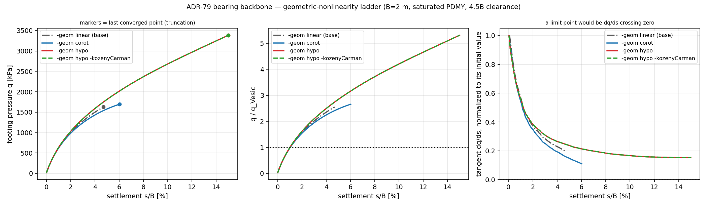

# ADR-79 bearing-backbone campaign — results

**Run 2026-07-28/29 on the merged `ladruno` state through PR #682
(`dist/bin` build `10db451c9`), graded 2816-element benchmark mesh, three legs
in parallel, 3.2–4.1 h each.**

## Verdict

**Climbing the geometry ladder does not produce a bearing limit point, and it
does not shrink the over-hardening — it makes it slightly worse.**

*Updated 2026-07-29: a `-geom linear` base rung was added and the hypo legs were
re-run to the full s/B = 0.15 target. Both change the reading — see
"The base rung changes the decomposition" and "The tangent plateaus" below.*

1. **No limit point on any rung.** Every leg is still hardening where it ends:
   the tangent `dq/ds` decays to 15 % (corot) / 25 % (hypo) of its initial
   value but never approaches zero, and `q` is monotone with its maximum at the
   last converged point. Genuine large strain does not bend this backbone over.
   `hypo` reaches **3.62 × Vesic at s/B = 7.6 %** and is still climbing.
2. **`hypo` is *stiffer* than `corot`, and the gap grows with penetration** —
   +2.1 % at s/B = 1 %, +6.2 % at 2.5 %, +14.8 % at 5 %. The sign matches
   ADR-79 P3's smoke (hypo stiffer; UL assembly on the *compacted*
   configuration plus the kinematic n(J) porosity), and it is the opposite of
   the "missing large deformation is why there is no limit point" hypothesis in
   ADR-78 §1. Large strain moves this model **away** from a limit point, not
   toward one.
3. **`-kozenyCarman` is inert here.** hypo and hypo+kc agree to ~1e-4 relative
   over the whole backbone. That is the physically expected answer, not a null
   result to explain away: the push is fully drained by construction, so
   permeability only sets how fast pore pressure dissipates, and at these rates
   every admissible k gives the same drained backbone. k(J) is a lever for
   *undrained or rapid* loading, and this campaign cannot see it.

So the ADR-78 §1 over-hardening is **not** a large-deformation-kinematics
artifact. Scoping finding 3 points at the much bigger lever: boundary
confinement. The same footing in a box with 0.5–1.5 B of clearance ran to
27 MPa (tens of × Vesic) purely as an oedometer, whereas this 4.5 B-clearance
benchmark is at 2.7–3.6 × Vesic at the same penetrations. We cannot attribute
a specific share of the reported 9.3 × to the SFIM model's boundaries without
that model — but the ladder is now excluded as the explanation.

*(A note on what "no limit point" does and does not mean here. A drained,
smooth, displacement-controlled footing on a hardening PDMY sand with
confinement-dependent moduli need not exhibit a load maximum at all: as the
footing sinks, the mechanism mobilizes deeper, better-confined soil whose
stiffness grows with p′. The campaign's finding is comparative and specific —
climbing the geometry ladder does not introduce one, and does not reduce the
over-hardening — not a claim that this model class must have one.)*



## Numbers

`q_Vesic = 637.5 kPa` = `q0·Nq·sq` (430.4) + `0.5·γ'·B·Nγ·sγ` (207.1),
φ = 33°, γ' = 9.81 kN/m³, B = 2 m, q0 = 10 kPa.

q/q_Vesic at settlement checkpoints (`--` = the leg never reached it):

| s/B | `linear` (base) | `corot` | `hypo` | `hypo -kozenyCarman` | corot/base | hypo/base | hypo/corot |
|---|---|---|---|---|---|---|---|
| 0.010 | 0.99 | 0.98 | 1.00 | 1.00 | 0.990 | 1.010 | 1.021 |
| 0.025 | 1.81 | 1.76 | 1.87 | 1.87 | 0.972 | 1.033 | 1.062 |
| 0.050 | -- | 2.48 | 2.85 | 2.85 | -- | -- | 1.148 |
| 0.075 | -- | -- | 3.59 | 3.59 | -- | -- | -- |
| 0.100 | -- | -- | 4.21 | 4.21 | -- | -- | -- |
| 0.125 | -- | -- | 4.77 | 4.77 | -- | -- | -- |
| 0.150 | -- | -- | 5.31 | 5.31 | -- | -- | -- |

Per leg, over the span each actually covered:

| leg | reached s/B | steps | retries | q_end | q_end/q_Vesic | final dq/ds | ended by |
|---|---|---|---|---|---|---|---|
| `-geom linear` (base) | 0.0469 | 407 | 63 | 1626 kPa | 2.55 | 23.5 % of initial | **divergence** |
| `-geom corot` | 0.0602 | 677 | 111 | 1695 kPa | 2.66 | 14.8 % of initial | adaptive floor |
| `-geom hypo` | **0.1500** | 2289 | 419 | 3384 kPa | 5.31 | 25.2 % of initial | **reached target** |
| `-geom hypo -kozenyCarman` | **0.1500** | 2284 | 415 | 3385 kPa | 5.31 | 25.2 % of initial | **reached target** |

### The base rung changes the decomposition

The base rung was added after the first pass and it halves the effect the
first pass reported. Measured at s/B = 0.0469, the deepest point all four
rungs share, `corot` is **5.4 % softer** than the small-strain base while
`hypo` is **7.5 % stiffer**. The two rungs pull in *opposite* directions, so
the 14.8 % hypo-vs-corot gap at s/B = 5 % is not "hardening due to large
strain" — roughly half of it is corot dropping below the base. Reporting only
the hypo-vs-corot gap, as the first pass did, was half wrong about its origin.

Mechanically the signs make sense. Corotational kinematics adds finite rotation
and geometric stiffness but assumes small deformational strain, contributing
essentially classical second-order softening. The hypo lane additionally
updates on the *current, compacted* configuration and carries porosity
kinematically as n(J) = 1 − (1−n0)/J; under a footing the soil compacts, J < 1,
and both effects stiffen. The dominant kinematic content here is therefore
**volumetric compaction, not shear distortion**.

### The tangent plateaus

| s/B | 0.010 | 0.025 | 0.050 | 0.075 | 0.100 | 0.125 | 0.150 |
|---|---|---|---|---|---|---|---|
| dq/ds [kPa/m] | 26 382 | 15 701 | 10 704 | 8609 | 7475 | 6993 | 6847 |
| fraction of initial | 0.617 | 0.367 | 0.250 | 0.201 | 0.175 | 0.163 | 0.160 |

The tangent loses 14 % across s/B 0.050→0.075 but only **2.1 %** across
0.125→0.150, and over the final 200 steps it lies in a 6840–6861 kPa/m band
(0.3 % spread) with q strictly monotone. That is a plateau **in the tangent**,
which is stronger than "no limit point was reached": the backbone is settling
into a straight line of slope ~6850 kPa/m, so no limit point is coming further
along either. A limit point requires dq/ds → 0 and a constant positive slope
cannot get there.

An interim reading of this at s/B = 0.076 claimed a plateau from two points and
was then apparently contradicted by a later interval reading; the latter turned
out to be scatter from differencing widely-spaced checkpoints. Only the
completed run settles it, and it settles it in favour of the plateau.

`q` crosses the Vesic capacity at s/B ≈ 1 % on every rung and keeps climbing —
the over-hardening reproduces cleanly on a properly sized benchmark.

## Why the legs stop where they stop

**Both hypo legs reached the s/B = 0.15 target. The two lower rungs did not, and
they stopped for different reasons — the distinction matters, so it is recorded
rather than smoothed over.**

- `linear` ended at s/B = 0.0469 by genuine **divergence**: displacement-increment
  norms of order 3e-2 and force residuals of 200–320, three to four orders of
  magnitude away from tolerance. It does not taper into its wall — its last
  successful step was at the full 0.4 mm cap — and it then failed to complete
  the halving ladder in 75 min because each diverged attempt costs ~10 min
  inside PDMY's *serial* return mapping (~1 busy core against 5.3 for a healthy
  leg, which is a fast tell for divergence versus mere slowness). Stopped by the
  operator after 75 min of zero progress.
- `corot` ended at s/B = 0.0602 on the adaptive floor, having narrowly missed
  tolerance with norms near 1e-5. That is a convergence limit, not a limit load.
- `hypo` and `hypo -kozenyCarman` **reached s/B = 0.1500**, in 2289 and 2284
  steps over 11.1 h each, still converging comfortably at the end.

None of these endings is a limit point, and they are distinguishable from one:
`dq/ds` is 15–25 % of its initial value and clearly positive in every case.

How deep each rung can be pushed is itself an ordered result — `linear` 0.047 <
`corot` 0.060 < `hypo` 0.150 — so richer kinematics stays solvable roughly
three times further on a mesh whose near-footing elements are being crushed.
That is an argument for the rate-form lane independent of the backbone values,
and it has a practical consequence: if a locus needs deep penetration, `hypo`
is the rung that survives the attempt.

The cross-rung comparison is bounded at s/B = 0.047 by the base rung's ceiling,
and no truncation can prove there is no limit point past the last converged
step — though for the hypo lane the tangent plateau above makes that a much
weaker caveat than it was at s/B = 0.076.

## Validation

Six independent checks, all run against this exact model:

| check | result |
|---|---|
| global vertical equilibrium after gravity | ΣR_z = 66 784.00 kN vs ρ_sat·g·V + q0·A = 66 784.00 kN — **exact to 0.0000 %** |
| effective stress at depth | σ'_zz ≈ −80.3 kPa at the base element ≈ γ'·z + q0 (buoyant), K0 = 0.51 vs 1−sinφ = 0.455 — buoyancy is carried by the pore-pressure field, so normalizing Vesic by γ' is the right choice |
| mesh geometry | volume 3200.000 m³ vs the exact 20 × 20 × 8 box |
| reaction bookkeeping | R extrapolates to 62.5 kN at s → 0 = q0 × 6.25 m² (the footing-node tributary) — the closed-form surcharge correction is exact |
| displacement control | commanded `s_m` ≡ measured `s_meas_m` to machine precision at every one of the 2527 recorded steps |
| solver | Pardiso vs UmfPack agree to **5.2e-13** relative on 16 push steps (Pardiso 2.2× faster) — the solver is a wall-clock choice only |

The gravity state is also uniform to 1e-16 across the whole top face
(1.7638 mm), i.e. a clean 1-D response before the footing is engaged, and pore
pressure is hydrostatic (0 at the surface, 78.48 kPa at z = −8 m).

## Caveats

- **Mesh coarseness.** B is resolved by 4 elements (0.5 m hexes). Adequate for
  the cross-method comparison — all three legs share the mesh exactly — but the
  *absolute* q is not mesh-converged, and no refinement study was run. A
  coarse mesh generally over-predicts capacity for a punching mechanism.
- **Truncation.** See above; no leg reached s/B = 0.15. corot stopped on its
  convergence floor at 0.060; the two hypo legs were stopped by the operator at
  0.076 while still converging, so their backbones could be extended simply by
  spending more wall clock.
- **Smooth footing.** Only u_z is driven on the 25 footing nodes; u_x, u_y are
  free. A rough footing would raise q and change the mechanism.
- **Boundary distance.** 4.5 B of side clearance and 4 B of depth is much
  better than the scoping boxes but is still a finite domain with roller sides;
  some confinement contribution remains.
- **Drained only.** k = 1e-4 m/s with a slow push. The undrained branch — where
  `-kozenyCarman` would actually bite — is untested.
- **PDMY calibration** is the generic medium-loose set from the P3 smoke, not a
  site calibration; the absolute multiples of Vesic should not be read as a
  statement about any real footing.
- **q includes the footing's own surcharge share** (≤ 1 %: 5.6 kPa of the
  600–2200 kPa signal), because the regularizing surcharge must cover the
  footing patch (scoping finding 2).

## Reproducing

```bash
C:/Users/nmb/venv/opensees_env/Scripts/python.exe Ladruno_files/testbed/hypo_bearing/build_mesh.py
```

```bash
C:/Users/nmb/AppData/Local/Programs/Python/Python312/python.exe Ladruno_files/testbed/hypo_bearing/bearing_backbone.py all
```

```bash
C:/Users/nmb/venv/opensees_env/Scripts/python.exe Ladruno_files/testbed/hypo_bearing/analyze.py
```

The mesh is cached in `bearing_mesh.npz`, so the second command reproduces
these CSVs exactly. Run the legs separately (`corot` / `hypo` / `hypo_kc`) to
parallelize; each takes ~3.5 h.
