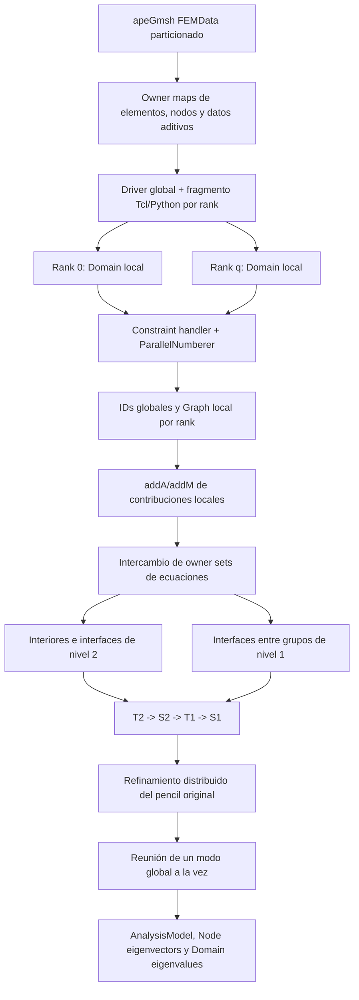

# ADR 1000 — Biblioteca independiente LadrunoCMS para análisis modal jerárquico paralelo

## 1. Decisión

Se implementará una biblioteca nueva e independiente denominada `OPS_LadrunoCMS`, con
sus propias clases `LadrunoCMSEigenSOE` y `LadrunoCMSEigenSolver`. La biblioteca seguirá
el algoritmo MHPMSA de Yu et al.: partición en dos niveles, dos reducciones locales de
Craig–Bampton, dos transformaciones de compatibilidad, solución global entre líderes y
retro-sustitución jerárquica. Los vectores CMS reconstruidos forman el subespacio inicial
de una iteración de subespacios sobre el pencil original; sólo esta última etapa puede
certificar el residual estricto solicitado por OpenSees.

La decisión impone seis límites no negociables:

1. no se modificará ninguna implementación de eigensolver existente;
2. `OPS_LadrunoCMS` será dueño de la jerarquía, las transformaciones, el eigensolve local
   y la retro-sustitución; sólo reutilizará MUMPS, METIS y BLAS/LAPACK como kernels
   numéricos generales;
3. v1 ejecutará obligatoriamente los dos niveles y la cadena completa
   `T_2 -> S_2 -> T_1 -> S_1`; un CMS de un nivel no satisface esta ADR;
4. la integración conservará el comando `eigen`, el ensamblaje `addA/addM` y la
   publicación ordinaria de valores y vectores de OpenSees; la aceptación se decide con
   `||Kx-lambda Mx||/(||Kx||+|lambda|||Mx||)` sobre las ecuaciones originales;
5. la primera versión sólo se habilitará en `OpenSeesMP` y `OpenSeesPyMP`;
6. la activación será optativa en CMake y no alterará el build ordinario.

La enmienda normativa de la sección 17 añade un séptimo límite: el modo CMS que aspire a
producción o a demostrar escalabilidad deberá recibir un `Domain` físicamente distribuido.
El flujo replicado que permitió verificar P0--P2c se conserva sólo como referencia de
corrección y diagnóstico. Cuando exista contradicción sobre distribución, propiedad o
ensamblaje entre las secciones históricas 4.2, 5, 10, 13--16 y la sección 17, prevalece la
sección 17.

V1 no modificará, envolverá ni dependerá de ninguna implementación modal existente del
fork. Los modos interiores de ambas reducciones se obtendrán mediante un Lanczos propio de
la biblioteca, siguiendo el flujo de Yu et al. y usando el wrapper MUMPS únicamente para
las acciones inversas. Esta frontera mantiene la familia CMS reconstruible y evita
acoplarla al estado o a las opciones de otra biblioteca.

### 1.1 Resolución de la revisión crítica

| Crítica | Resolución normativa |
|---|---|
| reutilizar una implementación modal existente | rechazada por alcance; el eigensolve local pertenece a la biblioteca nueva |
| ParMETIS obligatorio en v1 | aceptada; v1 usa METIS serial jerárquico y mide su coste |
| catorce componentes | aceptada; se reduce a cinco componentes C++ y métodos privados |
| falta de fallback global denso | aceptada; v1 usa `dsygvx` con `denseMax`, porque es el driver disponible en el fork |
| elemento que cruza grupos gruesos | aceptada como riesgo de clasificación; se resuelve con dueño único y owner sets efectivos para `S_2/S_1` |
| `reconfigureFrom` frágil | aceptada; se elimina y se corrige `setEigenSOE` por identidad de puntero |
| omitir uno de los niveles para simplificar | rechazada; ambos niveles son obligatorios y se medirán también mediante ablación controlada |

## 2. Base de evidencia y grado de certeza

### 2.1 Hechos expresos del paper

El artículo establece:

- `p` subdominios de nivel 1, uno por nodo de cómputo;
- `m` subdominios de nivel 2 dentro de cada subdominio de nivel 1;
- `p*m` procesos, asociados en Shenwei a los HCG disponibles;
- partición con ParMETIS;
- cuatro transformaciones: Craig–Bampton y compatibilidad en nivel 2, seguidas por
  Craig–Bampton y compatibilidad en nivel 1;
- solución local de modos de interfaz fija con Lanczos y solución de los sistemas
  internos con Cholesky modificada paralela;
- solución global iterativa sobre los líderes de cada nodo;
- almacenamiento disperso distribuido en CSC;
- retro-sustitución para recuperar los modos completos.

El paper informa hasta 13.167 millones de grados de libertad, 256 nodos, 1024 HCG y
65 536 cores; para ese caso reporta eficiencia paralela de 66.78 % y speedup 5.34
respecto del caso base de 32 nodos. Esos resultados pertenecen a Shenwei y no se
adoptan como expectativa de rendimiento para hardware convencional.

### 2.2 Información que el paper no proporciona

El artículo no entrega código, datos reproducibles, regla completa de retención modal,
tolerancias numéricas, detalle suficiente del precondicionador, pesos de partición ni
una especificación implementable de PMCD. Por ello:

- `-modesL2` y `-modesL1` serán datos obligatorios en la primera versión;
- la tolerancia residual y el máximo de enriquecimientos son decisiones de esta ADR,
  no valores atribuidos al paper;
- Lanczos local propio conserva el algoritmo del paper, con tolerancias y guards definidos por esta ADR;
- MUMPS se usará mediante un wrapper nuevo como backend práctico de factorización SPD;
- LAPACK denso sustituye inicialmente al PCG global, con un límite explícito de tamaño;
- cada sustitución respecto del artículo deberá quedar identificada en diagnósticos y
  pruebas.

### 2.3 Evidencia del repositorio OpenSees Ladruno auditado

La revisión corresponde al branch `ladruno`, commit `444e7ce1d`:

- `EigenSOE` exige `addA`, `addM`, `setSize`, `zeroA` y `zeroM`, y delega `solve` en un
  `EigenSolver`: `SRC/system_of_eqn/eigenSOE/EigenSOE.h:37-54`;
- `EigenSolver` expone `solve`, `getEigenvector`, `getEigenvalue` y `setSize`:
  `SRC/system_of_eqn/eigenSOE/EigenSolver.h:25-37`;
- el parser admite un `EigenSOE*` construido por una fábrica externa; `PythonSparse`
  demuestra el patrón: `SRC/interpreter/OpenSeesCommands.cpp:2311-2422`;
- `StaticAnalysis::eigen` y `DirectIntegrationAnalysis::eigen` forman `K` y `M` con
  `addA/addM`, llaman `solve` y publican cada modo por `AnalysisModel`:
  `SRC/analysis/analysis/StaticAnalysis.cpp:275-345` y
  `SRC/analysis/analysis/DirectIntegrationAnalysis.cpp:328-398`;
- `AnalysisModel::setEigenvector` distribuye el vector de ecuaciones a los DOF groups y
  nodos: `SRC/analysis/model/AnalysisModel.cpp:546-552`;
- `OpenSeesMP` y `OpenSeesPyMP` ya compilan con `_PARALLEL_INTERPRETERS` y enlazan MPI,
  MUMPS, METIS, SuperLU_DIST, BLAS/LAPACK y ScaLAPACK: `CMakeLists.txt:978-1045` y
  `CMakeLists.txt:1079-1150`;
- el camino MP actual que motivó esta revisión asume intérpretes replicados; esta
  condición está documentada en
  `SRC/system_of_eqn/eigenSOE/LadrunoDistBlockZKernel.cpp:328-331`;
- el árbol enlaza METIS serial y `MetisWrapper` ya expone
  `partition(Graph&,int)`/`partitionGraph(...)`; no existe una instalación utilizable de
  ParMETIS con `parmetis.h` y su biblioteca:
  `SRC/graph/partitioner/MetisWrapper.h:43-69`;
- `StaticAnalysis::setEigenSOE` y `DirectIntegrationAnalysis::setEigenSOE` comparan
  `classTag` en vez de identidad de puntero, aunque el comentario dice “not the same”:
  `StaticAnalysis.cpp:564-582` y `DirectIntegrationAnalysis.cpp:571-590`.

La conclusión es que el contrato nativo permite una biblioteca nueva sin alterar el
algoritmo de ensamblaje ni los consumidores modales. Sólo requiere la corrección genérica
de propiedad descrita en 6.2. Esta conclusión delimitó P2: el flujo auditado entonces no
eliminaba la réplica inicial del `Domain` y del `Graph`. La sección 17 sustituye esa
limitación para P3 mediante construcción por rank, numeración global y ensamblaje local,
sin cambiar el contrato matemático del eigensolver.

## 3. Contrato matemático normativo

### 3.1 Problema admitido

La versión 1 resolverá exclusivamente el problema generalizado simétrico real

\[
K\phi_j=\lambda_j M\phi_j,
\]

con `M` simétrica positiva semidefinida y `K` simétrica definida positiva después de
aplicar las restricciones, para búsqueda de los menores autovalores finitos. La nulidad
admitida en `M` es deliberadamente estrecha: debe estar alineada con coordenadas, es decir,
cada coordenada sin masa debe tener fila y columna numéricamente nulas. Éste es el patrón
del edificio de aceptación, cuyas rotaciones no reciben masa nodal. Se rechazarán
colectivamente:

- `-standard`;
- `-findLargest`;
- masa indefinida, nullspace de masa no alineado con coordenadas o ausencia total de
  coordenadas dinámicas;
- bloque de rigidez de coordenadas sin masa no factorizable como SPD;
- un bloque interior `K_II` no factorizable como SPD;
- dimensión reducida menor que `numModes`;
- particiones vacías;
- pérdida de simetría superior a la tolerancia de ensamblaje.

Los modos rígidos y nullspaces generales de `K` o `M` quedan diferidos hasta introducir
una estrategia explícita. No se simulará soporte devolviendo resultados parciales.

### 3.2 Condensación estática de coordenadas sin masa

Antes de **cada** problema propio generalizado —interiores finos, interiores gruesos y
pencil final— se clasifican las coordenadas en dinámicas `D` y sin masa `Z`. Con el orden
`[D,Z]`, v1 exige

\[
M=\begin{bmatrix}M_{DD}&0\\0&0\end{bmatrix},\qquad M_{DD}\succ0,
\qquad K_{ZZ}\succ0.
\]

Se construye la transformación estática

\[
G=\begin{bmatrix}I_D\\-K_{ZZ}^{-1}K_{ZD}\end{bmatrix},
\qquad
\widehat K=G^TKG=K_{DD}-K_{DZ}K_{ZZ}^{-1}K_{ZD},
\qquad
\widehat M=G^TMG=M_{DD}.
\]

El eigensolve opera sobre `(Khat,Mhat)` y reconstruye con `x=G*xhat`. `G` se compone con
la transformación CMS del nivel correspondiente; no elimina ni renumera la coordenada de
la salida OpenSees. Los modos de restricción de Craig–Bampton continúan resolviendo el
bloque completo `K_II`, porque describen equilibrio estático y no requieren masa.

Una coordenada se declara sin masa si su diagonal satisface
`|M_ii| <= massAtol + massRtol*max(1,max|M|)`. Su fila y columna completas deben cumplir
el mismo umbral; de lo contrario se trata de un nullspace no alineado y se rechaza. Las
factorizaciones de `M_DD` y `K_ZZ` son guards obligatorios. Tras reconstruir se evalúa el
residual sobre el pencil original, incluidas las filas `Z`.

### 3.3 Primera reducción, nivel 2

Para cada subdominio fino `s`, con coordenadas interiores `I` y de borde `B`, se forma

\[
K^{(s)}=
\begin{bmatrix}K_{II}&K_{IB}\\K_{BI}&K_{BB}\end{bmatrix},\qquad
M^{(s)}=
\begin{bmatrix}M_{II}&M_{IB}\\M_{BI}&M_{BB}\end{bmatrix}.
\]

Los modos de interfaz fija y los modos de restricción satisfacen

\[
K_{II}\Phi= M_{II}\Phi\Lambda,
\qquad
\Psi=-K_{II}^{-1}K_{IB}.
\]

La primera transformación es

\[
T_2^{(s)}=
\begin{bmatrix}\Phi&\Psi\\0&I_B\end{bmatrix},
\qquad
(\widetilde K_2^{(s)},\widetilde M_2^{(s)})=
({T_2^{(s)}}^TK^{(s)}T_2^{(s)},
 {T_2^{(s)}}^TM^{(s)}T_2^{(s)}).
\]

La masa consistente se conserva completa: ningún bloque `M_IB`, `M_BI` o `M_BB` puede
omitirse.

### 3.4 Compatibilidad del nivel 2

Dentro de cada subdominio de nivel 1 se construye una matriz booleana `S_2` que asigna
cada copia local de una coordenada física compartida a una sola coordenada independiente:

\[
K_2=S_2^T\operatorname{blkdiag}(\widetilde K_2^{(s)})S_2,
\qquad
M_2=S_2^T\operatorname{blkdiag}(\widetilde M_2^{(s)})S_2.
\]

Cada fila de `S_2` debe contener exactamente un uno. Las contribuciones de elemento se
asignan a un único subdominio antes de esta operación; por tanto `K_BB` y `M_BB` no se
duplican.

### 3.5 Segunda reducción y compatibilidad global

Cada subdominio de nivel 1 repite Craig–Bampton sobre `(K_2,M_2)` y obtiene `T_1`. Los
líderes ensamblan después con una segunda matriz de compatibilidad `S_1`:

\[
K_*=S_1^T\operatorname{blkdiag}(T_1^TK_2T_1)S_1,
\qquad
M_*=S_1^T\operatorname{blkdiag}(T_1^TM_2T_1)S_1.
\]

La solución de `K_*q=\lambda M_*q` de v1 reunirá el pencil reducido en el líder global y
usará LAPACK `dsygvx`. Este backend no altera `T_2`, `S_2`, `T_1` ni `S_1`: es un camino
de corrección para validar la jerarquía completa antes de introducir un solve global
distribuido. Se aplica sólo si la dimensión dinámica final `r_D <= denseMax`; por encima del límite
la ejecución falla con diagnóstico de memoria, sin degradarse silenciosamente. La fase P3
añadirá el backend distribuido y permitirá medir el escalamiento más allá de ese umbral.

Antes de reservar memoria se estimará primero la dimensión final cruda mediante

\[
r_{\mathrm{dup}}=\sum_{g=1}^{p}\left(k_{1,g}+|B_g|\right),
\qquad
r_{raw}=\sum_{g=1}^{p}k_{1,g}+\left|\bigcup_{g=1}^{p}B_g\right|.
\]

`B_g` es el conjunto de claves físicas de interfaz gruesa visto por el grupo `g`; la
unión representa la identificación efectuada por `S_1`. Si todos los grupos retienen el
mismo `k_1`, entonces `r_raw = p*k_1 + n_B`, con `n_B = |union_g B_g|`. Después de
clasificar masa se obtiene `r_D=r_raw-r_Z`; `denseMax` se aplica a `r_D`, que es la
dimensión enviada a `dsygvx`, no a `r_raw`. El diagnóstico imprimirá `r_dup`, `r_raw`,
`r_Z`, `r_D`, `sum(k1_g)`, `n_B`, el límite y la memoria estimada antes de cualquier
asignación grande.

### 3.6 Retro-sustitución y residual

Cada modo se reconstruye en orden inverso:

\[
q\xrightarrow{S_1}q_1^{dup}
\xrightarrow{T_1}q_2
\xrightarrow{S_2}q_2^{dup}
\xrightarrow{T_2}\phi.
\]

Las copias de una interfaz deben coincidir antes de cualquier gather. El criterio de
aceptación por modo será el residual del pencil original

\[
\rho_j=
\frac{\|K\phi_j-\lambda_jM\phi_j\|_2}
     {\|K\phi_j\|_2+|\lambda_j|\|M\phi_j\|_2}.
\]

La base se enriquecerá hasta `max rho <= tol` o hasta `-maxEnrich`. Si no converge, el
comando falla y no publica un conjunto incompleto.

## 4. Flujo de información compatible con OpenSees

### 4.1 Entrada sin un nuevo formato de modelo

El usuario seguirá construyendo nodos, elementos, masas y restricciones con Tcl o
OpenSeesPy. Las transformaciones de restricciones y la numeración de ecuaciones ocurren
antes del eigensolver. `LadrunoCMSEigenSOE` recibirá:

- el `Graph` numerado en `setSize(Graph&)`;
- cada matriz elemental de rigidez mediante `addA(Matrix,ID,fact)`;
- cada matriz elemental o nodal de masa mediante `addM(Matrix,ID,fact)`;
- `numModes`, `generalized` y `findSmallest` mediante `solve`.

Los `ID` negativos se omiten con la misma semántica de los SOE existentes. Los factores
distintos de uno se aplican durante el ensamblaje. `zeroA/zeroM` invalidan todo estado
numérico y permiten una nueva llamada modal después de cambiar el dominio.

### 4.2 Flujo histórico P2: de ensamblaje replicado a contribuciones disjuntas

La referencia P2 se apoya explícitamente en el modelo de intérprete replicado de los targets
MP actuales. En `setSize`, rank 0 aplica METIS serial al grafo completo para obtener las
`p` partes gruesas. Después, cada líder de nivel 1 extrae su subgrafo inducido y aplica
METIS serial para obtener sus `m` partes finas. Los líderes intercambian y difunden el
mapa global de `p*m` labels. Así se conservan los dos niveles sin exigir ParMETIS en v1.

Cada llamada `addA/addM` se asigna de manera determinista a un único subdominio fino usando
ese mapa. Sólo el rank propietario conserva la contribución completa.

El dueño de una contribución será:

1. el subdominio común si todos los ID activos pertenecen al mismo;
2. de otro modo, el subdominio con mayor número de ID activos;
3. en empate, el menor identificador de subdominio.

La misma función pura se aplica a rigidez y masa; así las llamadas de un mismo
`FE_Element` llegan al mismo dueño sin necesitar el tag del elemento. Una masa de
`DOF_Group` se asigna por sus propios ID. Después del ensamblaje se intercambian los sets
de ID activos de las contribuciones poseídas. La clasificación final deriva de la
propiedad elemental efectiva, no sólo del label inicial de METIS:

1. una ecuación vista por un solo dueño efectivo migra a ese subdominio y es interior;
2. una ecuación vista por varios dueños finos del mismo grupo es interfaz de nivel 2 y se
   identifica mediante `S_2`;
3. una ecuación vista por dueños de grupos gruesos diferentes es interfaz global y se
   identifica mediante `S_1`;
4. una contribución elemental completa aparece exactamente una vez, incluso si sus ID
   cruzan labels preliminares de nivel 1.

Esta regla resuelve el caso de un elemento que atraviesa dos grupos gruesos: el elemento
se conserva completo en un único dueño; las copias físicas compartidas se identifican en
`S_1`, o la ecuación migra al único dueño efectivo si no existe otra contribución. Marcar
preventivamente todos sus ID como interfaz global es correcto pero innecesario y aumenta
la dimensión reducida; se reservará como modo diagnóstico conservador.

La verificación del ensamblaje replicado se controla con
`-verifyAssembly off|signature|full`; el default es `signature`:

1. antes de descartar una contribución no poseída, cada rank registra ordinal, tipo
   `A/M`, lista `ID` completa y dimensiones; estos enteros se comparan directamente por
   bloques contra rank 0, sin convertir un hash en prueba de igualdad;
2. para la matriz ya multiplicada por `fact`, registra por llamada `maxabs`, suma, suma de
   absolutos, suma de cuadrados y una proyección ponderada determinista;
3. los registros se comparan por bloques: estructura mediante broadcast y comparación
   exacta de enteros; métricas mediante mínimos/máximos colectivos con
   `assemblyAtol/assemblyRtol` escaladas por el número de entradas;
4. ante la primera diferencia, todos los ranks fallan después de informar ordinal, tipo e
   IDs. No existe una comparación posterior que pretenda recuperar matrices ya
   descartadas.

`signature` consume `O(numero de llamadas)` escalares y es un diagnóstico fuerte, pero no
una prueba algebraica de igualdad. El modo `full` conserva temporalmente todas las
contribuciones en todos los ranks y realiza la comparación entrada por entrada; sólo se
autoriza para tests/modelos pequeños y se detiene antes de ensamblar si la estimación
supera `verifyFullMaxBytes` (default 256 MiB por rank). Así no se exige reproducibilidad
bit a bit ni se promete una inspección imposible después del filtrado por dueño.

Una ejecución con dominio ya particionado se rechaza en la referencia P2 para evitar pérdidas o doble
conteo. Tras conocer los dueños efectivos se rechaza cualquier subdominio sin
contribuciones. Un subdominio sólo de borde es válido y sigue una transformación
identidad; si su interior es no vacío, `K_II` debe ser factorizable.

Esta fue la adaptación algebraica usada para verificar la primera biblioteca. El paper
particiona una malla FE explícita; P3 adopta esa frontera mediante decks OpenSeesMP por
rank según la sección 17.

### 4.3 Salida idéntica a `eigen`

`getEigenvalue(i)` devolverá `lambda_i` y `getEigenvector(i)` un `Vector` de longitud igual
al número global de ecuaciones. Tras la retro-sustitución, los líderes distribuyen y todos
los ranks reciben los `numModes` vectores completos antes de retornar de `solve`. La
reunión se hará un modo a la vez para que el buffer colectivo transitorio sea `O(n)` y no
`O(n*numModes)`; el almacenamiento persistente continúa siendo `O(n*numModes)` por rank
debido al contrato de salida.

En consecuencia se conservan:

- la lista retornada por `eigen`/`ops.eigen`;
- `nodeEigenvector`;
- `modalProperties`;
- recorders y análisis modales que leen `Domain::getEigenvalues` y los vectores nodales.

El coste de replicar `n*numModes` valores al final es parte del contrato actual de
`AnalysisModel`; eliminarlo requeriría cambiar consumidores y no pertenece a esta ADR.

## 5. Topología MPI

> **Estado:** esta sección especifica la topología y la reasignación algebraica de la
> referencia P2. En modo `physical`, la relación rank--subdominio fino y la construcción
> de owner sets se rigen por 17.3--17.6; las colectivas `S_2/S_1` restantes continúan
> siendo aplicables.

Se crearán tres comunicadores:

- `worldComm`: los `p*m` ranks;
- `level1Comm`: los `m` ranks que cooperan en un subdominio grueso;
- `leaderComm`: rank local cero de cada `level1Comm`.

En modo `auto`, `MPI_Comm_split_type(MPI_COMM_TYPE_SHARED)` identifica nodos físicos. Se
exige el mismo número de ranks por nodo; `p` es el número de nodos y `m` los ranks por
nodo. En modo `logical`, necesario para CI y pruebas en una sola máquina, el usuario fija
`-level1 p -level2 m` y se exige `p*m == MPI_Comm_size(worldComm)`.

El flujo colectivo será:

1. rank 0 ejecuta METIS serial y divide el grafo en `p` partes gruesas;
2. se difunden los labels y cada líder extrae su subgrafo inducido;
3. los `p` líderes ejecutan simultáneamente METIS serial y dividen su parte en `m`
   subdominios finos; después intercambian el mapa completo de dueños;
4. cada rank reduce su subdominio fino sin comunicación inter-rank;
5. los `m` ranks ensamblan con `S_2` y cooperan en la reducción de nivel 1;
6. sólo los líderes forman `S_1` y reúnen el pencil final según el protocolo detallado
   abajo; el líder global ejecuta LAPACK denso dentro del límite `denseMax`;
7. la retro-sustitución recorre los comunicadores en orden inverso;
8. el resultado completo se difunde a `worldComm`.

Los pasos 4 y 5, incluidas la formación de `T_2`, `S_2` y `T_1`, son parte obligatoria de
v1 incluso cuando `p=1`. Para demostrar ambos niveles en integración se exige al menos un
caso `p>=2, m>=2`; `p=1` o `m=1` son casos degenerados de diagnóstico, no evidencia de
apalancamiento jerárquico.

Cada fase termina con un `allreduce` de estado. Ningún rank puede retornar localmente
mientras otro entra a un colectivo.

### 5.1 Protocolo colectivo de `S_2` dentro de cada grupo

Cada rank fino ordena sus coordenadas reducidas con claves estables: modos locales
`(level2_mode,fine,localMode)` y coordenadas físicas `("eq",globalEquation)`. Todos los
`level1Comm` ejecutan el mismo protocolo, independientemente y en el mismo orden local:

1. `MPI_Allgather` de conteos de claves y entradas triangulares; se calculan y validan
   `counts/displacements`, incluidos ranks con conteo cero;
2. `MPI_Gatherv` de claves al líder del grupo;
3. el líder ordena el conjunto único, crea `localRow -> groupColumn`, calcula dimensión
   duplicada y dimensión tras `S_2`, y valida que cada fila local tenga un único destino;
4. `MPI_Scatterv` devuelve los mapas locales y `MPI_Allreduce` propaga errores dentro del
   grupo;
5. cada rank remapea el triángulo superior de su pencil fino a triplets
   `(groupI,groupJ,Kvalue,Mvalue)` y `MPI_Gatherv` los entrega al líder;
6. el líder suma claves coincidentes, materializa `(K_2,M_2)`, verifica simetría y prepara
   la segunda Craig–Bampton; después difunde sólo el estado necesario para que todos los
   ranks mantengan la secuencia colectiva;
7. en retro-sustitución, el líder aplica `T_1`, `MPI_Scatterv` entrega a cada hijo sus
   filas duplicadas de `S_2`, y cada rank aplica su `T_2`.

Las colectivas de un grupo nunca usan `worldComm` ni `leaderComm`. Antes de entrar en la
siguiente fase, un `MPI_Allreduce` sobre `worldComm` confirma que todos los grupos
terminaron; esto evita que un fallo local deje otros líderes esperando en `S_1`.

### 5.2 Protocolo colectivo de `S_1` y solve global v1

Cada líder ordena sus coordenadas reducidas mediante claves estables: las coordenadas
modales usan `(level1_mode, group, localMode)` y las coordenadas físicas de borde usan el
ID global de ecuación. Sobre `leaderComm` se ejecuta siempre esta secuencia:

1. `MPI_Allgather` de los conteos locales de claves y de entradas triangulares del pencil;
2. `MPI_Gatherv` de las claves al líder global;
3. el líder global ordena las claves únicas, construye el mapa
   `localRow -> globalReducedColumn`, calcula `r_dup`, `r_raw` y el preflight preliminar;
4. `MPI_Scatterv` devuelve a cada líder su mapa local; un `MPI_Allreduce` propaga cualquier
   error antes de continuar;
5. cada líder empaqueta el triángulo superior de sus contribuciones de nivel 1 como
   `(globalI,globalJ,Kvalue,Mvalue)` y `MPI_Gatherv` lo reúne en el líder global;
6. el líder global suma entradas coincidentes, verifica simetría, aplica el guard y la
   condensación de masa si corresponde, materializa el pencil dinámico y resuelve;
7. `MPI_Bcast` difunde autovalores y coordenadas reducidas globales `q`, no las matrices
   densas `K_*` y `M_*`;
8. cada líder aplica su mapa, `T_1` y `S_2`, y entrega mediante las colectivas de
   `level1Comm` los datos que cada rank necesita para aplicar `T_2`.

Los vectores `counts/displacements` de cada `*v` se calculan una vez y se validan contra
overflow de `int` antes de llamar MPI. Todos los líderes ejecutan las colectivas en ese
orden, incluso con conteo local cero. Difundir el pencil final después del solve no es
necesario en v1 y multiplicaría su coste de memoria; sólo P3 redefinirá este patrón para
un backend distribuido.

## 6. Biblioteca nueva

### 6.1 Target y archivos propios

Se añadirá `SRC/system_of_eqn/ladrunoCMS/` con un target estático independiente
`OPS_LadrunoCMS`:

```text
LadrunoCMSEigenSOE.{h,cpp}
LadrunoCMSEigenSolver.{h,cpp}
LadrunoCMSOptions.{h,cpp}
LadrunoCMSLocalLanczos.{h,cpp}
LadrunoCMSMumps.{h,cpp}
CMakeLists.txt
```

`LadrunoCMSEigenSOE` es dueño de matrices, partición y configuración. El solver es dueño
de la orquestación jerárquica y de los resultados. Partición, contribution store,
compatibilidades `S_2/S_1`, Craig–Bampton, retro-sustitución, residual y diagnóstico son
métodos/estructuras privadas de estas clases hasta que exista una razón probada para
extraerlos. Las clases nuevas no se colocarán en `SRC/system_of_eqn/eigenSOE/` ni en
`OPS_SysOfEqn`.

La fábrica construirá en heap primero `LadrunoCMSEigenSolver` y después
`LadrunoCMSEigenSOE(*solver, options)`. La propiedad del solver se transfiere al SOE porque
el destructor base `EigenSOE::~EigenSOE` elimina `theSolver`. No se llamará `setSolver`
después de construirlo ni se mantendrán dos propietarios del mismo puntero.

Existe una sutileza de ciclo de vida en el fork: `StaticAnalysis::setEigenSOE` y
`DirectIntegrationAnalysis::setEigenSOE` conservan el objeto anterior cuando el classTag
coincide, aunque reciban una instancia diferente. Se corregirán ambas funciones para
comparar identidad (`theEigenSOE != &theNewSOE`): si es otro objeto, eliminan el anterior,
toman el nuevo y restablecen sus links. Este hook genérico y mínimo evita punteros
colgantes para CMS y para cualquier familia que construya dos SOE del mismo tipo. Se
elimina `reconfigureFrom`; el parser no copiará estado entre objetos.

| Método público | Responsabilidad concreta |
|---|---|
| `setSize(Graph&)` | construir topología, partición jerárquica, mapas de ecuación y patrones dispersos; invalidar factores/resultados |
| `addA` | aplicar `fact`, filtrar ID negativos y guardar una contribución de rigidez en un solo dueño |
| `addM` | aplicar la misma función de dueño y guardar masa elemental/nodal una sola vez |
| `zeroA/zeroM` | poner a cero valores y descartar toda reducción dependiente del pencil |
| `solve` | validar flags, ejecutar las cuatro transformaciones, enriquecer y sincronizar resultados |
| `getEigenvalue/vector` | índices OpenSees 1-based; error claro fuera de `1..numModes` |
| `sendSelf/recvSelf` | devolver error explícito en v1 |

### 6.2 Hooks mínimos en archivos existentes

La integración nativa de `eigen` hace imposible prometer cero cambios fuera del nuevo
directorio. Se autorizan únicamente estos hooks aditivos:

| Archivo existente | Cambio permitido |
|---|---|
| `SRC/interpreter/OpenSeesCommands.cpp` | rama `_PARALLEL_INTERPRETERS` para `-ladrunoCMS`, construcción por fábrica y entrega como `providedEigenSOE` |
| `SRC/analysis/analysis/StaticAnalysis.cpp` | reemplazar comparación por `classTag` por identidad de puntero al instalar un `EigenSOE` |
| `SRC/analysis/analysis/DirectIntegrationAnalysis.cpp` | la misma corrección de identidad y propiedad |
| `SRC/classTags.h` | reservar `EigenSOE_TAGS_LadrunoCMS 33025` y `EigenSOLVER_TAGS_LadrunoCMS 33026`, previa auditoría final |
| `CMakeLists.txt` y `SRC/system_of_eqn/CMakeLists.txt` | opción, subdirectorio y enlace del target nuevo sólo a `OpenSeesMP/OpenSeesPyMP` |
| `Ladruno_implementation/testbed/manifest.yaml` | entrada pending/shipped según la puerta alcanzada |
| `Ladruno_implementation/LEDGER_implementations.md` | procedencia de todos los hooks y archivos nuevos |

No se modifican clases de eigensolvers existentes, `AnalysisModel`, elementos, materiales
ni handlers. Los dos cambios en clases de análisis son una corrección de ciclo de vida,
no una implementación modal, y llevarán marca Ladruno, ledger vanilla y regresiones de
propiedad.

La rama del parser se compilará sólo con
`#if defined(_PARALLEL_INTERPRETERS) && defined(_LADRUNO_CMS)`. CMake propagará
`_LADRUNO_CMS` al source per-target de `OpenSeesMP` y a `OPS_InterpPyCmds_MP`; no se
declarará globalmente ni en `OpenSeesLIB`. Así `LADRUNO_CMS=OFF` no deja una referencia
sin resolver a la fábrica.

La fábrica directa hace innecesario registrar el SOE en
`FEM_ObjectBrokerAllClasses::getNewEigenSOE` para v1. `sendSelf/recvSelf` devolverán un
error explícito porque esta versión no reconstruye el eigensolver mediante `Channel`.
Si un flujo futuro lo requiere, broker y serialización serán una fase separada con tests.

## 7. Interfaz Tcl y Python

La sintaxis normativa es:

```tcl
set lambdas [eigen -ladrunoCMS \
    -hierarchy logical -level1 2 -level2 4 \
    -modesL2 16 -modesL1 32 \
    -tol 1.0e-8 -maxEnrich 4 \
    -maxIter 500 -refinement subspace \
    -iterationVectors auto -maxRefineIter 160 \
    -partition metis -localEigen lanczos \
    -globalSolver dense -denseMax 2000 \
    20]
```

```python
lambdas = ops.eigen(
    '-ladrunoCMS',
    '-hierarchy', 'logical', '-level1', 2, '-level2', 4,
    '-modesL2', 16, '-modesL1', 32,
    '-tol', 1.0e-8, '-maxEnrich', 4,
    '-refinement', 'subspace', '-iterationVectors', 'auto',
    '-maxRefineIter', 160,
    '-maxIter', 500, '-partition', 'metis', '-localEigen', 'lanczos',
    '-globalSolver', 'dense', '-denseMax', 2000,
    20,
)
```

El último argumento continúa siendo el entero `numModes`, como exige el parser genérico.
La fábrica consume únicamente las opciones anteriores y deja ese entero sin consumir.

| Opción | Contrato v1 |
|---|---|
| `-hierarchy auto|logical` | obligatoria; `auto` usa memoria compartida MPI |
| `-level1 p -level2 m` | obligatorias en `logical`; ilegales si `p*m != np` |
| `-modesL2 k2` | obligatoria, `k2 >= numModes` no es requisito pero `k2 > 0` sí |
| `-modesL1 k1` | obligatoria, `k1 > 0` |
| `-tol value` | default ADR `1e-8`, no atribuido al paper |
| `-maxEnrich n` | default ADR `4`; sólo amplía `k2/k1` si el CMS no logra producir las `q` direcciones iniciales |
| `-maxIter n` | default ADR `500`; máximo de iteraciones Lanczos por eigensolve local |
| `-refinement subspace\|none` | default `subspace`; `none` publica una aproximación de investigación sin garantía de convergencia |
| `-iterationVectors auto\|q` | default `auto`; resuelve `q=max(p+8,2p)`, donde `p=numModes` |
| `-maxRefineIter n` | default `160`; máximo de acciones globales `K^{-1}M` con Rayleigh–Ritz en cada paso |
| `-assemblyRtol value` | default ADR `1e-12`; comparación numérica entre ranks |
| `-assemblyAtol value` | default ADR `1e-14`; piso absoluto de esa comparación |
| `-massRtol value` | default ADR `1e-12`; clasificación de filas/columnas sin masa |
| `-massAtol value` | default ADR `1e-14`; piso absoluto de clasificación de masa |
| `-verifyAssembly off\|signature\|full` | default `signature`; `full` queda limitado a debug pequeño |
| `-verifyFullMaxBytes n` | default `268435456`; guard por rank antes de guardar contribuciones completas |
| `-partition metis` | único backend v1; dos etapas seriales jerárquicas |
| `-localEigen lanczos` | único backend v1; eigensolve propio para `T_2` y `T_1` |
| `-globalSolver dense` | único backend v1; LAPACK en el líder después de `S_1` |
| `-denseMax r` | default ADR `2000`; guard sobre dimensión dinámica final `r_D` |
| `-verbose` | diagnóstico por fases, sólo líderes salvo errores |

Opciones desconocidas, duplicadas o incompletas causan error. Las decisiones derivadas de
retención y partición se sincronizan desde líderes para que todos los ranks ejecuten el
mismo árbol colectivo.

## 8. Dependencias y build

### 8.1 Dependencias

| Dependencia | Uso | Estado en el repo |
|---|---|---|
| MPI | tres niveles de comunicadores y colectivas | disponible en targets MP |
| MUMPS | wrapper nuevo de factorización SPD de `K_II` | disponible en targets MP |
| BLAS/LAPACK | congruencias y `dsygvx` global | disponible y ya usado por el fork |
| METIS serial | partición gruesa y particiones finas | target y `MetisWrapper` existentes |

V1 no introduce ParMETIS, PETSc ni PCG global propio. Sí implementa el Lanczos local como
parte de `OPS_LadrunoCMS`; los dos niveles y las cuatro transformaciones permanecen
encapsulados en la biblioteca nueva.

La implementación usará `MetisWrapper` en vez de declarar por segunda vez símbolos C de
METIS. Los subgrafos inducidos tendrán tags consecutivos antes de invocar el wrapper,
porque éste exige esa numeración. Los colores producidos se copiarán inmediatamente a los
mapas propios de CMS; no se conservarán referencias a los `Graph` temporales.

ParMETIS queda como backend opcional P3 si los perfiles muestran que la partición serial
domina tiempo o memoria. Su futura integración deberá comprobar compatibilidad de GKlib,
METIS, `idx_t` y `real_t`, además de resolver su licencia y redistribución en una ADR
separada. No es una puerta para construir ni validar v1.

### 8.2 Opción CMake

```cmake
-DLADRUNO_CMS=ON
```

Con `LADRUNO_CMS=OFF`, valor por defecto, no se compilan fuentes, no aparece el comando y
ningún target existente adquiere includes, macros o bibliotecas. Con `ON`, CMake exige
MUMPS, METIS, BLAS/LAPACK y MPI; una ausencia detiene la
configuración con mensaje accionable. El target nuevo enlaza directamente sus dependencias
y sólo se agrega a `OpenSeesMP` y `OpenSeesPyMP`.

## 9. Estrategia numérica de la biblioteca

### 9.1 Almacenamiento y congruencias

`addA/addM` recibe matrices densas pequeñas e IDs, pero el solver no guardará el pencil
global replicado. El formato normativo es:

1. durante ensamblaje, el dueño conserva cada contribución simétrica como
   `{kind,activeIDs,upperValues}` después de aplicar `fact`, filtrar IDs negativos y
   verificar simetría;
2. en `finalizeAssembly`, ordena claves de ecuación locales, emite triplets del triángulo
   superior, ordena/reduce duplicados y forma CSR simétrico con índices C++ de base cero;
3. sólo el adaptador MUMPS convierte temporalmente índices a base uno; no se mezcla
   indexación Fortran con mapas CMS;
4. `Phi`, `Psi`, `T_2/T_1` y pencils reducidos locales se almacenan `double`
   column-major; `G` se representa implícitamente mediante los sets `D/Z` y respuestas
   estáticas calculadas por bloques, no como matriz global permanente; las congruencias
   calculan `K*T` y `M*T` por bloques de 32 columnas y acumulan
   `T^T(K*T)`/`T^T(M*T)` con BLAS;
5. las contribuciones se liberan tras validar firmas y crear CSR; el pencil local completo
   se libera después de su reducción; factores y transformaciones se retienen sólo hasta
   terminar enriquecimiento, residual y retro-sustitución.

El bloque de 32 columnas es un default interno medible, no parte de la interfaz pública.
P1 contrastará CSR, multiplicación dispersa-densa y congruencia contra ensamblaje denso
independiente, incluyendo IDs repetidos, negativos y matrices de dimensión cero.

### 9.2 Factorización y modos locales

`LadrunoCMSMumps` encapsulará directamente la API C/Fortran de MUMPS, sin usar ni
modificar wrappers existentes. Su contrato RAII queda fijado así:

- `SYM=1`, `PAR=1` y `COMM_FORTRAN=MPI_COMM_SELF` en v1;
- `JOB=-1` inicializa, `JOB=4` analiza y factoriza, `JOB=3` resuelve y `JOB=-2` libera;
- sólo acepta CSR simétrico validado, lo convierte a índices MUMPS de base uno y comprueba
  en configuración que el ancho entero enlazado sea compatible;
- resuelve múltiples RHS densos column-major en una llamada cuando sea posible;
- cualquier `INFOG(1)<0`, pivote no positivo o NaN/Inf se convierte en estado de fase y
  falla colectivamente con nivel, grupo y subdominio;
- un bloque sin interiores no crea contexto MUMPS y sigue el camino identidad de borde.

Una factorización de `K_II` se reutiliza
para:

- los múltiples RHS de `Psi=-K_II^{-1}K_IB`;
- las aplicaciones `K_II^{-1}M_II` de Lanczos cuando `M_II` es SPD.

Si `M_II` contiene coordenadas `Z`, existen tres roles distintos y no se confunden: la
factorización completa de `K_II` produce `Psi`; una factorización de `K_ZZ` construye `G`
y `Khat`; y una factorización de `Khat` aplica el operador de Lanczos. Las dos últimas se
omiten cuando `Z` está vacío. Cada contexto tiene ciclo de vida y diagnóstico propios.

En v1 cada rank factoriza su bloque fino y cada líder factoriza el bloque interior de
nivel 1 ya ensamblado con `S_2`; ambos usan un comunicador local/`MPI_COMM_SELF`. P3 podrá
distribuir la factorización gruesa dentro de `level1Comm` sin cambiar el contrato de
`LadrunoCMSMumps` ni las transformaciones.

`LadrunoCMSLocalLanczos` será un **block thick-restart Lanczos** y aplicará el operador
`A=Khat^{-1}Mhat` mediante `LadrunoCMSMumps`, donde el sombrero coincide con el bloque
interior original si no existen coordenadas sin masa. Sus mayores Ritz
`mu_j` corresponden a los menores autovalores físicos `lambda_j=1/mu_j`. Implementará
Rayleigh–Ritz y locking en producto interno `Mhat` (`M_II` cuando no hay condensación).
Para `k` modos y dimensión dinámica `n_D`, los defaults
internos son

\[
b=\min(n_D,\max(1,\min(8,k))),\qquad
q_{max}=\min(n_D,\max(4k+2b,40)).
\]

En cada reinicio conserva los `k+b` mejores Ritz disponibles, sin cortar un cluster cuyo
gap relativo sea `<=sqrt(localTol)`. Cada bloque nuevo se ortogonaliza completamente
contra vectores bloqueados y base activa; se ejecuta una segunda pasada si la pérdida de
norma supera `sqrt(eps)`. Un par converge sólo si su residual normalizado del pencil local
es `<=localTol`, con `localTol=min(1e-10,0.1*tol)` por defecto. Cada vector convergido se
refina con cociente de Rayleigh, se bloquea y se reconstruye mediante `G`.

Se declara breakdown si la norma `M` del bloque nuevo es menor que
`100*eps*max(1,norma previa)`. Si aún faltan pares, se genera un bloque determinista a
partir de `(nivel,subdominio,restart)`, se proyecta contra toda la base y se continúa.
`maxIter` cuenta aplicaciones del operador inverso correspondiente; se permiten como
máximo 20 reinicios. Agotar
cualquiera de ambos límites sin `k` pares convergidos es error, nunca aceptación parcial.
No se usa el recíproco del Ritz como único criterio de convergencia.

El mismo kernel se ejecuta en dos sitios: cada rank obtiene los modos interiores de su
subdominio fino para `T_2`, y cada líder obtiene los modos interiores del pencil de nivel
1 ya ensamblado con `S_2` para `T_1`. Las dimensiones, iteraciones, reinicios, pares
convergidos, pérdida de ortogonalidad y residuales se registran por nivel. El resultado
local se contrasta con `dsygvx` en P1 sobre pencils pequeños y adversariales.

### 9.3 Solución global entre líderes

Los líderes ensamblarán el pencil final y lo reunirán en el líder global. V1 verifica
simetría, aplica la condensación de 3.2 si `M_*` es semidefinida y exige SPD de la masa
dinámica resultante. Después valida dimensión y memoria antes de convertir a
almacenamiento denso y llamar LAPACK `dsygvx`; luego difunde autovalores y coordenadas
reducidas a `leaderComm`. El default `denseMax=2000` evita describir `r_D=5000` como trivial: sólo dos
matrices `5000 x 5000` consumen aproximadamente 400 MB, sin contar copias ni workspace, y
el coste es cúbico. El usuario puede cambiar el límite de forma explícita, quedando el
valor y la memoria estimada en diagnósticos.

Después de `S_1`, el líder mantiene el pencil crudo en forma dispersa, identifica `D/Z`,
factoriza `K_ZZ` y forma el complemento de Schur en bloques de 32 RHS. No materializa un
`G` de dimensión `r_raw x r_D`. Tras `dsygvx`, reconstruye `Z` modo a modo resolviendo
`K_ZZ*x_Z=-K_ZD*x_D` con el mismo factor.

La estimación mínima conocida antes del solve será

\[
M_{K,M,Q}=16r_D^2+8r_D\,n_{modes}+8r_Zb_s\quad\text{bytes},
\]

correspondiente a dos matrices `double r_D x r_D`, los eigenvectores reducidos y un tile
estático `r_Z x b_s`, con `b_s=32` por defecto. A esto se añaden CSR crudo, factores
MUMPS y workspace LAPACK, cuyos tamaños dependientes de sparsity se reportan cuando MUMPS
los conoce. Durante el gather se añadirá conservadoramente

\[
M_{pack}=\left(2\,\mathrm{sizeof(int)}+2\,\mathrm{sizeof(double)}\right)
\sum_g\frac{d_g(d_g+1)}{2},
\qquad d_g=k_{1,g}+|B_g|,
\]

más claves, mapas y workspace LAPACK. El preflight reportará
`M_root_est >= M_KMQ + M_pack` en MiB. La cifra es una cota operativa, no una promesa de
RSS, pero permite decidir conscientemente si aumentar `-denseMax`. Para el ejemplo
`p=8`, `k1=200`, `n_B=400` y `r_Z=0`, se estima `r_D=2000`: llega al límite
dimensional aunque las dos matrices densas por sí solas ocupen sólo unos 61 MiB.

P3 incorporará `-globalSolver distributed` con Krylov/PCG y precondicionador validado.
Hasta entonces no se afirmará escalabilidad del solve final; sí podrá medirse el ahorro de
dimensión, memoria local y trabajo producido por ambos niveles CMS.

### 9.4 Refinamiento global y uso acotado de `maxEnrich`

La jerarquía reconstruye `q` vectores completos, con `q=max(p+8,2p)` por defecto. El
solver los ortonormaliza en el producto `M`, ejecuta Rayleigh–Ritz y, mientras el residual
original exceda `-tol`, aplica

$$
K\bar X=MX,
$$

seguido por dos pasadas de ortogonalización `M` y un nuevo Rayleigh–Ritz. La rigidez
original se factoriza una sola vez mediante MUMPS distribuido. Como MUMPS desactiva su
refinamiento iterativo interno para múltiples lados derechos, cada solve de bloque aplica
explícitamente dos correcciones `K Delta=B-KX` con el mismo factor. Esta decisión fue la
que eliminó el piso numérico observado alrededor de `1.6e-8` en el edificio 1A.

`maxEnrich` ya no es un mecanismo de convergencia residual. Únicamente incrementa `k2` y
`k1` si la dimensión dinámica CMS no puede entregar las `q` direcciones solicitadas. Una
vez obtenido el espacio inicial, la convergencia pertenece al pencil original. El modo
`-refinement none` se conserva sólo para investigación aproximada y emite advertencia.

## 10. Pruebas y puertas de aceptación

### P0 — oráculo matemático independiente: completada en este estudio

Los archivos `test/cms_core.py` y `test/test_cms_level2.py` verifican:

- cadena fija-fija contra solución analítica;
- masas concentradas y consistentes, incluido `M_IB != 0`;
- `K_BB/M_BB` presentes una sola vez;
- particiones no contiguas y acoplamientos creados sólo por masa;
- propiedad efectiva de una contribución que cruza grupos gruesos, dueño único y
  promoción de la ecuación compartida a `S_1`;
- bases completas exactas;
- cota de Rayleigh–Ritz y enriquecimiento monótono;
- segunda condensación auténtica;
- las cuatro transformaciones del paper con `S_2` y `S_1` explícitas;
- una sola entrada por fila de cada matriz de compatibilidad;
- igualdad de copias de interfaz en la retro-sustitución;
- residual, MAC y MAC de subespacio para clusters;
- condensación y reconstrucción de una o varias coordenadas sin masa;
- plan colectivo determinista de claves, incluidas duplicadas y un líder vacío;
- fórmulas de memoria del solve denso y gather triangular;
- firmas de ensamblaje con estructura exacta y valores tolerantes;
- rechazo de masa indefinida/nullspace no alineado, `K_ZZ` o `K_II` singular, jerarquía
  imposible y petición modal inválida.
- refinamiento global que reduce el residual original, control negativo limitado al
  pencil reducido, regla `q=max(p+8,2p)`, masa semidefinida, pérdida de rango y rechazo de
  rigidez singular.

`test/cms_report.py` genera el informe numérico reproducible. Estas pruebas demuestran la
matemática, no MPI ni rendimiento.

### P1 — núcleo C++ sin MPI

- tests del contribution store contra ensamblaje denso independiente;
- caso de contribución multi-subdominio entre grupos gruesos: aparece una vez y sus
  owner sets producen la interfaz `S_1` correcta;
- tests de `T_2`, `S_2`, `T_1`, `S_1` contra el oráculo Python;
- factorización MUMPS con múltiples RHS y residuos;
- Lanczos local contra LAPACK, incluidos clusters, reinicios y pérdida de ortogonalidad;
- condensación de coordenadas sin masa antes de los eigensolves de nivel 2, nivel 1 y
  global; reconstrucción y residual sobre el pencil anterior a condensar;
- solve final `dsygvx`, guard `denseMax` y estimación de memoria;
- registros estructurales comparados exactamente y firmas numéricas tolerantes, incluidos
  valores justo dentro y fuera de `assemblyRtol/assemblyAtol`;
- sanitizers, matrices vacías y errores colectivos simulados.

Puerta: igualdad de pencil reducido y transformación dentro de `1e-11` en fixtures
pequeños; ningún resultado NaN/Inf; cobertura de cada guard.

### P2 — v1 jerárquica completa en OpenSeesMP/OpenSeesPyMP

- parser Tcl y Python con opciones válidas e inválidas;
- METIS serial global y METIS serial simultáneo en líderes;
- `np=1`, `np=2`, `np=4` y, obligatoriamente, jerarquía lógica `p=2,m=2`;
- evidencia explícita de que se ejecutaron `T_2`, `S_2`, `T_1`, `S_1` y la
  retro-sustitución completa;
- salida de `eigen`, `nodeEigenvector` y `modalProperties` contra el solver estándar en
  modelos pequeños;
- masas nodales y elementales, constraints Plain/Transformation/Penalty y ecuaciones
  negativas;
- dos llamadas a `eigen` después de modificar masa o rigidez;
- misma instancia reinstalada y dos instancias del mismo `classTag`, además de cambio de
  familia modal, sin puntero obsoleto, doble `delete` ni leak;
- fallo simultáneo de todos los ranks sin deadlock;
- detección del ensamblaje no replicado;
- protocolo `S_1` con dimensiones desiguales, claves duplicadas, líder con conteo cero y
  rechazo previo de `counts/displacements` que desborden `int`;
- el mismo contrato colectivo para `S_2` dentro de cada `level1Comm`; el helper de
  transporte se prueba también con un participante sintético de conteo cero, aunque una
  partición física sin contribuciones siga siendo inválida;
- preflight de `r_raw/r_Z/r_D`, memoria densa y memoria final de vectores contra cálculos
  manuales.

Puerta: mismo número de modos solicitado, error relativo `<=1e-8` para autovalores simples,
residual `<=tol`, MAC `>=1-1e-8`; para clusters se usa MAC de subespacio.

P2 es la puerta de “v1 implementada”. Un CMS de un solo nivel, aunque entregue autovalores
correctos, no pasa esta puerta y no puede usarse para evaluar el apalancamiento buscado.

### Caso real obligatorio de P2 — edificio 1A

El notebook `notebooks/building_1A_manual_run.ipynb` queda congelado como generador y
referencia de entrada; no se reescribe para simular que el comando CMS ya existe. Su deck
modal plano y replicado es el input compatible con v1. Las cuatro particiones de Gmsh son
autoría del modelo, no la jerarquía CMS: `LadrunoCMS` vuelve a particionar el grafo de
ecuaciones internamente.

La aceptación se ejecutará con cuatro ranks y jerarquía lógica `p=2,m=2`, única
configuración de ese tamaño que demuestra los dos niveles no degenerados. El modelo tiene
11 841 nodos, 27 360 elementos, 1 333 nodos de base restringidos y aproximadamente 63 048
ecuaciones activas antes de confirmar constraints adicionales. Su masa nodal es sólo
traslacional; el diagnóstico debe informar las coordenadas rotacionales sin masa,
condensarlas y reconstruirlas sin alterar la longitud de los vectores publicados.

La primera corrida usa ocho modos, `modesL2=24`, `modesL1=48`, `tol=1e-8` y
`maxEnrich=4`. Estos son parámetros iniciales de aceptación, no una afirmación de
retención óptima. Antes de reservar el pencil final se registran `r_dup`, `r_raw`, `r_Z`,
`r_D`, memoria raíz estimada y conteos `D/Z`. Si `r_D>denseMax`, el fallo controlado del
preflight es correcto, se eleva `denseMax` sólo si la memoria estimada cabe en el nodo y se deja la
decisión en el reporte; si no cabe, el edificio pasa a ser la puerta temprana de P3 y no se
disfraza con una reducción más agresiva que incumpla residual.

Los ocho autovalores de referencia congelados son

```text
14.448045635233683, 14.661827604161822, 32.92074680793754,
346.24936007060205, 358.60147903440566, 884.0394435484916,
1102.3146722691856, 1193.743437958608
```

La puerta exige: mismos ocho modos finitos y ordenados; error relativo de autovalor
`<=1e-8`; residual original `<=1e-8`; MAC `>=1-1e-8` para modos simples y MAC de
subespacio para clusters; igualdad de copias de interfaz; dos ejecuciones con la misma
jerarquía sin cambio por encima de tolerancia; y evidencia de ejecución
`T_2,S_2,T_1,S_1`. También registra tiempo y memoria por fase, pero P2 juzga corrección,
no speedup. El protocolo reproducible completo vive en
`notebooks/building_1A_cms_acceptance.md`.

### P3 — solve global distribuido y partición escalable, ampliado por la sección 17

- backend Krylov/PCG distribuido contrastado contra `dsygvx`;
- precondicionador con casos adversariales y fallback/fracaso explícito;
- ParMETIS opcional sólo si el perfil demuestra cuello de botella de partición;
- si se incorpora ParMETIS, compatibilidad ABI 32/64 bits y licencia resueltas;
- topología `auto` en al menos dos nodos físicos;
- distribución de memoria por rank;
- invariancia de resultados ante `np` y ante permutación de numeración;
- comparación distribuida contra el backend denso en dimensiones admitidas.

Puerta: cero doble conteo, cero divergencia entre ranks, reproducción de P2 y rango
documentado donde el backend distribuido supera al denso.

### P4 — rendimiento y decisión de producción

Se medirán por fase partición, ensamblaje, modos finos, compatibilidad, nivel 1, solve
global, back-substitution y publicación. Se informarán tiempo, memoria máxima por rank,
comunicación y dimensión en cada transformación. En particular se publicarán `n`, la
dimensión después de `S_2` (`r_2`), la dimensión final después de `S_1` (`r_*`), y los
cocientes `n/r_2` y `r_2/r_*`; este último mide el aporte marginal del nivel 1.

La comparación se hará en el mismo hardware y con el mismo modelo contra el solver
estándar de OpenSees. Un modo de benchmark no expuesto al usuario podrá omitir `T_1` para
la ablación “sólo nivel 2”; nunca será un solver aceptado ni un fallback. Se compararán:

1. solver estándar sin CMS;
2. ablación CMS sólo nivel 2;
3. CMS v1 completo nivel 2 + nivel 1;
4. en P3, CMS completo con solve global distribuido.

Así se separa la reducción aportada por cada nivel del coste del backend final.

La funcionalidad sólo pasa a `shipped` si existe al menos un rango documentado de tamaño y
paralelismo donde reduce memoria o tiempo sin incumplir P2. Los speedups de Shenwei no son
criterio de aceptación local.

## 11. Rama, build y secuencia de implementación

La implementación partió de `ladruno` en el commit auditado `444e7ce1d` y se desarrolla
en `feature/ladruno-cms-adr1000`. La rama contiene una biblioteca independiente, los hooks
mínimos de ciclo de vida, los frontends Tcl/Python y pruebas unitarias y MPI. No se ha
integrado a producción: P2c ya pasó, pero P3/P4 y la revisión de promoción permanecen
abiertas.

No se reutilizaron los caches `build-mp`/`build-linux`, porque apuntaban a otro checkout.
El build verificable vive en `/home/pxpalacios/builds/build-ladruno-cms-adr1000`, con
`LADRUNO_CMS=ON`. MUMPS se recompiló con código independiente de posición para que la
biblioteca estática pudiera enlazarse de forma segura en los ejecutables MP; la instalación
utilizada está bajo `/home/pxpalacios/builds/local-mp-pic`. La toolchain dispone además de
CMake 4.3.2, `mpicxx`, `mpiexec`, METIS y BLAS/LAPACK.

La secuencia de hitos verificables es:

1. P1a: target, options, contribution store, CSR y guards de masa;
2. P1b: wrapper MUMPS, condensación `G`, Lanczos y comparación con fixtures LAPACK;
3. P1c: `T_2,S_2,T_1,S_1`, solve denso y retro-sustitución sin parser;
4. P2a: hooks mínimos, parser Tcl/Python y tests de ciclo de vida;
5. P2b: MPI `np=1,2,4`, incluida `p=2,m=2`, fallos colectivos y salidas OpenSees;
6. P2c: edificio 1A, reporte de corrección y perfil por fase.

Cada commit debe compilar el target afectado y ejecutar su subconjunto de tests; antes de
integrar se ejecutan build ON/OFF, toda la batería CMS, regresiones modales MP y auditoría
Ladruno. No se declara `shipped` ni se actualiza el banner durante P1.

## 12. Gobernanza y trazabilidad

Cada fase debe actualizar en el mismo commit:

- `Ladruno_implementation/testbed/manifest.yaml`;
- `LEDGER_implementations.md`;
- tabla de tags y auditoría de colisiones;
- guía de usuario con limitaciones;
- fixtures y comandos exactos de reproducción;
- banner únicamente cuando la función esté `shipped`.

Los tags 33025/33026 son propuestas de esta ADR, no reservas efectivas hasta que se
incorporen atómicamente a `classTags.h` y al ledger. Antes de hacerlo se repetirá `rg` en
todo el repositorio.

## 13. Riesgos aceptados y trabajo diferido

- En la referencia P2, el `Domain` y el `Graph` siguen replicados; sólo las contribuciones
  numéricas y el trabajo CMS se distribuyen. P3 no acepta esta condición.
- En la referencia P2, la asignación algebraica por ID sustituye a la partición explícita
  de malla del paper. P3 la reemplaza por propiedad física según la sección 17.
- El paper no permite reproducir PMCD; MUMPS SPD es una sustitución documentada.
- El Lanczos local propio aumenta el código numérico y exige pruebas explícitas de
  ortogonalización, convergencia, clusters, reinicios y bloques interiores mal condicionados.
- METIS serial puede convertirse en cuello de botella; v1 lo mide y P3 reserva ParMETIS.
- El backend global denso limita el tamaño verificable de v1; no invalida la jerarquía,
  pero todavía no demuestra escalabilidad extremo a extremo.
- La retención adecuada depende del problema y puede reducir poco en modelos con interfaz
  dominante.
- V1 sólo trata masa semidefinida cuando su nullspace está alineado con coordenadas y
  `K_ZZ` es SPD; otros mecanismos, constraints o formulaciones que produzcan un nullspace
  oblicuo fallan de forma explícita.
- Con el contrato actual, cada rank termina almacenando al menos
  `8*n*numModes` bytes de vectores completos, sin contar estructuras de `Domain` ni
  buffers temporales. Para `n=500000` y `numModes=50` son 200 MB decimales, aproximadamente
  190.7 MiB por rank. V1 hará `MPI_Allgatherv` modo por modo para limitar el buffer
  transitorio, pero no puede eliminar la réplica persistente exigida por
  `getEigenvector/AnalysisModel`.
- P3 podrá reconstruir inicialmente sólo los DOF poseídos y diferir la reunión, pero
  publicar únicamente vectores locales requiere cambiar `AnalysisModel` y sus consumidores;
  esa salida distribuida necesita una ADR separada y no será activada silenciosamente.
- No se incluyen modos rígidos, pencil estándar, búsqueda de mayores modos, buckling,
  damping no clásico, respuesta en frecuencia ni `sendSelf/recvSelf` distribuido.
- No se autoriza vendorización de ParMETIS sin una decisión posterior de licencia y ABI.

## 14. Consecuencia de la decisión

El diseño es implementable y cohesivo con el flujo actual de OpenSees. Es una nueva familia
que consume el mismo ensamblaje y publica el mismo resultado que cualquier `EigenSOE`.
MUMPS, METIS y LAPACK son kernels generales reemplazables; el eigensolve local, la
partición jerárquica, `T_2`, `S_2`, `T_1`, `S_1`, el refinamiento global, la
retro-sustitución y el diagnóstico pertenecen a `OPS_LadrunoCMS`.

P1 y P2, incluido P2c, están implementados y verificados en la rama de trabajo. La cadena
de dos niveles y el corrector del pencil original funcionan en pruebas unitarias, MPI y el
edificio 1A. La rama todavía no se declara `shipped`: P3 elimina límites de distribución y
P4 debe establecer el régimen de rendimiento antes de una promoción.

## 15. Diagnóstico histórico previo al refinamiento — 2026-07-21

### 15.1 Alcance efectivamente implementado

La rama ejecuta obligatoriamente `T_2 -> S_2 -> T_1 -> S_1`, resuelve los modos locales
con Lanczos propio y acciones inversas MUMPS, reconstruye los vectores completos y publica
los resultados mediante el contrato ordinario de `EigenSOE`. El enriquecimiento conserva
explícitamente el subespacio Ritz aceptado: los vectores completos anteriores se unen con
los nuevos, se ortonormalizan respecto de `M` y se vuelve a resolver el pencil proyectado.
Esta unión anidada es necesaria porque recalcular bases CMS locales con una retención mayor
no produce, por sí solo, subespacios matemáticamente anidados.

El edificio contiene 63 048 ecuaciones: 31 524 dinámicas y 31 524 rotaciones sin masa. La
masa es, por tanto, semidefinida. Después de la retro-sustitución se aplica la única
corrección aceptada en esta revisión: la reconstrucción estática distribuida de las
coordenadas originales sin masa,

$$
K_{ZZ}x_Z=-K_{ZD}x_D.
$$

Esta operación elimina el desequilibrio artificial en las filas `Z` y vuelve a imponer la
condición de Ritz en el subespacio limpiado. No modifica las bibliotecas existentes ni
introduce un eigensolver externo. Las correcciones diagonales y Schwarz ensayadas después
de esta etapa fueron rechazadas y retiradas del camino de producción, porque no redujeron
el residual de manera robusta.

### 15.2 Evidencia del edificio 1A

El deck y el notebook congelados conservaron sus hashes. Las corridas se realizaron con
cuatro ranks, `p=2`, `m=2` y ocho modos. La tabla separa resultados aceptados del algoritmo
activo y experimentos que sólo constituyen evidencia negativa.

| Configuración | Estado del algoritmo | `r_D` | `dim(Z)` original | `rho_max` original | tiempo de pared |
|---|---|---:|---:|---:|---:|
| `k2=24`, `k1=48`, antes de limpiar `Z` | diagnóstico intermedio | 486 | 31 524 | 0.999542 | 147.749 s |
| `k2=24`, `k1=48`, reconstrucción global `Z` | algoritmo activo | 486 | 31 524 | 0.916338 | 151.599 s |
| `k2=48`, `k1=96`, reconstrucción global `Z` | algoritmo activo | 582 | 31 524 | 0.902530 | 247.329 s |
| `k2=48`, `k1=96`, correctores diagonal/Schwarz | experimento rechazado | 582 | 31 524 | 0.904959 | 249.696 s |

Aquí `r_D` es la dimensión dinámica del pencil final, después de `S_1` y de condensar sus
coordenadas sin masa; no es el número de ecuaciones del modelo original. Para la
configuración activa representa una reducción dimensional de `63048/486`,
aproximadamente 129.7 veces, antes del solve denso final. Esa reducción es real, pero no
garantiza que la base truncada aproxime con igual calidad todos los modos solicitados.

Con `k2=24`, `k1=48` y reconstrucción global `Z`, los autovalores fueron
`14.4550, 14.6689, 33.0778, 356.255, 367.264, 1019.29, 1200.53, 1377.41`. Los errores
relativos frente al baseline fueron, respectivamente, `0.0481 %, 0.0482 %, 0.4771 %,
2.8897 %, 2.4156 %, 15.2992 %, 8.9099 %, 15.3858 %`. El máximo residual normalizado del
pencil original fue `0.916338`, muy por encima de `1e-8`. La mayor retención, combinada
únicamente con el algoritmo activo, produjo
`14.4549, 14.6679, 32.9464, 355.857, 366.949, 984.85, 1116.42, 1215.57`.
Los errores fueron aproximadamente `0.0474 %, 0.0414 %, 0.0779 %, 2.7748 %, 2.3278 %,
11.4034 %, 1.2796 %, 1.8284 %`, con `rho_max=0.902530`. Duplicar `k2/k1` mejora
algunos modos, pero no produce una caída comparable del residual ni satisface la puerta.
La corrida con correctores posteriormente rechazados mejoró siete autovalores, pero dejó
el modo 6 con error de `5.6353 %` y `rho_max=0.904959`; tampoco constituye una solución
aceptable ni se usa para caracterizar el algoritmo activo.

### 15.3 Interpretación: verificación, validación y paper

Las pruebas pequeñas verifican ensamblaje, condensación, dos niveles, compatibilidad,
retro-sustitución, semidefinitud de masa, llamadas repetidas y comportamiento colectivo
MPI. El edificio 1A valida algo distinto: si una retención truncada concreta entrega modos
útiles del modelo real con el contrato de precisión exigido por OpenSees. Esa validación
falló.

Yu et al. informan error relativo agregado del vector de frecuencias naturales menor que
0.5 % en sus casos; el artículo no impone un residual del pencil original de `1e-8` por
modo. La tolerancia estricta de esta ADR es, por tanto, una exigencia local de
certificación y no una reproducción literal del criterio del paper. Tampoco se puede usar
el dato agregado del artículo para ocultar errores individuales de 2 % a 15 % observados
en el edificio.

### 15.4 Decisión de salida y tareas restantes

P2c se declara `FAIL`; no se actualiza el banner y la biblioteca no se presenta como
lista para producción. No se relajará silenciosamente `-tol` para convertir una
aproximación insuficiente en un resultado exitoso. Antes de continuar debe resolverse y
probarse una de estas dos rutas, manteniendo siempre ambos niveles CMS:

1. definir un contrato explícito de CMS aproximado, con criterio de error modal coherente
   con el paper, estudio de convergencia por `k2/k1` y advertencia inequívoca de que no es
   una certificación del pencil original; o
2. incorporar una etapa global de refinamiento rigurosa, independiente y testeada, que
   reduzca el residual original sin reconstruir ni factorizar todo el problema en cada
   rank y sin borrar el beneficio medido de CMS.

La siguiente tarea técnica definida en ese punto fue construir un ensayo de convergencia de retención en el
edificio y un corrector matemáticamente defendible sobre el operador original. Sólo si ese
ensayo satisface la puerta estricta, o si una ADR posterior redefine de manera explícita
el contrato aproximado, podrá cerrarse P2c.
### 15.5 Evidencia de build y pruebas

En ese punto histórico, después de retirar los experimentos rechazados, se recompilaron `OPS_LadrunoCMS`,
`OpenSeesMP` y los ejecutables de prueba. La batería cerró con 26 pruebas Python, checks
C++ de MUMPS, Lanczos y jerarquía en ejecución serial y MPI, topología/ownership en
`np=2,4`, y smokes Tcl y Python de dos solves consecutivos en cuatro ranks. El mismo núcleo
MUMPS/Lanczos/jerarquía pasó instrumentado con UBSan. El build con `LADRUNO_CMS=OFF`
también compiló `OpenSeesMP`, confirmando que la integración es optativa.

ASan no se contabiliza como PASS: el ejecutable instrumentado aborta durante el arranque
de la pila externa Fortran/MPI, antes de entrar a código CMS. Esto se registra como una
limitación ambiental pendiente, no como evidencia a favor ni en contra de la corrección de
la biblioteca.

## 16. Cierre de la remediación y veredicto P2c final — 2026-07-21

La unidad `LadrunoCMSSubspaceRefiner` implementa el corrector definido en 9.4 sin alterar
ningún eigensolver existente. `LadrunoCMSEigenSolver` solicita `q` vectores a la jerarquía
completa `T2 -> S2 -> T1 -> S1`, reconstruye esos vectores, forma acciones distribuidas
del pencil original y publica únicamente los `p` modos que satisfacen el residual. La
utilidad anterior `solveNestedRitzUnion` permanece fuera del camino de producción.

La batería ejecutada después del cambio fue:

- `30 passed` en el oráculo de la carpeta de estudio;
- `31 passed` en el espejo del repositorio, incluyendo el compilador C++ puro;
- checks C++ de opciones/CSR, MUMPS/condensación, Lanczos, jerarquía, topología y el nuevo
  refinador;
- nuevo refinador aprobado en `np=1` y `np=4`;
- smoke Tcl de `OpenSeesMP` con dos eigensolves consecutivos en cuatro ranks;
- compilación completa del target `OpenSeesMP` con `LADRUNO_CMS=ON`.

El edificio 1A tiene `n=63048`, `dim(Z)=31524` y ocho modos solicitados. Con
`k2=24`, `k1=48`, `q=16`, `r_D=486` y tolerancia `1e-8`, dos corridas independientes
convergieron en 123 y 122 iteraciones:

| Evidencia | Corrida 1 | Corrida 2 |
|---|---:|---:|
| residual original máximo | `9.09852e-9` | `9.81460e-9` |
| error relativo máximo frente al baseline | `7.510e-12` | dentro de `2.339e-12` de la corrida 1 |
| MAC diagonal mínimo | `0.9999999999997498` frente al baseline | `0.9999999999999278` frente a la corrida 1 |

Una corrida con `k2=48`, `k1=96` y `r_D=582` convergió en 73 iteraciones, con residual
`9.68682e-9`, diferencia relativa máxima `1.609e-12` y MAC mínimo
`0.9999999999997349` respecto de la primera corrida aceptada. Por tanto, una base CMS más
rica reduce las iteraciones globales pero no altera materialmente los modos aceptados.

P2c cambia de `FAIL` histórico a **PASS final**. La implementación queda verificada para
el contrato y el caso real definidos por esta ADR. No se declara todavía escalabilidad ni
superioridad de rendimiento: la representación inicial de OpenSeesMP sigue replicada, los
vectores completos se mantienen por rank y P3/P4 continúan abiertos. El banner de
funcionalidad enviada y cualquier promoción a producción requieren esas puertas y la
auditoría final de gobernanza del repositorio.

## 17. Enmienda normativa P3 — integración con un `Domain` físicamente distribuido — 2026-07-22

### 17.1 Decisión, precedencia y estado

P3 ya no se define únicamente como sustituir el solve reducido denso o incorporar un
particionador distribuido. Antes de cualquier afirmación de escalabilidad, CMS deberá
operar con una partición física del modelo: cada rank construirá sólo sus elementos, sus
nodos interiores y las copias necesarias de sus nodos de interfaz. La distribución física
es una condición de aceptación del modo productivo, no una optimización opcional.

Esta enmienda no invalida P2c. Los resultados P0--P2c demuestran la matemática, el
refinamiento sobre el pencil original y la compatibilidad de salida de OpenSees bajo un
ensamblaje replicado. Ese camino pasa a denominarse `replicatedReference`; sirve como
oráculo integrado, prueba de regresión y herramienta de diagnóstico, pero no puede usarse
para afirmar reducción de memoria del modelo, escalabilidad extremo a extremo ni estado
`shipped`.

La nueva modalidad normativa se denomina `physical`. Durante la transición, el parser
deberá exponer explícitamente ambos nombres para evitar autodetecciones ambiguas. Al cerrar
P3, `physical` será el default de `-ladrunoCMS`; `replicatedReference` sólo podrá activarse
de manera explícita y emitirá una advertencia de que no es un modo de producción. El modo
`physical` deberá fallar colectivamente cuando todas las particiones presenten un modelo
replicado o cuando el contrato de propiedad no pueda validarse.

No se modifica, envuelve ni invoca ningún eigensolver existente. La enmienda cambia el
adaptador de entrada, la propiedad de las contribuciones y la construcción de interfaces;
no cambia las ecuaciones Craig--Bampton, `T_2`, `S_2`, `T_1`, `S_1`, la retro-sustitución
ni el refinador del pencil original ya verificados.

### 17.2 Definición obligatoria de distribución física

Una ejecución `physical` satisface simultáneamente estas invariantes:

| Invariante | Contrato normativo |
|---|---|
| propiedad elemental | cada elemento físico se emite y existe en exactamente un rank |
| localidad nodal | un nodo interior existe en un rank; un nodo de interfaz existe sólo en los ranks incidentes que lo necesitan |
| identidad compartida | las copias de interfaz conservan el mismo tag de nodo, `ndf`, coordenadas, restricciones compatibles e identidad algebraica global |
| datos aditivos | cada masa nodal y cada carga aditiva tiene un propietario primario y se ensambla exactamente una vez globalmente |
| datos idempotentes | fixities y declaraciones requeridas por cada `Domain` local pueden repetirse únicamente en los ranks propietarios del nodo |
| ensamblaje | `addA/addM` entrega a CMS sólo contribuciones producidas por el `Domain` local; CMS no vuelve a asignarlas a otro rank |
| interfaces | las interfaces de nivel 2 y nivel 1 se deducen de los owner sets físicos de las ecuaciones, no de labels algebraicos reconstruidos sobre un grafo replicado |
| memoria de modelo | ningún rank contiene todos los elementos o todos los nodos del modelo, salvo un caso serial de un rank |
| salida inicial | se permiten vectores modales completos por rank como puente de compatibilidad con `AnalysisModel`; esta excepción no autoriza replicar el `Domain` |
| fallo | toda violación se reduce colectivamente y todos los ranks salen antes del siguiente colectivo |

La duplicación acotada de nodos de interfaz es necesaria y no constituye replicación del
modelo. Materiales, secciones y comandos globales pequeños pueden declararse en cada
intérprete; la propiedad física se juzga principalmente sobre nodos, elementos, cargas,
masas, restricciones y objetos clonados por los elementos.

### 17.3 Producto paralelo elegido

P3 se implementará primero en `OpenSeesMP` y, después de validar la misma ruta de comandos,
en `OpenSeesPyMP`. Cada proceso de estos productos ejecuta un intérprete y mantiene un
`Domain` ordinario independiente, por lo que un driver común puede cargar únicamente el
fragmento correspondiente a `getPID`.

`OpenSeesSP` no es la ruta inicial. Su arquitectura crea el modelo en el intérprete del
rank 0 y lo transporta a `ActorSubdomain` mediante `ShadowSubdomain`, brokers y
`sendSelf/recvSelf`. Esa ruta exige una integración distinta, conserva un pico inicial del
modelo completo en rank 0 y no está cubierta por la serialización actual de CMS. Podrá
evaluarse después mediante otra fase, pero no bloqueará P3.

El `ParallelNumberer` existente será el primer puente para producir IDs de ecuación
globalmente coherentes a partir de los grafos locales, usando el tag de nodo como referencia
compartida. Se acepta de forma transitoria que rank 0 reúna el grafo de numeración; esto no
reconstruye el `Domain` completo, pero debe perfilarse porque puede convertirse en límite.
Una numeración completamente distribuida pertenece a una optimización posterior si la
evidencia muestra que este gather domina memoria o tiempo.

### 17.4 Flujo normativo de información



La responsabilidad se divide sin solapamientos:

1. apeGmsh determina la propiedad física y escribe los decks por rank;
2. OpenSees construye el `Domain` local, aplica constraints y establece la numeración;
3. `LadrunoCMSEigenSOE` conserva las contribuciones locales y descubre identidad de
   interfaz mediante IDs globales;
4. `LadrunoCMSEigenSolver` ejecuta la jerarquía y el refinamiento;
5. la capa ordinaria de análisis publica resultados compatibles con `eigen`.

CMS no será un repartidor de elementos. La relación normativa es un rank MPI por
subdominio fino físico. Los grupos gruesos se forman agrupando ranks según
`coarse_of_fine(rank)`: en modo lógico, por `rank/level2`; en modo auto, por el
comunicador de memoria compartida, siempre que el producto `p*m` sea coherente.

### 17.5 Contrato de emisión de apeGmsh

La primera integración reutilizará las capacidades existentes de apeGmsh:

- `g.mesh.partitioning.partition(n_parts)` crea las particiones del `FEMData`;
- `build_element_partition_owner` asigna un propietario único por elemento;
- `build_node_partition_owners` determina los ranks incidentes por nodo;
- `ops.tcl(..., per_rank=True)` escribe un driver global y un fragmento por rank;
- cargas y masas aditivas se emiten sólo en su propietario primario;
- nodos compartidos, fixities y restricciones se emiten únicamente donde sean necesarios.

Antes de invocar OpenSees, el emisor deberá fallar si no existe cobertura exacta y única de
elementos o si una construcción atravesando particiones no tiene semántica soportada. La
primera versión física excluye de manera explícita las rutas que el emisor actualmente
marca como no soportadas para particiones: embedded reinforcement ties, auto structural
rebar, `g.embed`, fork contact y elementos explícitos de pares de nodos tipo zero-length.
Building 1A no usa esas rutas; cualquier nuevo modelo deberá pasar el mismo preflight.

El emisor escribirá además un artefacto auditable `cms_partition_manifest.json` con, como
mínimo:

- hash e identidad del snapshot `FEMData`;
- número global de nodos y elementos;
- número de particiones;
- conteo y hash ordenado de elementos por rank;
- conteo y hash ordenado de nodos por rank;
- owner primario de masas y cargas aditivas;
- nodos compartidos y sus owner sets;
- agrupación `coarse_of_fine` usada por CMS;
- hashes de los fragmentos emitidos.

Este manifest es evidencia de generación y entrada, no un sustituto de las comprobaciones
algebraicas. En P3a lo verificará el harness/notebook antes de `mpiexec`; incorporar un
lector C++ sólo se justificará si puede hacerse sin añadir una dependencia frágil al
target. Los decks manuales deberán producir el mismo contrato o se considerarán fuera del
modo productivo certificado.

### 17.6 Cambios C++ requeridos en `OPS_LadrunoCMS`

Los cambios se realizarán dentro de la biblioteca nueva salvo hooks genéricos mínimos que
sean imprescindibles y queden registrados en el ledger de archivos vanilla.

#### 17.6.1 Tamaño global y grafo local

`LadrunoCMSEigenSOE::setSize(Graph&)` dejará de interpretar
`graph.getNumVertex()` como dimensión global. Los vértices locales conservarán sus tags de
ecuación global. Cada rank calculará su máximo ID activo y se obtendrá

$$
n = 1 + \operatorname{Allreduce}_{\max}
        \left(\max_{i\in\mathcal I_q} i\right).
$$

Esta fórmula dice que cada rank informa el mayor identificador de ecuación que realmente
posee y que el máximo colectivo, incrementado en una unidad por la indexación desde cero,
define el orden global del sistema sin confundirlo con el número de filas locales.

Se verificará que todos los IDs sean no negativos o estén correctamente omitidos, que las
ecuaciones compartidas tengan semántica compatible y que la unión global cubra el espacio
publicado. El código no indexará arreglos locales usando la suposición `0..n_local-1`.

#### 17.6.2 Propiedad de contribuciones

En modo `physical`, `addContribution` almacenará toda contribución local válida. No llamará
a `assignContributionOwner` y no descartará matrices por un label METIS. La regla de dueño
por mayoría se conserva exclusivamente en `replicatedReference` para reproducir P2c.

La verificación `verifyReplicatedAssembly` se ejecutará únicamente en
`replicatedReference`. En `physical` se sustituirá por validaciones de cobertura,
owner sets, dimensiones, finitud, simetría, conteos globales y acciones distribuidas del
pencil. El API `EigenSOE::addA/addM` no transporta el tag del elemento; por ello la prueba
exacta de unicidad física pertenece inicialmente al emisor/manifest y la equivalencia
algebraica se certifica mediante oráculos de acción. Si se requiere provenance exacta en
runtime, se diseñará un hook genérico opcional de contexto de ensamblaje con default
no-op; no se introducirá un `dynamic_cast` CMS dentro del flujo común de análisis.

#### 17.6.3 Owner sets e interfaces

Cada rank publicará el conjunto ordenado de IDs globales presentes en sus contribuciones.
Para una ecuación `i` se construirá

$$
\mathcal O(i)=\{q\mid i\text{ aparece en contribuciones locales del rank }q\}.
$$

Esta expresión dice que el owner set de la ecuación `i` es la lista de ranks cuyos
elementos locales producen alguna contribución sobre esa ecuación. No representa copias
arbitrarias del nodo, sino incidencia algebraica efectiva después de aplicar constraints y
numeración.

- `|O(i)| = 1`: coordenada interior del único rank;
- varios owners dentro de un mismo grupo grueso: interfaz de nivel 2;
- owners pertenecientes a grupos gruesos distintos: interfaz de nivel 1.

El intercambio se implementará primero con IDs ordenados, conteos explícitos y
`Allgatherv`/`Gatherv` acotados; se verificará overflow antes de llamar MPI. No se
materializará un vector global `fineLabels[n]` en todos los ranks cuando un mapa disperso
de ecuaciones compartidas sea suficiente.

#### 17.6.4 Jerarquía, refinamiento y salida

`LadrunoCMSHierarchy` conservará la cadena matemática existente. Su entrada cambiará de
subdominios algebraicamente reasignados a subdominios físicos ya poseídos. El refinador
del pencil original ya trabaja conceptualmente sobre CSR local único y acciones globales
por reducción; deberá adaptarse al tamaño global y a los mapas dispersos, no reescribirse.

En P3 se mantendrá la publicación de vectores globales: cada modo se reunirá de forma
acotada y será accesible por ID de ecuación para que `AnalysisModel::setEigenvector` siga
funcionando. Eliminar esta réplica de resultados requiere una interfaz local de publicación
y recorders conscientes de ownership; continúa siendo una decisión separada. Tampoco se
confunde esta excepción con la distribución obligatoria de nodos y elementos.

### 17.7 Interfaz propuesta y compatibilidad

La extensión del comando será:

```text
eigen -ladrunoCMS
      [-domainMode physical|replicatedReference]
      -hierarchy logical -level1 <p> -level2 <m>
      -modesL2 <k2> -modesL1 <k1>
      ...
      <numModes>
```

Reglas:

1. `physical` será el default al cerrar P3 y requerirá decks físicamente particionados;
2. `replicatedReference` conservará las opciones `-verifyAssembly` existentes y emitirá
   una advertencia visible;
3. `-verifyAssembly` no tendrá semántica en `physical`; usarlo allí será error de parser,
   no una opción silenciosamente ignorada;
4. `level1*level2` seguirá siendo igual al número de ranks;
5. un caso con `level1=1` o `level2=1` será diagnóstico degenerado y no demostrará ambos
   niveles;
6. la primera evidencia no degenerada seguirá siendo cuatro ranks con `p=2,m=2`;
7. para seis ranks se preferirá `p=2,m=3`, salvo que la topología física justifique otra
   agrupación documentada.

Hasta que P3 pase, el default compilado puede mantenerse temporalmente en
`replicatedReference` para no romper las pruebas existentes, pero cada ejecución deberá
reportar el modo. Esa compatibilidad de transición no autoriza promover la feature.

### 17.8 Verificación obligatoria de la nueva frontera

> **Plan de ejecución P3:** [[ladruno_cms_p3_execution_plan]] traduce esta
> sección (P3a–P3e) + las puertas restantes de
> [[ladruno_cms_building_1A_acceptance]] en artefactos de prueba concretos, e
> incluye el diagnóstico y el arreglo candidato para el fallo de ordenamiento
> MUMPS a 2 ranks. Requiere un build `LADRUNO_CMS=ON` en ejecución.

La corrección física y la corrección modal se probarán por separado.

#### P3a — emisor y manifest de partición

- fixture pequeño con cobertura exacta de elementos;
- nodos interiores únicos y nodos de interfaz sólo en ranks incidentes;
- cargas y masas aditivas exactamente una vez;
- control negativo de elemento duplicado, elemento sin dueño y owner set inconsistente;
- equivalencia entre deck monolítico con guards y deck `per_rank=True`;
- preflight fail-loud para cada construcción aún no soportada.

#### P3b — numeración y ensamblaje local

- IDs globales iguales para copias del mismo nodo compartido;
- IDs locales dispersos y no contiguos;
- dimensión global obtenida colectivamente;
- cada rank recibe sólo sus contribuciones;
- comparación de `Kx` y `Mx` distribuidos contra una matriz serial explícita para varios
  vectores deterministas y aleatorios;
- control negativo con un rank que recibe input replicado o un owner set corrupto.

#### P3c — CMS físico pequeño

- comparación `physical` contra `replicatedReference` y LAPACK serial;
- base completa con error de redondeo;
- base truncada con residual original y MAC;
- masas concentradas y consistentes, incluyendo `M_IB != 0`;
- coordenadas sin masa y reconstrucción estática;
- solves repetidos y `domainChanged`;
- fallos colectivos sin deadlock.

#### P3d — jerarquía no degenerada

- cuatro ranks con `p=2,m=2`;
- interfaces sólo de nivel 2, sólo de nivel 1 y combinadas;
- permutación de rank/partición sin cambiar autovalores, residuales ni subespacio;
- ablación controlada de niveles sólo como diagnóstico, nunca como configuración
  aceptada.

#### P3e — Building 1A físicamente distribuido

El notebook congelado ya contiene 11 841 nodos, 27 360 elementos y cuatro particiones
reales. La evidencia guardada reporta 27 360 elementos únicos y 12 282 membresías nodales,
es decir, 441 membresías adicionales de interfaz. La aceptación exigirá:

- un fragmento por rank emitido desde el mismo `FEMData`;
- cero elementos duplicados o ausentes;
- 1 333 nodos de base preservados con semántica de restricción compatible;
- los mismos ocho modos de P2c dentro de tolerancia de autovalor, residual y MAC;
- `rho_max <= 1e-8` sobre el pencil original;
- invariancia frente a al menos dos particiones válidas de cuatro ranks;
- dos ejecuciones repetidas;
- reporte de tiempo y memoria por fase, sin afirmar todavía speedup.

#### P3f — puerta de memoria y escalabilidad

La distribución física se demostrará, no se inferirá. Para cada rank se registrarán:

- número de nodos, elementos, DOF groups y FE elements locales;
- pico RSS durante parseo, construcción, numeración, ensamblaje, CMS, refinamiento y
  publicación;
- bytes de CSR local, mapas de interfaz, pencil reducido y vectores globales;
- tiempo de emisión, parseo, numeración, ensamblaje, reducción, solve, refinamiento y
  reconstrucción;
- volumen y tiempo de colectivas principales.

Ningún rank de una corrida multirank podrá reportar los 27 360 elementos de Building 1A.
La memoria del `Domain` deberá seguir aproximadamente
`O(N/p + N_interface)`; el gather temporal del grafo de numeración, el solve reducido
denso en el líder y los vectores finales replicados se reportarán por separado. Sólo
después de esta puerta se ejecutarán comparaciones formales de 2, 4 y 6 procesos. Dos ranks
constituyen una prueba funcional degenerada; cuatro y seis permiten medir la jerarquía
completa.

### 17.9 Tareas de implementación complementarias

El trabajo se ejecutará en tareas pequeñas, cada una con build y evidencia propia:

| Tarea | Cambio acotado | Criterio de cierre |
|---|---|---|
| `P3-D01` | congelar contrato `physical`/`replicatedReference` y diagnósticos | parser tests y documentación coherente |
| `P3-D02` | añadir manifest y preflight de partición en apeGmsh | fixtures positivos/negativos y hashes reproducibles |
| `P3-D03` | generar deck CMS `per_rank=True` y driver MPI | cada rank parsea sólo su fragmento |
| `P3-D04` | preparar deck con `ParallelNumberer` y validar IDs compartidos | test de 2 y 4 ranks sin colisiones |
| `P3-D05` | adaptar `setSize` a grafo local e IDs globales dispersos | tests C++ de tamaño/cobertura/overflow |
| `P3-D06` | almacenar contribuciones locales sin reasignación | `Kx/Mx` iguales al oráculo serial |
| `P3-D07` | construir owner sets físicos y clasificar `I/B2/B1` | fixtures topológicos y permutación de ranks |
| `P3-D08` | conectar owner sets a la jerarquía existente | CMS físico pequeño igual a referencia |
| `P3-D09` | adaptar refinador y reconstrucción a mapas globales dispersos | residual original y MAC aprobados |
| `P3-D10` | ejecutar Building 1A físico `p=2,m=2` | puerta P3e completa |
| `P3-D11` | instrumentar memoria, tiempos y colectivas | reporte reproducible por fase |
| `P3-D12` | ejecutar escalabilidad 2/4/6 a igual precisión | curvas con tiempo, RSS y régimen degenerado etiquetado |
| `P3-D13` | auditoría Ladruno, build ON/OFF y decisión de promoción | fast gates, tests focalizados y limitaciones publicadas |

No se combinarán `P3-D05`--`P3-D09` en un único cambio. La referencia replicada se ejecutará
después de cada cambio de frontera para localizar regresiones sin confundirlas con errores
de emisión o de partición.

### 17.10 Riesgos aceptados y no-goals de P3

- rank 0 puede reunir temporalmente el grafo de numeración mediante `ParallelNumberer`;
- el pencil final puede continuar denso en el líder mientras `r_D <= denseMax`;
- los vectores modales completos permanecen replicados para compatibilidad de salida;
- el manifest demuestra propiedad del deck, pero el API actual `addA/addM` no identifica
  por sí solo el elemento fuente;
- restricciones que necesitan nodos extranjeros pueden ampliar de manera acotada el halo;
- no se implementa repartición dinámica ni balance durante el solve;
- no se introduce ParMETIS hasta que el perfil muestre que la partición offline o la
  numeración centralizada son un cuello de botella;
- no se habilita silenciosamente ninguna construcción que el emisor particionado no pueda
  representar con propiedad única y semántica global correcta;
- no se elimina `replicatedReference`, porque sigue siendo el oráculo integrado de P3.

### 17.11 Nueva consecuencia de la decisión

La implementación CMS verificada sigue siendo necesaria, pero ya no es suficiente para
producción. El beneficio completo sólo existe cuando coinciden tres distribuciones:

1. distribución física del `Domain` y del input;
2. distribución algebraica de contribuciones y trabajo CMS;
3. comunicación acotada para interfaces, refinamiento y reconstrucción.

La primera ruta `physical` ya cierra las dos primeras distribuciones en un caso real de
cuatro ranks; la sección 18 registra la evidencia y sus límites. Aún debe medirse y reducirse
la tercera distribución. Por tanto, la frase correcta es: **CMS de dos niveles verificado
sobre referencia replicada y ejecutado sobre cuatro `Domain` físicos del Building 1A, con
P3 todavía abierto por repetibilidad, oráculos de ensamblaje, memoria local densa e
instrumentación de comunicación**. Ninguna campaña de escalabilidad podrá omitir esas
condiciones.

## 18. Evidencia de la primera implementación física P3 — 2026-07-22

### 18.1 Alcance implementado

La rama `feature/ladruno-cms-physical-domain` añade la modalidad explícita
`-domainMode physical` sin modificar eigensolvers preexistentes. En esta modalidad:

1. cada intérprete OpenSeesMP construye sólo el fragmento asignado a su rank;
2. `ParallelNumberer` establece las identidades globales de ecuación;
3. `LadrunoCMSEigenSOE::setSize` obtiene el tamaño global mediante los máximos de ID y
   comprueba cobertura global contigua, IDs no negativos y grafos locales no vacíos;
4. el SOE conserva todas las contribuciones locales `addA/addM` y no aplica la regla de
   desduplicación propia de `replicatedReference`;
5. el rank físico constituye el subdominio fino y la jerarquía lógica `p=2,m=2` forma los
   dos grupos gruesos;
6. la reconstrucción publica vectores globales compatibles con el contrato ordinario de
   OpenSees.

El modo físico rechaza `-verifyAssembly` porque las secuencias locales son distintas por
diseño. También rechaza colectivamente un modelo completo idéntico en todos los ranks
cuando se solicitaron varios subdominios físicos. `replicatedReference` se conserva como
oráculo integrado y mantiene su conducta previa.

### 18.2 Corrección numérica surgida del edificio

El primer intento exigía a cada solve interior una tolerancia
`min(1e-8, 0.1*tol_global)`. En el Building 1A, aumentar las iteraciones de Lanczos de 500 a
1200 no cambió la convergencia: sólo 19 de 24 pares cumplían y el residual local se
estancaba alrededor de `3.7e-9`. Esto demostró que era una meseta de precisión y no falta
de iteraciones.

La ruta física usa ahora
`localTolerance = min(1e-8, tol_global)`. El refinamiento sobre el pencil original sigue
siendo la autoridad de aceptación global. La ruta de referencia replicada no fue alterada.
El cambio permitió conservar `maxIter=500` y superar el residual original estricto.

### 18.3 Pruebas ejecutadas

- oráculo y núcleo C++: `31 passed`;
- compilación de `OpenSeesMP` con CMS habilitado: PASS;
- compilación opt-out con `LADRUNO_CMS=OFF`: PASS y sin símbolos `LadrunoCMS`;
- smoke de referencia replicada, dos solves consecutivos en cuatro ranks: PASS;
- smoke físico de cuatro ranks, 16 ecuaciones, cuatro particiones y jerarquía
  `p=2,m=2`: PASS, residual máximo `5.80175e-9`;
- Building 1A físicamente distribuido en cuatro ranks: PASS en el primer particionado.

El smoke permanente es `tests/ladruno_cms_physical_smoke.tcl`. El caso real ejecutable y
su evidencia están en `notebooks/building_1A_cms_physical_run.ipynb`,
`notebooks/building_1A_cms_physical_run/` y
`notebooks/building_1A_cms_physical_acceptance.md`.

### 18.4 Evidencia de propiedad física del Building 1A

| Rank | nodos construidos | elementos OpenSees construidos |
|---:|---:|---:|
| 0 | 3,190 | 2,959 |
| 1 | 3,260 | 3,004 |
| 2 | 3,009 | 2,864 |
| 3 | 2,823 | 2,769 |
| universo global | 11,841 | 11,596 |

Ningún rank contiene el modelo completo. La suma de membresías nodales es 12,282; las 441
membresías adicionales corresponden a nodos de interfaz. La malla `FEMData` contiene
27,360 entidades crudas, mientras que el deck estructural realmente emitido contiene
11,596 elementos OpenSees. El manifest registra ambos universos por separado; no deben
compararse como si fueran la misma colección.

### 18.5 Resultado modal aceptado

El comando usó ocho modos, `-modesL2 24`, `-modesL1 48`, `-tol 1e-8`, `-maxIter 500`,
refinamiento de subespacio y solve final denso acotado por `-denseMax 4000`. Se obtuvo:

| Magnitud | Resultado |
|---|---:|
| ecuaciones globales `n` | 63,048 |
| rango de tamaños de grafos locales | 10,740–19,560 |
| dimensión reducida nivel 2 `r2` | 2,940 |
| dimensión final cruda y compatible `r_raw=r_D` | 564 |
| iteraciones de refinamiento | 145 |
| residual original máximo | `9.84323e-9` |
| error relativo máximo de autovalores frente a referencia | `4.474074e-12` |
| MAC mínimo frente a referencia | `0.9999999999997988` |
| salto máximo en interfaces duplicadas | `0` |
| tiempo de pared observado | `319.410324 s` |

Estos resultados prueban corrección e integración para este particionado; no prueban aún
aceleración ni escalabilidad.

### 18.6 Memoria observada y deuda explícita

Los picos RSS observados por rank fueron aproximadamente 4095, 4142, 2689 y 1272 MiB. El
`Domain` está físicamente distribuido, pero el kernel Craig–Bampton actual convierte cada
pencil local disperso a almacenamiento denso durante el solve interior. Éste es ahora el
principal riesgo de memoria y debe distinguirse de replicar el modelo completo. Además,
los vectores modales globales continúan reunidos por compatibilidad de salida.

No se autoriza una afirmación de escalabilidad hasta sustituir o acotar el workspace local
denso y medir por fase construcción, numeración, ensamblaje, reducción, refinamiento,
colectivas y publicación.

### 18.7 Estado de las puertas P3

| Puerta | Estado después del primer caso físico |
|---|---|
| P3a, deck por rank y manifest positivo | PASS para Building 1A; fixtures negativos pendientes |
| P3b, numeración y ensamblaje local | PASS de integración; oráculo explícito `Kx/Mx` pendiente |
| P3c, CMS físico pequeño | PASS en cuatro ranks |
| P3d, jerarquía no degenerada `p=2,m=2` | PASS |
| P3e, Building 1A | primer particionado PASS; repetición y segundo particionado pendientes |
| P3f, memoria e instrumentación | RSS total observado; desglose por fase y comunicación pendientes |
| P4, rendimiento 2/4/6 a igual precisión | PENDIENTE |

La implementación puede continuar hacia las puertas restantes, pero todavía no se marca
`shipped` ni cambia el default transitorio de `replicatedReference`.

## 19. Instrumentación y baseline Building 1A 2/4/6

`LadrunoCMSEigenSolver` emite, bajo `-verbose`, una línea estable con tiempos de
ensamblaje del pencil local, jerarquía, refinamiento y solve total. Esta observabilidad no
cambia la matemática ni el contrato de salida.

La campaña del 2026-07-22 produjo los siguientes resultados de un solo run:

| Método | Ranks | solve [s] | RSS agregado pico [MiB] | Estado |
|---|---:|---:|---:|---|
| ARPACK estándar | 1 | 30.127 | 2,010.7 | PASS |
| FEAST RCI certificado | 2 / 4 / 6 | 376.667 / 391.980 / 448.826 | 2,331.0 / 4,475.0 / 6,635.7 | PASS |
| CMS físico | 2 | — | 15,653.4 | FAIL MUMPS ordering |
| CMS físico | 4 / 6 | 311.606 / 208.731 | 10,289.4 / 6,718.5 | PASS |

CMS-4 y CMS-6 obtuvieron residuales originales menores que `1e-8` y errores relativos de
autovalores menores que `2.81e-12`. La propiedad física fue verificada por manifests y
conteos runtime. CMS es más rápido que FEAST en 4 y 6 ranks para este caso, pero ARPACK
secuencial es el método más rápido. La memoria CMS continúa dominada por workspaces
locales densos.

P4 queda parcialmente ejecutado. No se declara `shipped`: faltan repeticiones
estadísticas, segundo particionado, oráculo explícito `Kx/Mx`, diagnóstico de MUMPS a dos
ranks y reducción de memoria local.

## 20. Desbloqueo del carril de ejecución `LADRUNO_CMS=ON` — 2026-07-26

Los planes P3 y P4 fueron redactados sin una construcción funcional y designaron
al job nocturno auto-hospedado como arnés permanente. Esta sesión auditó ese
supuesto: **el carril no había ejecutado nunca un solo check**, por dos defectos
independientes y por una condición de infraestructura.

### 20.1 Defecto de enlace: capas MKL estática y dinámica en un mismo target

`OPS_LadrunoCMS` enlazaba `${SCALAPACK_LIBRARIES}` (pila MKL **estática
secuencial**, la que usan `OpenSeesSP` y `OpenSeesMP`) y además
`${LAPACK_LIBRARIES}`, que en cualquier máquina donde `find_package(LAPACK)`
resuelve a oneAPI expande a la interfaz **dinámica**. MKL no admite esa mezcla:
el enlace muere con `LNK2005` sobre `mkl_serv_verbose_mode` y `mkl_serv_xerbla`.
La lista era `PUBLIC`, de modo que el defecto alcanzaba también a cualquier
target MP construido con `LADRUNO_CMS=ON`. Al depender de qué encuentra
`find_package(LAPACK)`, el mismo árbol enlaza en una máquina y falla en otra —
esta es la causa concreta del "no se pudo producir una construcción estable"
registrado en el plan P3. Corrección: `${LAPACK_LIBRARIES}` sólo se enlaza
`if(NOT MKL_FOUND)`. Detalle en [[../Ladruno_internal/BUILD_GOTCHAS]] #10.

### 20.2 Defecto de batch: el lazo de ejecución nunca corría

`build.bat` emitía `echo --- running ..._check (mpiexec -n 4) ---` dentro de un
`for` con cuerpo entre paréntesis; `cmd` cerraba el bloque en ese `)` interno y
abortaba con `--- was unexpected at this time` **después** de una compilación
exitosa. El carril reportaba fallo sin haber ejecutado ningún check. Paréntesis
internos escapados como `^( ^)`.

### 20.3 El carril nocturno no existe en ejecución

`GET /repos/nmorabowen/OpenSees/actions/runners` devuelve `total_count: 0`: no
hay ningún runner auto-hospedado registrado. El job `zone-b-nightly` exige
`[self-hosted, windows, ladruno-perf]`, por lo que queda en cola y el grupo de
concurrencia lo cancela en cada corrida programada (22, 23, 24 y 25 de julio,
todas `cancelled`). El arnés permanente que P3 y P4 dan por sentado **no produce
evidencia alguna**, y aun con un runner en línea habría fallado por 20.2.

### 20.4 Evidencia obtenida tras las correcciones

Construcción local `LADRUNO_CMS=ON` completa —biblioteca, checks autónomos y el
binario `OpenSeesMP.exe`— y toda la batería ejecutada bajo `mpiexec -n 4`:

| Evidencia | Resultado |
|---|---|
| `ladruno_cms_mumps_check` | PASS en 4 rangos |
| `ladruno_cms_lanczos_check` | PASS en 4 rangos |
| `ladruno_cms_hierarchy_check` | PASS en 4 rangos |
| `ladruno_cms_subspace_check` | PASS en 4 rangos |
| enlace de `OpenSeesMP.exe` con `LADRUNO_CMS=ON` | PASS (confirma que la corrección 20.1 se propaga por el `PUBLIC`) |
| `ladruno_cms_openseesmp_smoke.tcl` | PASS — dos `eigen -ladrunoCMS` consecutivos, cadena `T2->S2->T1->S1`, error relativo `<1e-8` contra el espectro analítico |
| `ladruno_cms_physical_smoke.tcl` | PASS — modo `physical` en cuatro rangos, `n=16 r2=16 rRaw=13 rD=13`, residual `5.80175e-9` en 10 iteraciones de refinamiento |

Es la primera evidencia de ejecución de CMS posterior a los planes P3/P4, y la
primera vez que el comando `eigen -ladrunoCMS` se ejerce de extremo a extremo
desde el intérprete en este árbol. No mueve ninguna puerta: son los checks
unitarios de la biblioteca y dos smokes minúsculos, no el caso físico Building
1A. El estado sigue siendo `draft` con P3 parcial y P4 pendiente.

**Traza de reproducción** (necesaria porque el binario recién construido no
encuentra Tcl por sí solo): `Ladruno_scripts\setup_env.bat`, luego
`TCL_LIBRARY` apuntando al `lib\tcl8.6` de la caché de conan —de lo contrario
el intérprete arranca sin comandos y falla con `invalid command name "wipe"`—,
y finalmente `mpiexec -n 4 build\build\Release\OpenSeesMP.exe <deck>.tcl`. El
`dist\` curado por el paso 5 de `build.bat` ya resuelve esto; el árbol de
construcción crudo no.

### 20.5 Corrección normativa al protocolo de la Parte 0 del plan P3

El plan P3 ordena validar la corrección `ICNTL(28)=1` corriendo los checks a
`np=2`. **Ese protocolo es vacío tal como está escrito**: `testDistributedMumps`
y `checkDistributedFourRankFlow` retornan de inmediato si `size != 4`, así que a
dos rangos la factorización distribuida —la ruta que falla— nunca se ejecuta y
el check pasa sin probar nada. Validar la Parte 0 exige antes una fixture
distribuida de dos rangos o un deck físico a `np=2`. La corrección `ICNTL(28)`
no se aplica en esta sesión: aplicarla sin poder ejecutarla violaría su propia
puerta de aceptación ("np=2 corregido Y np=4 sin regresión").

> **Superado por la sección 21**: la fixture de dos rangos se construyó
> inmediatamente después y reprodujo el fallo. La corrección correcta **no** es
> `ICNTL(28)`.

## 21. Cierre de la Parte 0 — el fallo de ordenamiento de MUMPS — 2026-07-26

### 21.1 La fixture de dos rangos

`ladruno_cms_mumps_check` gana `testDistributedMumpsAtScale` y
`testSerialMumpsAtScale`, y la pierna distribuida preexistente deja de estar
restringida a `size == 4`. La fixture antigua era una matriz `2x2`: sirve para
probar el cableado, pero MUMPS nunca abandona su camino trivial sobre ella, así
que jamás pudo haber visto un fallo de la fase de análisis. La nueva fixture
construye un pencil SPD distribuido por bloques de filas contiguas en dos
formas —Laplaciano 3-D de 7 puntos (realmente disperso) y bloque denso
diagonalmente dominante (la forma que `reduceCraigBampton` entrega hoy)— con
tamaños gobernados por `LADRUNO_CMS_CHECK_SIDE` y
`LADRUNO_CMS_CHECK_DENSE_ORDER`. Los valores por defecto son baratos para CI;
subir el orden denso convierte el mismo binario en el reproductor.

### 21.2 El fallo reproducido, y la hipótesis del plan refutada

Con orden denso `12000` el fallo aparece de forma determinista y con el mensaje
exacto de la campaña Building 1A:

```
Error in function orderMinPriority
  no valid number of stages in multisector (#stages = 2)
```

Tres mediciones desmontan el diagnóstico registrado en el plan P3:

| Experimento | Resultado |
|---|---|
| denso `12000`, `ICNTL(7)=7` por defecto, **np=2** | FALLA (multisector) |
| denso `12000`, `ICNTL(7)=7`, **np=4** | **FALLA igual** |
| disperso `64000` (Laplaciano), `ICNTL(7)=7`, np=2 y np=4 | PASA |
| denso `12000`, `ICNTL(28)=1` forzando análisis secuencial, np=2 | **FALLA idéntico** |
| denso `12000`, `ICNTL(7)=0` (AMD), np=2 y np=4 | PASA |

Conclusiones. Primero, **`ICNTL(28)` es irrelevante**: forzar análisis
secuencial no evita el fallo, de modo que la causa no es el análisis paralelo.
Segundo, **el número de rangos tampoco es la variable**: el mismo pencil denso
mata también a cuatro rangos. Lo que dispara el fallo es el **patrón denso**:
bajo `ICNTL(7)=7` MUMPS elige PORD, y el ordenamiento multisector de PORD no
puede formar etapas válidas sobre un patrón denso. Que Building 1A fallara a
dos rangos y sobreviviera a cuatro y seis es consistente con esto: al repartir
en más rangos, el pencil local baja del umbral. No era una propiedad de `np=2`.

### 21.3 Corrección aplicada, en los dos sitios

`ICNTL(7)=0` (AMD, sin concepto de multisector y siempre compilado en MUMPS) en
las dos factorizaciones de `LadrunoCMSMumps.cpp`: la distribuida
(`MPI_COMM_WORLD`, `ICNTL(18)=3`) y la serial `MumpsSPD` (`MPI_COMM_SELF`).
**El sitio serial importa más**, y no estaba en el alcance original de la Parte
0: los pencils locales de Craig-Bampton —los densos— pasan por ahí, y la sonda
serial demuestra que ese camino muere igual sobre un solo rango.

### 21.4 Validación

| Evidencia | Resultado |
|---|---|
| reproductor denso `12000`, np=2 y np=4 | PASS en ambos (antes FALLA en ambos) |
| los cuatro checks autónomos, np=4, tamaños por defecto | PASS |
| los cuatro checks autónomos, np=2 | PASS |
| `ladruno_cms_openseesmp_smoke.tcl`, np=4 | PASS |
| `ladruno_cms_physical_smoke.tcl`, np=4 | PASS |

### 21.5 Lo que esto NO cierra

El deck Building 1A no está en el repositorio, así que **no se ha verificado que
la campaña original a dos rangos ahora corra**. Lo demostrado es que la modalidad
de fallo está identificada, reproducida en una fixture permanente y corregida en
ambos sitios de factorización. La nota "2-rank unsupported" de `RESULTS.md` sólo
puede levantarse volviendo a correr Building 1A. Tampoco se ha medido si AMD
cuesta más que PORD en fill-in para los pencils dispersos de CMS; no se observó
regresión en ninguna de las pruebas anteriores, pero ninguna es grande y dispersa
a la vez. Las demás puertas P3 y P4 siguen abiertas.

La pierna distribuida de `ladruno_cms_hierarchy_check` sigue restringida a cuatro
rangos, y con razón: su oráculo fija cuatro subdominios finos y dimensiones
`12/10/10/9` propias de ese reparto. Una jerarquía de dos rangos es una fixture
nueva con su propio oráculo —trabajo de P3d, no de la Parte 0.

## 22. Puerta P3b — oráculo de ensamblaje distribuido — 2026-07-26

`tests/ladruno_cms_assembly_check.cpp` implementa la puerta que el plan P3
califica como la más importante: demostrar que "físicamente distribuido"
significa que **el álgebra** está partida de verdad, y no que hay una matriz
replicada que por casualidad devuelve el resultado correcto. Todo lo que está
por encima en la jerarquía consume los pencils locales; si el reparto duplica o
pierde una contribución, las demás puertas miden el operador equivocado.

### 22.1 Método

Una malla estructurada de celdas bilineales, un grado de libertad por nodo y la
fila inferior restringida —con ecuación global `-1`, de modo que también se
ejercita el camino de grados de libertad restringidos—. Las mismas
contribuciones elementales se ensamblan dos veces por **las mismas llamadas de
producción**, `makeAssemblyRecord` + `buildSymmetricCSR`:

- referencia: todos los elementos, en un rango, sin MPI;
- distribuido: cada rango sólo su franja de columnas.

Ambas se comparan como **operadores** —`K·x` y `M·x`, formando la acción
distribuida exactamente como lo hace `globalAction` del refinador
(`SymmetricCSR::multiply` por rango más `MPI_Allreduce`)— y **entrada por
entrada** —la suma de las matrices locales contra la matriz de referencia—.
El producto matriz-vector es el instrumento de medida, no el sujeto: el mismo
núcleo corre en ambos lados, así que cualquier diferencia es atribuible al
reparto.

Sondas: `e1`, unos, rampa y tres vectores pseudoaleatorios de semilla fija (un
LCG explícito, para que sean idénticos en todo rango y plataforma sin depender
de `<random>`). Tolerancia relativa `1e-12`.

El check es **genérico en tamaño**: corre sus piernas colectivas con cualquier
`size >= 2` y anuncia el salto en voz alta a un solo rango. Es la lección
directa de la sección 20.5: una prueba que condiciona su pierna colectiva a
`size == N` no prueba nada en los demás tamaños.

### 22.2 Controles negativos

Dos, y ambos verifican que **el oráculo tiene dientes**:

- pencil replicado: cada rango ensambla todos los elementos. La acción
  distribuida debe diferir de la referencia; si no difiere, las comprobaciones
  anteriores no demuestran nada.
- propiedad corrupta: el rango 1 reclama además un elemento del rango 0. La
  diferencia debe detectarse.

### 22.3 Resultado

| Evidencia | Resultado |
|---|---|
| `ladruno_cms_assembly_check`, np=2, np=3, np=4 | PASS |
| np=1 | SKIP anunciado en voz alta |
| carril `build.bat` con los cinco checks | PASS, salida 0 |

### 22.4 Filas de P3b que esto NO cubre

- **Dimensión global por colectiva** (`n` igual al conteo monolítico, 63 048 en
  Building 1A): exige un `Domain` real, no una fixture.
- **El guardián de producción**: los controles negativos prueban que *el oráculo*
  distingue un doble conteo, no que `-verifyAssembly signature|full` falle en voz
  alta en el camino del `EigenSolver`. Ese guardián vive en el solver y necesita
  un `Domain`; queda abierto.
- **Equivalencia de decks** monolítico-con-guardas contra `per_rank=True`: es
  P3a, del lado del emisor.

## 23. Puerta P3d — invariancia frente a permutación de rangos — 2026-07-26

Qué rango posee qué subdominio fino es un accidente del particionador. La
matemática no puede depender de ello. `ladruno_cms_hierarchy_check` gana
`checkRankPermutationInvariance`: ejecuta la jerarquía distribuida con el reparto
identidad y luego con dos permutaciones, y exige autovalores iguales a `1e-9`
relativo, residuales intactos y `MAC >= 1 - 1e-9` modo a modo.

Las dos permutaciones son una inversión y un intercalado; el intercalado es el
que importa, porque deja el grupo grueso 0 con los subdominios `{0,2}` en lugar
de `{0,1}` y por tanto detectaría una implementación que asuma que un grupo
grueso es un bloque contiguo. Ambas pasan.

### 23.1 La etiqueta `fine` no es un índice libre

El primer intento permutaba `input.fine`. `solveDistributedHierarchy` valida
`input.fine == rank` (`LadrunoCMSHierarchy.cpp:1293`) y lo rechaza. Es una
restricción real de la interfaz, no un defecto: la etiqueta fina **es** la
identidad del rango. Un reparto permutado sólo puede expresarse **moviendo los
datos** —que es exactamente lo que entregaría otro particionador—, así que el
check mantiene `fine = rank` y permuta el subdominio cuyos datos carga cada
rango.

### 23.2 Control de que la prueba no es vacía

El check exige además, por colectiva, que al menos un rango termine con
ecuaciones distintas de las que tenía en la corrida base. Sin eso, una
permutación mal construida compararía una corrida consigo misma y pasaría
trivialmente.

### 23.3 Trampa encontrada en los checks existentes

El primer intento reportó todos sus fallos con un diagnóstico **vacío**. La causa
es el modismo `require(llamada(...), "..." + message)`: el orden de evaluación de
los argumentos no está especificado en C++, y la cadena se construía **antes** de
que la llamada rellenara `message`. El mismo modismo aparece en otros puntos de
`ladruno_cms_hierarchy_check` (por ejemplo en la construcción de los
`AssemblyRecord` del flujo distribuido). No produce falsos aprobados —sólo
mensajes inútiles cuando algo ya falló—, pero conviene barrerlo. Aquí se corrigió
únicamente en el código nuevo. Ver [[LEDGER_quirks]].

### 23.4 Alcance

| Evidencia | Resultado |
|---|---|
| invariancia, permutación por inversión, np=4 | PASS |
| invariancia, permutación intercalada, np=4 | PASS |
| control de no-vacuidad | PASS |
| np=2 | SKIP anunciado en voz alta |

Las demás filas de P3d —tres topologías de interfaz y la ablación de nivel como
diagnóstico etiquetado— siguen abiertas, igual que P3a, P3e y P4.

## 24. P3d — barrido de topologías de interfaz y saneamiento de diagnósticos — 2026-07-26

### 24.1 Las tres topologías

La fixture compartida tiene una sola forma: una cadena cuyos subdominios
comparten ecuaciones **dentro** de un grupo grueso (interfaz de nivel 2) y
**entre** grupos (interfaz de nivel 1). Ejercita S2 y S1 juntos, lo que puede
ocultar un camino de compatibilidad que sólo funcione cuando el otro también
está activo. `checkInterfaceTopologies` añade las dos formas degenerantes en una
fixture **separada**, para no tocar `makeFixture` ni las siete pruebas ancladas a
sus dimensiones `9/12/10/10`:

| Topología | Subdominios | Orden | Qué aísla |
|---|---|---:|---|
| `combined` | `{0,1,2} {2,3,4} {4,5,6} {6,7,8}` | 9 | ambas interfaces a la vez |
| `level2Only` | `{0,1,2} {2,3,4}` \| `{5,6,7} {7,8,9}` | 10 | sólo dentro del grupo; los grupos quedan desacoplados |
| `level1Only` | `{0,1,2} {3,4,5}` \| `{2,6,7} {5,8,9}` | 10 | sólo entre grupos; sin compartición intra-grupo |

Cada topología se compara contra LAPACK directo sobre el pencil global
ensamblado: autovalores a `3e-8`, residuales por debajo de `3e-8`, salto máximo
entre copias duplicadas por debajo de `2e-10`, y la cadena obligatoria
`T2 -> S2 -> T1 -> S1` aplicada de extremo a extremo. **Las tres pasan**,
incluida `level2Only`, donde el conjunto de interfaz de nivel 1 está vacío y el
pencil global es diagonal por bloques: la cadena se aplica igualmente.

### 24.2 Saneamiento del modismo `require`

La trampa de la sección 23.3 se barrió en toda la batería: se añadió
`REQUIRE_CALL(status, text)`, que evalúa la llamada y sólo después construye el
diagnóstico. Convertidos once sitios en cuatro archivos —`assembly` (4, código
nuevo de esta misma sesión), `lanczos` (4), `mumps` (2) y `topology` (1)—; los
sitios que ya calculaban el booleano por separado se dejaron intactos, porque
nunca tuvieron el problema. Cambio mecánico, sin efecto sobre qué se comprueba:
sólo garantiza que un fallo futuro imprima su causa.

### 24.3 Evidencia

| Evidencia | Resultado |
|---|---|
| `checkInterfaceTopologies`, tres topologías, np=4 | PASS |
| los cinco checks autónomos, np=2 y np=4 (diez combinaciones) | PASS |
| `ladruno_cms_topology_check` (enlaza `OpenSeesLIB`) | compila y enlaza |

Con esto P3d queda cerrada salvo la ablación de nivel como diagnóstico
etiquetado. P3a, P3e y P4 siguen abiertas.

## 25. P3d — ablación de nivel 1 como diagnóstico etiquetado — 2026-07-26

Última fila abierta de P3d. La sección 2b del plan P4 pide una ablación
"sólo nivel 2" (omitir T1) para atribuir coste y reducción entre los dos
niveles; P3d exige que **nunca** pueda ser una configuración aceptada ni un
repliegue. No existía: `appliedT1` se fijaba incondicionalmente a `true`.

### 25.1 Implementación

`TwoLevelHierarchyInput::diagnosticAblateLevel1` (por defecto `false`). Cuando
está activo, el lazo de T1 no llama a `reduceCraigBampton`: entrega a S1 el
pencil de grupo **sin reducir**, que es exactamente el espacio de nivel 2.
La reconstrucción sólo necesita `cb.transformation`, que para un grupo sin
reducir es la identidad, de modo que el camino de retro-sustitución no cambia.
El diagnóstico reporta `appliedT1 = false` y `ablatedLevel1 = true`.

### 25.2 Las cuatro barreras

1. **Por construcción**: el camino de producción es `solveDistributedHierarchy`,
   que construye su propio `TwoLevelHierarchyInput` local y nunca toca el
   indicador. La ruta distribuida no tiene ni campo de ablación.
2. **En el parser**: `parseCommandOptions` rechaza `-ablate`, `-ablateLevel1`,
   `-diagnosticAblateLevel1`, `-level2Only` y `-omitT1` como opciones
   desconocidas. Es una prueba, no una promesa: si alguien añade la bandera, el
   check falla.
3. **En el solver**: `LadrunoCMSEigenSolver` rechaza un resultado con
   `ablatedLevel1`, o sin `appliedT1`/`appliedS1`, antes de publicar modo alguno.
   Hoy no puede dispararse; existe para atrapar una regresión futura.
4. **Etiquetado**: ningún consumidor puede confundir una corrida ablada con la
   cadena obligatoria, porque el diagnóstico lo dice.

### 25.3 Que la ablación no sea un no-op

Se mide sobre la fixture truncante (`modesLevel1 = 2`, donde T1 sí recorta):

| Corrida | `finalRawDimension` |
|---|---:|
| cadena completa | 5 |
| ablada (sólo nivel 2) | 7 |

T1 elimina 2 coordenadas. Si la ablación fuera un no-op las dimensiones
coincidirían y no podría atribuir nada; el check lo exige explícitamente.
También se comprueba que el espacio mayor no produce valores de Ritz **más
altos** —sería una reducción inconsistente— y que el indicador está apagado por
defecto.

### 25.4 Evidencia

| Evidencia | Resultado |
|---|---|
| ablación etiquetada, no-op descartado, defecto apagado | PASS |
| ruta de producción nunca ablada, np=4 | PASS |
| parser rechaza las cinco grafías | PASS (g++ `-Wall -Wextra -pedantic`) |
| los cinco checks, np=2 y np=4 | PASS |
| ambos smokes de `OpenSeesMP`, np=4 | PASS |

**P3d queda cerrada.** Siguen abiertas P3a, P3c (extras), P3e —bloqueada, el
deck del edificio 1A no está en el repositorio— y todo P4.

## 26. P4 sección 4 — refactor de memoria del ensamblaje compatible — 2026-07-26

La deuda que el plan P4 identifica como **la puerta** a cualquier victoria de P4:
los workspaces densos por rango. Esta sección cierra la parte del ensamblaje.

### 26.1 Qué hacía `assembleCompatible`

Materializaba un buffer **denso** de `dimension x dimension`, más una copia densa
de cada bloque, y luego convertía con `csrFromDenseUpper` —que conserva **todas**
las entradas del triángulo superior, ceros incluidos—. Es decir: `O(dimension^2)`
pagado dos veces, y una matriz de salida **estructuralmente densa**.

Eso explica tres síntomas que hasta ahora se trataban por separado:

1. el rango más grande de Building 1A ocupando 4.0 GiB;
2. el `dense-as-CSR fed to MUMPS` que anota el plan P4;
3. el fallo de ordenamiento de la sección 21 — el patrón denso es exactamente lo
   que hace que la ordenación automática de MUMPS elija PORD y muera en análisis.

Los tres son el mismo defecto.

### 26.2 Qué hace ahora

Acumulación dispersa por filas, misma aritmética. La regla de mapeo se explicita
porque el código anterior la obtenía por fuerza bruta —esparcía el bloque denso
completo, ambos triángulos—:

- entrada **diagonal** del bloque: cae una vez en la diagonal mapeada;
- entrada fuera de la diagonal cuyas dos coordenadas **se funden** en una sola
  coordenada única: recibe **ambas** mitades simétricas, luego contribuye
  `2*valor` a esa diagonal (rama defensiva: con claves distintas dentro de un
  bloque es inalcanzable, pero el código anterior la habría ejecutado);
- en otro caso las dos mitades caen en la misma ranura del triángulo superior:
  contribuye `valor` una vez.

Los ceros estructurales no se crean nunca. Las entradas que se **cancelan** a
cero sí se conservan, de modo que el patrón es la unión de las contribuciones y
no depende de la cancelación numérica.

`compatibilityMaps` pasa de un `std::find` lineal sobre `unique` por **cada**
clave —`O(claves * únicas)`— a una tabla hash. El orden de primera aparición de
`unique` se conserva, porque define la numeración de coordenadas ensambladas.

> La cifra de "`1e9` comparaciones en Building 1A" que apareció en el mensaje de
> commit es una **extrapolación** desde `u ~ 31k`, no una medición. El punto de
> cruce donde el join por hash empieza a importar no está medido. Ver 26.6.

### 26.3 Medición

Cadena de `F` subdominios finos, pencil final ensamblado (sonda opcional
`LADRUNO_CMS_ASSEMBLY_SCALING=1`):

| F | dim | almacenadas | triángulo denso | bytes antes | bytes ahora | factor |
|---:|---:|---:|---:|---:|---:|---:|
| 4 | 9 | 29 | 45 | 1 188 | 348 | 3.41x |
| 8 | 17 | 57 | 153 | 4 148 | 684 | 6.06x |
| 16 | 33 | 113 | 561 | 15 444 | 1 356 | 11.39x |
| 32 | 65 | 225 | 2 145 | 59 540 | 2 700 | 22.05x |
| 64 | 129 | 449 | 8 385 | 233 748 | 5 388 | 43.38x |

Lo que importa no es el factor puntual sino su **crecimiento**: el coste pasa de
`O(dim^2)` a `O(nnz)`, así que el ahorro escala con el número de subdominios. Es
una mejora asintótica, no una constante.

### 26.4 Equivalencia

El smoke físico devuelve `maxResidual = 5.80175e-09` con `n=16 r2=16 rRaw=13
rD=13` — **el mismo valor y las mismas dimensiones** que antes del refactor. Los
autovalores del check de jerarquía siguen coincidiendo con LAPACK directo en las
tres topologías. No es "dentro de tolerancia": es el mismo resultado.

### 26.5 Lo que NO cubre

De los tres puntos del plan P4 sección 4:

- **hecho** — fusionar las compatibilidades sin buffers densos `único x único`, y
  el join por hash en lugar de la búsqueda lineal `O(u^2)`;
- **hecho a medias** — ensamblar los pencils reducidos de grupo/líder de forma
  dispersa: `assembleCompatible` ya lo hace, pero `gatherCompatiblePencil` sigue
  materializando un bloque denso por participante al desempacar el triángulo
  superior recibido por MPI;
- **no hecho** — mantener los pencils interiores locales dispersos de extremo a
  extremo; `reduceCraigBampton` sigue construyendo `phi`/`psi` densos.

El piso irreducible de la sección 13 —los autovectores completos replicados por
rango— sigue intacto y sigue necesitando su propia ADR.

**No se ha medido en Building 1A**: el deck no está en el repositorio. El factor
de arriba viene de una fixture sintética; el efecto en el caso real sigue sin
verificar, y P4 sigue abierta.

### 26.6 Tiempo de reloj: medido, sin cambio

La sección 26.3 mide **memoria**. La pregunta obvia —qué pasa con el tiempo— se
midió después, y la respuesta honesta es **nada**.

Protocolo: misma caja, misma sesión, back-to-back, reconstruyendo la
implementación anterior desde `9bb6367c1` y midiendo mejor-de-5 sobre la misma
fixture de cadena.

| F | antes [ms] | ahora [ms] |
|---:|---:|---:|
| 4 | 11.43 | 11.59 |
| 8 | 21.32 | 22.52 |
| 16 | 42.42 | 45.41 |
| 32 | 85.13 | 85.51 |
| 64 | 168.51 | 170.80 |
| 128 | 342.19 | 341.08 |
| 256 | 721.22 | 708.32 |

Dentro de ±3% en ambas direcciones. **El refactor es una victoria de memoria, no
de tiempo**, y así debe citarse.

Es coherente con lo que hace el código: el coste `O(dim^2)` anterior eran
*escrituras en un buffer* —baratas por elemento—, y la ruta dispersa las cambia
por un ordenamiento por fila. A estas dimensiones ninguna domina. El join por
hash tampoco puede notarse aquí: con `u ~ 513` en el caso mayor, la búsqueda
lineal anterior son ~263k comparaciones, nada.

Un efecto secundario útil: reconstruir la implementación anterior hizo **fallar**
`checkAssembledPencilsAreSparse` con el mensaje esperado (`stores the FULL upper
triangle (45 of 45)`). El guardia tiene dientes, comprobado contra el código real
que pretende atrapar, no sólo por construcción.

**Intento fallido que conviene registrar.** Se construyó una segunda fixture
—pocos subdominios pero grandes— para ver si el ensamblaje llega a dominar el
reloj. No produjo ni un número: más de 15 minutos sin completar el caso más
pequeño. Se descartó en lugar de arreglarla, porque medía la fixture y no el
producto: usaba `denseMax = 4*order`, que permite un solve denso final mucho
mayor que cualquiera de producción (Building 1A corrió con `r_D = 486`). Queda
como advertencia: una fixture cuyo coste es un artefacto de su propia
configuración es peor que ninguna.

**Consecuencia para P4.** Se optimizó el código que *parecía* obvio —un buffer
denso `dim x dim` literal— y movió la memoria pero no el reloj. Eso es la señal
clásica para dejar de optimizar por inspección: el 7x frente a ARPACK sigue sin
localizarse. Antes del siguiente cambio de rendimiento hay que ejecutar la
instrumentación de la sección 1 del plan P4 (fases finas, RSS pico por rango,
volumen de comunicación, razones `n/r2` y `r2/r*`).

## 27. P4 sección 1 — instrumentación por fases y el primer perfil real — 2026-07-26

La sección 26.6 concluyó que había que dejar de optimizar por inspección. Esto
ejecuta la instrumentación que el plan P4 pide y la usa.

### 27.1 Qué se instrumentó

`HierarchyDiagnostics` gana las fases de la jerarquía **distribuida** —
`partition`, `T2 fineModes`, `S2 compatibility`, `T1 level1`, `S1 globalSolve`,
`backSubstitution`, `publication`— más el RSS pico del rango. Cada marca se toma
**después** de la colectiva que cierra la fase, así que el tiempo de una fase
incluye la espera al rango más lento: es lo que interesa al buscar un cuello de
botella entre rangos. El solver emite además las razones `n/r2` y `r2/r*`.

El RSS usa `GetProcessMemoryInfo` en Windows y `getrusage` en POSIX; el plan P4
asumía sólo Linux, pero el arnés que de verdad corre CMS hoy es Windows. Devuelve
0 cuando la consulta falla, y 0 significa **desconocido**, nunca "cero memoria".

### 27.2 El perfil

Deck `Ladruno_implementation/cms_profile/cms_profile_chain.tcl`: cadena 1-D,
4 rangos x 2000 elementos, `n=8000`, `k2=12 k1=24`. Tres repeticiones dieron
`total = 1.133 / 1.136 / 1.145 s`; se cita la primera. El deck verifica el primer
autovalor contra el espectro analítico (error relativo `1.18e-9`), de modo que un
perfil no puede tomarse de una corrida que produjo basura.

| Fase | s | % del total |
|---|---:|---:|
| ensamblaje | 0.0021 | 0.2% |
| **jerarquía** | **0.474** | **41.8%** |
| — `partition` | 0.000012 | ~0% |
| — **`T2 fineModes`** | **0.461** | **40.7%** |
| — `S2 compatibility` | 0.00016 | 0.01% |
| — `T1 level1` | 0.0066 | 0.6% |
| — `S1 globalSolve` | 0.0010 | 0.1% |
| — `backSubstitution` | 0.0011 | 0.1% |
| — `publication` | 0.0021 | 0.2% |
| **refinamiento** | **0.656** | **57.9%** |
| total | 1.133 | 100% |

Dimensiones: `n=8000`, `r2=52`, `r*=49`, `n/r2 = 153.8`, `r2/r* = 1.06`.
RSS pico rango 0: 59.4 MiB.

### 27.3 Tres lecturas

1. **`T2` es el 97% de la jerarquía** y el 40.7% del total. Es
   `reduceCraigBampton` —la misma función cuyos `phi`/`psi` densos son el
   workspace grande que queda por dispersar (sección 26.5)—. El objetivo
   siguiente ya no es una conjetura: es el mismo en las dos métricas.
2. **El refinamiento es el 57.9%**, más que toda la jerarquía. Sus sub-fases ya
   reportadas dan `solve = 0.566 s`, la mayor partida individual del programa.
   *Nota de honestidad:* `solve` e `inverseRefinement` suman más que el total del
   refinamiento, así que esos dos ámbitos se solapan; no son un desglose
   disjunto y no deben sumarse.
3. **`r2/r* = 1.06`: el nivel 1 casi no reduce nada.** El segundo nivel entero
   —el que hace de esto una jerarquía— pasa de 52 a 49 coordenadas en este
   modelo, por 0.6% del tiempo. En una cadena 1-D con interfaces de un solo grado
   de libertad es lo esperable, pero es exactamente lo que la razón se especificó
   para revelar.

Todo lo demás —ensamblaje, `S2`, `S1`, retro-sustitución, publicación— suma menos
del 1% junto. Optimizarlo sería ruido.

### 27.4 Un límite duro encontrado al escalar

Subir a 8000 elementos por rango (`n=32000`) **no produce un perfil: falla**.
Primero por `maxIter` (aplicaciones del operador), y con el presupuesto subido a
6000, por `local Lanczos exhausted maximum restarts`.

`maximumRestarts` está **fijo en 20** en `solveDistributedHierarchy`
(`LadrunoCMSHierarchy.cpp:1547`) y **ninguna opción de comando lo expone**. Es
decir: al crecer el subdominio local, `T2` deja de converger y el usuario no
tiene ninguna palanca.

Esto importa especialmente ahora que CMS es una decisión de producción: el
argumento para usar CMS es precisamente el modelo que no cabe en un nodo, y ese
caso tiene subdominios locales **grandes**. Exponer el control —y revisar el
criterio de reinicio— es el primer punto accionable de la lista.

### 27.5 Alcance del perfil

Es **una cadena 1-D**, la topología más amable posible: las interfaces son de un
grado de libertad, así que `S2` y `T1` tienen casi nada que hacer. En Building 1A,
con interfaces grandes, ese reparto puede cambiar mucho. No se debe generalizar
este perfil a "CMS gasta el tiempo en T2 y refinamiento" sin repetirlo sobre un
modelo con interfaces reales — que sigue bloqueado por el deck ausente.

## 28. `-maxRestarts` — el presupuesto de reinicios de T2 deja de estar fijo — 2026-07-26

La sección 27.4 encontró un muro duro: `maximumRestarts` fijo en 20 dentro de
`solveDistributedHierarchy`, sin ninguna opción que lo expusiera. Al crecer el
subdominio local, el Lanczos de interfaz fija de T2 deja de converger y el
usuario no tiene palanca. Para una feature cuyo argumento de producción es
justamente el modelo que no cabe en un nodo —subdominios locales **grandes**—,
eso no es una constante de ajuste: es un techo.

### 28.1 Cambio

`-maxRestarts <n>` en la gramática del comando, `Options::maxRestarts`,
propagado por `DistributedHierarchyInput::maximumRestarts` hasta
`controls.maximumRestarts`. **Por defecto 20**, de modo que toda corrida
existente se comporta exactamente igual.

`validate()` exige `>= 1`. La opción se suma además a la puerta de consistencia
entre rangos: no porque dimensione una colectiva —no lo hace—, sino porque un
presupuesto divergente haría converger T2 en unos rangos y no en otros, es decir
un resultado dependiente del rango, que es peor que un rechazo.

### 28.2 Evidencia

- checks del parser en `ladruno_cms_core_check` (g++ `-Wall -Wextra -pedantic`):
  la opción llega a `Options`, el **defecto sigue siendo 20**, un valor no
  entero se rechaza y `validate` rechaza `0`;
- la cadena de 8000 elementos por rango que en 27.4 moría con `exhausted maximum
  restarts` ya **no muere ahí**: con `-maxRestarts 400` el muro de reinicios
  desaparece y el fallo se desplaza al presupuesto de aplicaciones del operador
  (`-maxIter`). Ese desplazamiento es la prueba de que la opción llega de verdad
  al Lanczos local.

### 28.3 Lo que esto NO arregla

Quitar el techo no hace barato a T2. Con los dos presupuestos subidos, el caso de
32 000 elementos **deja de fallar rápido y pasa a tardar mucho**: en esta caja no
completó en un margen razonable. Es coherente con el perfil de la sección 27 —T2
es el 97% de la jerarquía— y confirma que el trabajo siguiente es el coste de
`reduceCraigBampton`, no su presupuesto.

Dicho de otro modo: la sección 27.4 describía **dos** problemas superpuestos, un
techo artificial y un coste real. Esto elimina el techo. El coste sigue ahí.

El deck de perfilado expone ambos presupuestos por variable de entorno
(`LADRUNO_CMS_PROFILE_RESTARTS`, `LADRUNO_CMS_PROFILE_MAXITER`) para que el
siguiente experimento no tenga que editar el archivo.

## 29. T2 no era `phi`/`psi` — era el Lanczos, y ahora es 1.65x más rápido — 2026-07-26

### 29.1 La premisa era falsa, y medirla lo demostró

La sección 27 dejó a T2 como objetivo siguiente y la intuición decía `phi`/`psi`:
son las matrices densas visibles del código. **La medición dice otra cosa.**

Primer perfil con una **interfaz real** —deck nuevo `cms_profile_sheet.tcl`, malla
de cuadriláteros cortada en cuatro franjas, `b=40`, `m=760`—:

| Sub-fase de T2 | s | % de T2 |
|---|---:|---:|
| **lanczos** | **0.136** | **79.6%** |
| factorize `K_II` | 0.0084 | 4.9% |
| condensación | 0.0036 | 2.1% |
| congruencia | 0.0027 | 1.6% |
| modos de restricción (`psi`) | 0.0016 | 0.9% |
| dispersión a `T` | 0.00025 | 0.1% |
| reconstrucción | 0.00003 | ~0% |

Y la memoria: **`transformation` = 0.317 MiB**. El objetivo propuesto era una
estructura de un tercio de megabyte que cuesta el 0.1% de T2. Reescribirla habría
sido optimizar ruido — el mismo error de la sección 26, evitado esta vez por
medir antes de tocar.

**Corrección adicional:** la sección 27 leyó `r2/r* = 1.06` y concluyó que el
nivel 1 casi no reduce. En la malla con interfaz real, `r2/r* = 2.36`. Aquello
era un artefacto de la cadena 1-D y sus interfaces de un solo grado de libertad,
exactamente como advertía 27.5.

### 29.2 Dentro del Lanczos

| | s | % del Lanczos | llamadas |
|---|---:|---:|---:|
| `applyOperator` (acción inversa) | 0.092 | 49% | 120 |
| `rayleighRitz` | 0.052 | 28% | 15 |
| `mOrthonormalize` | 0.025 | 13% | — |
| residuales | 0.0095 | 5% | — |

**0.77 ms por solve de MUMPS contra ~31 us por producto disperso sobre la misma
matriz.** Veinticinco veces más caro por llamada en una matriz de 760: eso no es
aritmética, es **sobrecoste por llamada**.

### 29.3 Dos cambios

1. **Acción inversa por bloques.** La expansión aceptaba hasta `blockSize`
   columnas y hacía un solve de un RHS por cada una. Ahora acumula `M*x` de todas
   las columnas aceptadas y emite **un** solve multi-RHS. `MumpsSPD::solve` ya
   admitía `numberOfColumns`; no hizo falta API nueva. La comprobación de
   presupuesto pasa a `operatorApplications + acceptedColumns` para que un bloque
   no rebase el tope.
2. **`M*operatorBasis` cacheado.** `rayleighRitz` recomputaba ese producto —un
   producto disperso y dos asignaciones por columna— **en cada llamada**, sobre
   una base que sólo había crecido un bloque. Ahora se mantiene incremental: una
   vez por columna en lugar de una vez por columna por iteración. En el reinicio
   se reconstruye para las columnas retenidas.

### 29.4 Resultado

A/B en la misma caja y la misma sesión, cuatro repeticiones cada uno:

| | base (mejor) | ahora (mejor) | factor |
|---|---:|---:|---:|
| jerarquía | 0.1966 | 0.1194 | **1.65x** |
| solve total | 0.3309 | 0.2461 | **1.34x** |

Rangos sin solapamiento (base 0.331–0.349; ahora 0.246–0.268).

**No es bit-idéntico**, y conviene decirlo: MUMPS resuelve un bloque multi-RHS
con núcleos por bloques, no repitiendo el camino de un RHS. El primer autovalor
de la malla cambia en `2.7e-13` relativo. El deck de cadena, en cambio, reproduce
su error analítico `1.1750199004417125e-9` **dígito a dígito**, y el smoke físico
mantiene `maxResidual = 5.80175e-09`.

Batería completa: cinco checks a np=2 y np=4, ambos smokes, ambos decks de perfil.

### 29.5 Lo que queda

`rayleighRitz` sigue siendo el mayor término del Lanczos (~0.029 s). Su coste
restante son las `j^2` productos escalares de la proyección, que también podrían
hacerse incrementales —sólo cambian filas y columnas nuevas al crecer la base—,
pero eso es cirugía sobre el reinicio y no se ha hecho. `phi`/`psi` siguen densos,
y ahora se sabe que da igual.

## 30. P4 sección 2 — CMS contra el solver estándar, vuelto a medir — 2026-07-26

Tras la mejora de 1.65x de la sección 29 procede repetir la comparación. **No es
la comparación de Building 1A**: ese deck no está en el repositorio, así que el
veredicto de 7x del plan P4 no puede re-medirse. Esto es un equivalente sobre la
malla, con `cms_compare_arpack.tcl`, que construye **el mismo modelo** en ambos
caminos —cuatro franjas siempre— y sólo cambia el solver:

- `mpiexec -n 1` → monolítico + `eigen` estándar (Arpack + UmfPack);
- `mpiexec -n 4` → particionado + `eigen -ladrunoCMS`.

### 30.1 Mismo problema

Los seis autovalores coinciden a `~1e-12` relativo. Se está comparando el mismo
espectro, no dos problemas distintos.

### 30.2 El resultado, y no es bueno

| Malla | `n` | estándar [s] | CMS 4 rangos [s] | CMS / estándar |
|---|---:|---:|---:|---:|
| 20x20 | 3 200 | 0.0294 | 0.2335 | **7.9x** |
| 40x40 | 12 800 | 0.2061 | **107.90** | **523x** |
| 60x60 | 28 800 | 0.6480 | no completó | — |

A `n=3200` el factor 7.9x reproduce casi exactamente el 7.0x que el plan P4
registró para Building 1A — la mejora de la sección 29 movió el cociente desde
~11x, pero no cambia el orden de magnitud.

**Lo grave es la segunda fila.** Cuadruplicar `n` multiplica el estándar por 7
—comportamiento sano— y a CMS por **462**. CMS no sólo es más lento: **escala
mucho peor**. La corrida de 60x60 se abandonó tras varios minutos sin terminar.

### 30.3 Qué significa para la decisión de producción

El argumento aceptado para llevar CMS a producción es la **capacidad de
memoria**: el modelo que no cabe en un nodo. Estos números lo comprometen: si el
coste crece como `O(n^4)` aproximado, el modelo grande que CMS debería hacer
posible tardaría un tiempo inutilizable. Una victoria de capacidad sólo sirve si
el resultado llega.

### 30.4 Salvedad honesta, y el sospechoso

Los parámetros de CMS se dejaron **fijos** (`k2=12`, `k1=24`) en todos los
tamaños. Al crecer `m`, una base de interfaz fija de 12 modos es relativamente
más pobre, así que el refinamiento y el Lanczos local tienen que trabajar mucho
más — y ya se vio (secciones 27.4 y 29) que ese Lanczos agota reinicios al
crecer el subdominio. Una campaña que escale `k2` con el tamaño daría un
cociente mejor, y **esta medición no la sustituye**.

Pero 523x no es una brecha de afinado. La hipótesis a comprobar es que el coste
del Lanczos de interfaz fija crece super-linealmente en `m` a `k2` constante, y
que ése —no la memoria— es el verdadero obstáculo de P4.

**P4 sigue sin cumplirse, y ahora con un dato peor que el de partida:** no sólo
no hay régimen donde CMS gane, sino que el cociente empeora con el tamaño en el
único eje medido.

## 31. Qué dicen las mediciones sobre el paper fuente — y por qué el veredicto se aplaza a Esmeralda — 2026-07-26

### 31.1 Las mediciones NO contradicen a Yu et al.

Conviene decirlo primero, porque la tentación contraria es fuerte: el 523x de la
sección 30 no refuta MHPMSA. Compara otra cosa, a otra escala, contra otra
referencia.

| | Yu et al. (2023) | Este fork (sección 30) |
|---|---|---|
| modelo | 6 176 367 y **13 167 203** gdl | 3 200 – 28 800 gdl |
| hardware | 4 096 – **65 536 núcleos** (Shenwei) | **4 rangos**, un escritorio |
| modos | 20 | 6 – 8 |
| **referencia de comparación** | **CPMSA, otra síntesis modal PARALELA** | ARPACK+UmfPack secuencial |

Entre 400x y 4 000x más pequeño, con entre 1 000x y 16 000x menos núcleos, y
contra una referencia distinta. **El paper simplemente no habla de nuestro
régimen.**

### 31.2 Pero ese silencio es el hallazgo

**Primero: la ventaja que MHPMSA demuestra no existe estructuralmente a cuatro
rangos.** En las propias tablas del paper, la eficiencia de MHPMSA frente a
CPMSA en el túnel pasa de la paridad a 8 192 núcleos a `66.78 %` contra
`26.79 %` a 65 536. El mecanismo es la **reducción de comunicación global entre
líderes** al crecer el número de núcleos. A cuatro rangos no hay comunicación
global que reducir. Y en su configuración **más pequeña** (rotor, 4 096 núcleos)
la ventaja es de `1.11x` — `12 213.7 s` contra `13 581.1 s`. La propia evidencia
del paper muestra el beneficio desvaneciéndose al bajar de escala, y 4 096
núcleos ya está tres órdenes de magnitud por encima de donde vive este fork.

**Segundo: la referencia del paper nunca fue "el solver estándar".** CPMSA es a
su vez una CMS paralela. Yu et al. establecen *"nuestra CMS supera a la CMS de
ellos a 65k núcleos"*, lo cual no dice nada sobre CMS frente a un eigensolver
directo secuencial — que es exactamente la barra que fija la sección 10 de esta
ADR ("el solver estándar de OpenSees"). **El paper y la puerta de aceptación
nunca midieron lo mismo**, y ese desajuste pasó inadvertido hasta esta semana.

**Tercero: la ADR lo intuyó a medias y no lo llevó hasta el final.** La sección
10 ya decía que los speedups de Shenwei no son criterio local de aceptación —
instinto correcto. Pero no se sacó la consecuencia: si la evidencia del paper no
transfiere, entonces **no había ninguna evidencia** de que CMS ayudara a la
escala de este fork. Y `scalability/RESULTS.md` ya había respondido en julio
—"the standard sparse ARPACK path is the fastest Building 1A workflow", decisión
2: "do not claim CMS is faster than the standard sequential ARPACK solver"—.

### 31.3 Lo que la lectura del corpus sí acertó

No fue trabajo perdido: acertó en **precisión**. Bathe y Dong dieron el diseño
del refinamiento, y la observación de que Yu et al. demuestran escalamiento y
error en frecuencia pero **no certifican el residual por vector propio** es
exactamente la brecha que P2c cerró a `1e-9`. La matemática estuvo bien
fundamentada. **Lo que nunca se fundamentó fue el caso de rendimiento a esta
escala.**

### 31.4 Decisión: el veredicto se APLAZA a una campaña en Esmeralda

La sección 30 y el análisis de Fable apuntan a cerrar P4. **No se cierra
todavía**, por una razón concreta y no sentimental: toda la evidencia negativa se
ha tomado a 4 rangos en un escritorio, que es precisamente donde la teoría del
paper predice que CMS no puede ganar. Cerrar la línea sin haberla probado en el
régimen para el que fue diseñada repetiría, en espejo, el error de haberla
construido sin comprobar que el régimen era alcanzable.

El fork tiene acceso a **Esmeralda** y precedente de usarla justo para esto: la
evaluación L2 de FEAST allí devolvió "DON'T BUILD, premisa refutada", y esa es
una forma perfectamente buena de terminar.

**La campaña debe ser decisiva, no indicativa. Requisitos:**

1. **Modelo grande de verdad** — el deck de 18.6 M gdl ya usado en ADR-74/G3, o
   comparable. A 3 200 gdl no se puede aprender nada sobre este algoritmo.
2. **Barrido de rangos** (escalamiento fuerte), no un punto: la ventaja de
   MHPMSA *crece* con el número de núcleos, así que un único conteo no puede
   confirmarla ni refutarla.
3. **La referencia correcta es doble**: (a) ARPACK secuencial donde todavía
   corra, y (b) **`eigen` sobre `MumpsParallelSOE`** — la ruta distribuida que ya
   existe en el árbol (ver 31.5). (b) es el competidor honesto a esta escala; si
   CMS no le gana, no tiene caso.
4. **`k2` escalado con el subdominio**, no fijo — el experimento pendiente del
   handoff. Fijarlo fue lo que produjo el 523x.
5. **>=3 repeticiones** por punto, como exige la disciplina estadística de P4.

**Criterio de salida.** Si existe algún `(n, rangos)` donde CMS reduzca tiempo
**o** RSS pico por rango frente a la mejor de las dos referencias, P4 tiene por
fin su régimen y la línea sigue. Si no lo hay a escala de Esmeralda, P4 se cierra
como "no existe régimen ganador a escalas alcanzables" —lo que la sección 10
permite explícitamente— y el código queda archivado y verificado tras su bandera
CMake.

### 31.5 El competidor que estaba en casa

Verificado en el código, no supuesto: `ArpackSolver` conduce el shift-invert a
través del `LinearSOE` que posea el análisis (`theSOE->solve()`), `ArpackSOE` es
consciente del paralelismo (`processID`, `theChannels`) y `MumpsParallelSOE`
existe y es alcanzable desde el intérprete MP. Es decir, `eigen` sobre un sistema
MUMPS distribuido **ya reparte la factorización** —el objeto de memoria
dominante— entre rangos, sin CMS. Verificar ese camino en Esmeralda es días de
trabajo, no meses, y entrega el objetivo de capacidad para el que CMS fue
encargada. Debe medirse en la misma campaña.

### 31.6 Consecuencias inmediatas

- El **stand-down a apeGmsh sigue en pie** ([[LadrunoCMS_apegmsh_emitter_guide]]
  §0): no se les pide nada mientras el veredicto esté abierto.
- Los experimentos del handoff ([[_adr1000_cms_p4_handoff]]) siguen siendo
  útiles: dicen si el 523x es afinado o algoritmia, y esa respuesta condiciona
  cómo configurar la campaña de Esmeralda.
- **Deuda de trazabilidad:** `scalability/RESULTS.md` —la fuente de todos los
  números del veredicto P4— **nunca ha estado en el repositorio**. Vive en una
  carpeta de descargas. Debe importarse antes de la campaña, o la evidencia de
  Esmeralda nacerá con el mismo defecto.
