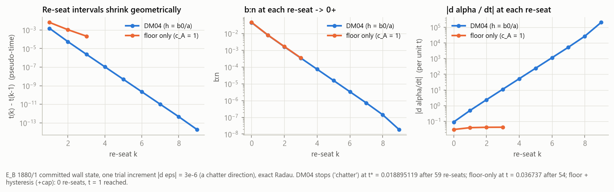
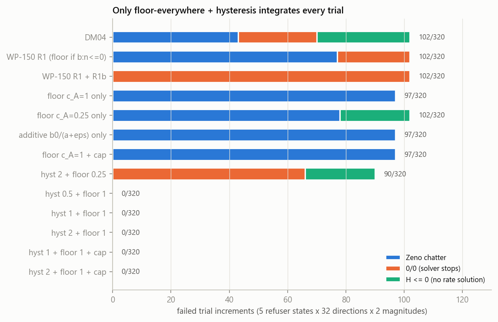
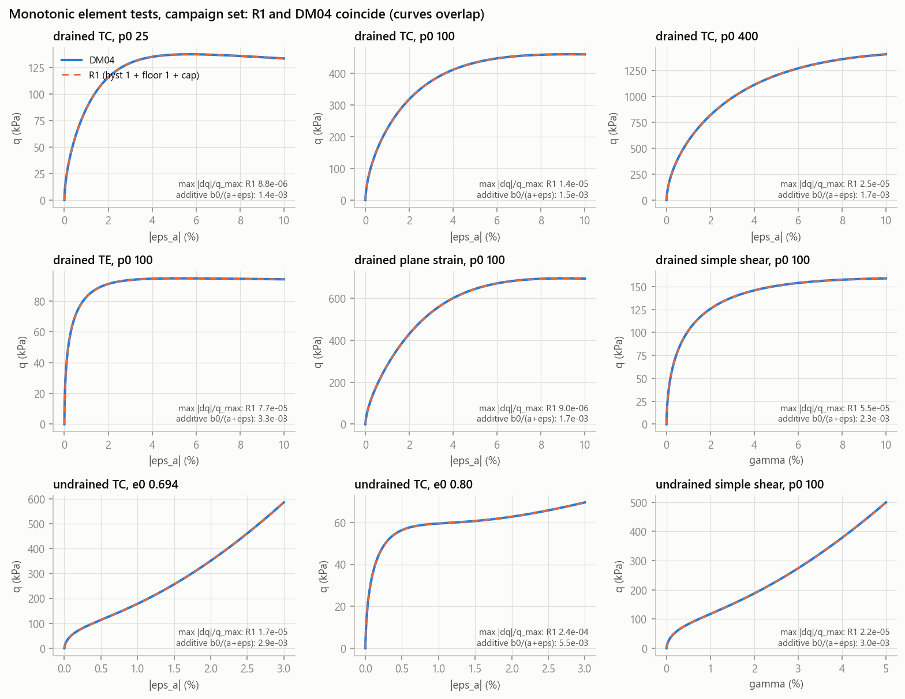
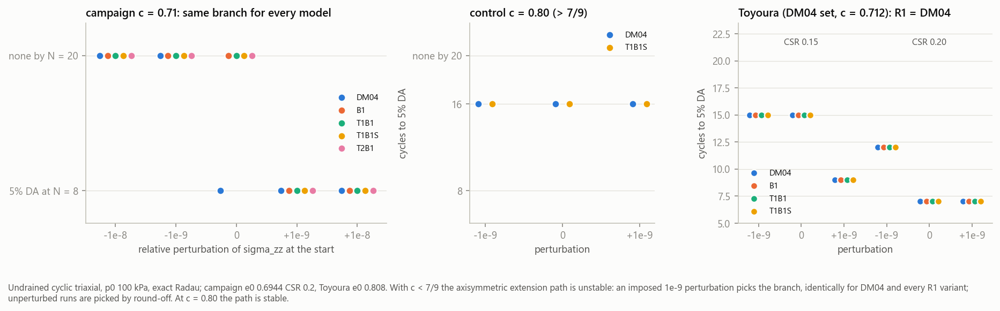
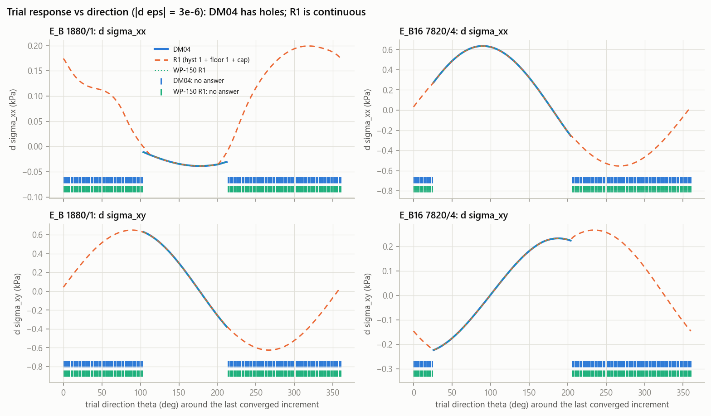
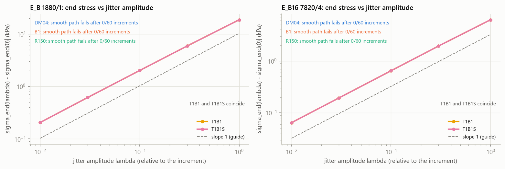

# WP-151 — The SANISAND α_in re-seat singularity: a model-intrinsic fix (R1)

> [!summary] The short version
> 1. **The wall is a singularity of the DM04 rate equations themselves, and it is a *Zeno* one.** Integrated
>    exactly (WP-134 oracle, Radau), a trial increment from a real wall state re-seats α_in at pseudo-times
>    1.7e-2, 1.5e-3, 5.6e-5, 2.4e-6, 1.1e-7, … : the re-seats **accumulate at a finite t\***, while b:n → 0⁺
>    (4.5e-2 → 1.9e-8, ×0.2 per re-seat) and |dα/dt| → ∞ (0.09 → 2e5, ∝ 1/b:n). H ≤ 0 is only the b:n < 0 exit of
>    that sequence. Mechanism: after a re-seat h = ∞ makes α slide along b; with b nearly normal to n that slide
>    rotates n on the thin yield cone (radius √(2/3)m = 0.004), (α−α_in):n turns negative again, and the next
>    re-seat follows (§2).
> 2. **SAS-ME's `loadingNonPosH` is that singularity, one-to-one.** On the five real wall states (E_B 1880/1,
>    1879/1; E_D 1962/1, 2058/1; E_B16 7820/4) × 32 directions × 2 Newton-scale magnitudes, today's C++ refuses
>    **exactly** the 102/320 trials where the exact oracle fails, and accepts exactly the 218 where it
>    integrates (§2.3). The integrator is faithful; the model has no answer there.
> 2b. **The Lode parameter c moves the singular set; it does not remove it.**
>    - At the campaign's c = 0.71 (< 7/9), every wall refuser has n on the extension side, where the bounding
>      surface is concave. Those states are regular at c = 0.80 (0/320 failures vs 102/320).
>    - But a c = 0.80 footing walls anyway (`C080_EB_off`: first NonPosH at s/B 0.0416, stopped at 0.0480).
>      Its refusers are on the compression side (cos3θ ≈ +0.65), and exact DM04 runs the same Zeno sequence
>      there: 119/576 trials fail, R1 0/576 (§2.5.1).
>    - **Recalibrating c is not a way out; R1 is.** The footing's bands are a separate, compression-side matter
>      (WP-150).
> 3. **Neither piece works alone.** Bounded h alone: 97/320 still fail (Zeno). WP-150's floor gated on b:n ≤ 0:
>    102/320 (the blow-up is on the b:n → 0⁺ side). The hysteretic re-seat alone leaves h = ∞ (or < 0) in its
>    band. **Floor everywhere + hysteretic re-seat: 0/320**; with the softening cap also 0/320 and H ≥ ½X
>    guaranteed (§5).
> 4. **The fix (R1), three opt-in flags** (ρ_c = √(2/3)·m, the yield-cone radius):
>    - `-sasHFloor c_A`: h = b0 / max((α−α_in):n, c_A·ρ_c);
>    - `-sasReseatHyst c_rev`: α_in re-seats only when (α−α_in):n < −c_rev·ρ_c (a *finite* reversal);
>    - `-sasSoftCap κ`: where b:n < 0, h ≤ (1−κ)X / (⅔ p |b:n|), so H ≥ κX.
>
>    Recommended **c_A = 1, c_rev = 1, κ = 0.5**, no fitted parameter (c_A, c_rev in units of the calibrated m).
> 5. **What it changes vs DM04 (§6):** monotonic TC/TE/plane-strain/simple shear, drained and undrained,
>    p 25–400 kPa: |Δq| ≤ 2.7e-4·q_max, peak ≤ 1e-5 relative; drained cyclic (stiffness, damping, ε_v)
>    identical to 4 digits; undrained cyclic cycles-to-liquefaction identical. The WP-128 reproducer is
>    unchanged (η 0.534, ρ_α 0.251). The cap never binds in any element test.
> 6. **The CTXu "outlier" is DM04's own bifurcation, not R1 (§6.3, a separate TIMs finding).** With c = 0.71
>    < 7/9 the Lode interpolation is non-convex on the extension meridian; the axisymmetric extension path is
>    unstable and a 1e-9 perturbation decides whether a dense-sand CTXu test liquefies at N = 8 or not by N = 20,
>    **for DM04 and R1 alike**. At c = 0.80 the path is stable and R1 = DM04 exactly (N = 16 = 16).
> 7. **Near-neutral jitter (§7):** every jittered chain completes (DM04: 1–2 of 5); the response to a trial
>    increment is continuous in its direction (DM04 has no answer in 126/181 directions around the last converged
>    one at E_B 1880/1 — including that direction itself); the end state is Lipschitz in the jitter amplitude
>    (slope 1.00).
> 8. **No recalibration** is needed for anything measured here, and recalibrating c would not remove the wall
>    (2b). The C++ opt-in (§9) is on this branch. Footing acceptance so far (§9):
>    - q–s within ±0.22 % of E_B below s/B 0.03;
>    - floor + hysteresis has 0 `loadingNonPosH` past E_B's onset, on B/8, B/16 and B/4 (to s/B 0.127);
>    - the shape past E_B's wall (0.0508) is still pending.

Tags: **[E]** read in the source, **[E-sec]** via a secondary source, **[R]** recollection, not re-verified,
**[I]** inference/derivation here. Every number without a tag is **measured** by a script in
`Ladruno_files/testbed/sanisand_reseat_r1/` (§11) and saved under its `out/`.

---

## 1. Scope and method

- **Model.** DM04 (Dafalias & Manzari 2004) with the UW constitutive additions U1–U5 and the *paper's* α_in rule,
  i.e. WP-134's `uw_model` oracle — the model SAS-ME (IntScheme 129) integrates. Campaign set (TIMs attachments):
  G0 264.32, ν 0.312885, e_init 0.6944, Mc 1.3309, c 0.71, λc 0.027, e0 0.83, ξ 0.45, P_atm 101, m 0.005, h0 1.3,
  ch 0.968, nb 3.5, A0 0.05, nd 5.75, z_max 12.5, c_z 1100, p_min 0.0101.
- **Oracle, not a new integrator.** `sanisand_r1/` is a copy of `Ladruno_scripts/sanisand_reference` (WP-134,
  @ 6cef73cc8) with the R1 mechanisms as `Options` toggles, **all OFF by default**. With them off it is
  bit-identical to the committed oracle (`check_identity.py`: 13 cases incl. the 1950/3 0/0 stop, max |Δ| = 0).
  The committed package is not edited. `r1_vs_wp134.diff` is the full change.
- **States.**
  (a) the five `loadingNonPosH` refusers at the Esmeralda walls — committed states rebuilt bit-for-bit from the
  WP-138 field checkpoints into `data/refuser_states.csv` (σ_zz recovered from ψ and e as the deck does);
  (b) b8 1950/3 and 1950/2 (inadmissible, ρ_α 7.3/6.8) and WP-128's smallest reproducer;
  (c) element tests from isotropic states.
- **The C++ side** (§2.3, §9) runs `ladrunoSANISANDReplay` on the WP-138 E_B material (IntScheme 129, TanType 0,
  TolR 1e-4, `-maxSubsteps 2000`, `-Pmin 0.0101`, `-flipAlphaIn init`).

## 2. The singular set

### 2.1 The wall states

| state | s/B | p kPa | η | ρ_α | ρ_b (θ of n) | a/ρ_c | b:n | cos3θ_n |
|---|---|---|---|---|---|---|---|---|
| E_B 1880/1 | 0.0508 | 366.1 | 1.681 | 0.958 | 1.306 | +0.05 | 0.193 | −1.00 |
| E_B 1879/1 | 0.0508 | 334.4 | 1.677 | 0.949 | 1.174 | −0.39 | 0.030 | −0.36 |
| E_D 1962/1 | 0.0410 | 12.85 | 1.883 | 0.953 | 1.078 | −1.20 | 0.029 | +0.13 |
| E_D 2058/1 | 0.0410 | 3.46 | 1.864 | 0.935 | 0.937 | −0.77 | 2.889 | +0.77 |
| E_B16 7820/4 | 0.0135 | 50.35 | 1.785 | 0.926 | 1.238 | −0.81 | 0.046 | −0.88 |

(a = (α−α_in):n at the committed normal; ρ_c = √(2/3)m = 4.08e-3.)

What the table says:
- **α_in sits within about one cone radius of α at every refuser** (|a| ≤ 1.2 ρ_c; |α| 1.37–1.54). α_in was
  re-seated a moment ago. That is the chatter signature (E_B: 10.1 M re-seats, 88 M rejected reversals).
- **ρ_b > 1 while ρ_α < 1** at four of five: n points to an extension-side Lode angle where the (non-circular,
  c = 0.71) bounding image is closer than it is along α. So b:n can be small or negative for an α that is
  inside its own bounding surface.
- All are dense (ψ ≈ −0.1) and pre-peak in the ρ_α sense, as WP-150 found.

### 2.2 The Zeno accumulation of re-seats — mechanism and scaling

Notation: a = (α−α_in):n, β = b:n, X = 2G − K D n:r (the elastic part of the loading denominator,
H = K_p + X), N the loading numerator, ρ_c = √(2/3)m. DM04 has h = b0/a and re-seats α_in := α when a < 0
(the paper's rule, as WP-134 integrates it). At a re-seat a = 0 and h = ∞. The exact continuous extension is
L = aN/H_s, hL = b0N/H_s, with H_s = ⅔ p b0 β + aX (WP-134 fact (c)).

**The sequence [I, derived here; confirmed by the trace below].**
1. At a re-seat, L = 0 and hL = N/(⅔ p β): no plastic strain, α moves along b at the consistency rate, with
   n:dα = N/p. The tangential part of that motion, dα_⊥ = (N/p)(b_⊥/β), grows like 1/β.
2. On the cone f = ‖r−α‖ − ρ_c = 0 the normal n = (r−α)/ρ_c rotates with dn ≈ −dα_⊥/ρ_c. So:
   - d a/dt = N/p − |dα_⊥|²·t/ρ_c + … : a rises, then falls back through 0 after τ ≈ ρ_c β² p/(N|b_⊥|²);
   - dβ/dt ≈ −(N/p)|b_⊥|²/(β ρ_c): β² decreases linearly and reaches 0 in finite time.
3. So each re-seat interval scales like β², β shrinks every cycle, the intervals shrink geometrically, and the
   re-seats accumulate at a finite t\* where β → 0⁺ and |dα/dt| ∝ 1/β → ∞. The thin cone (m = 0.005) makes the
   rotation term large; that is why the campaign set meets it so readily.

**Measured** (`zeno_trace.py`, E_B 1880/1, one trial increment |dε| = 3e-6 along a chatter direction), fig. 1:

| re-seat k | 1 | 2 | 3 | 4 | 5 | 6 | 7 | 8 | 9 | 10 |
|---|---|---|---|---|---|---|---|---|---|---|
| t_k − t_{k−1} | 1.7e-2 | 1.5e-3 | 5.6e-5 | 2.4e-6 | 1.1e-7 | 5.0e-9 | 2.3e-10 | 1.1e-11 | 4.8e-13 | 2.0e-14 |
| b:n | 4.5e-2 | 7.9e-3 | 1.6e-3 | 3.4e-4 | 7.3e-5 | 1.6e-5 | 3.4e-6 | 7.2e-7 | 1.4e-7 | 1.9e-8 |
| \|dα/dt\| | 0.09 | 0.49 | 2.4 | 11 | 52 | 246 | 1.2e3 | 5.4e3 | 2.7e4 | 2.1e5 |

After k = 10 the interval is below double precision in t, and the oracle stops (`chatter`: 51 zero-length
segments) at t\* = 0.0188951191, having counted 59 re-seats. b:n falls ×0.2 per re-seat, |dα/dt| grows ×4.7
(∝ 1/b:n), and the intervals shrink ×0.04 (∝ (b:n)²), as the scaling above predicts. Meanwhile n stays at a
fixed extension-side Lode angle (cos3θ = −0.77, ρ_b = 1.26).



### 2.3 The C++ refusal is the same set, one-to-one

`cxx_fan.py` replays the same 320 trials through today's SAS-ME (a build with the `origin/ladruno` SANISAND
sources):

| exact oracle (DM04) | → C++ SAS-ME | count |
|---|---|---|
| ok | ok | 218 |
| H ≤ 0 (no rate solution) | `loadingNonPosH` | 32 |
| Zeno chatter | `loadingNonPosH` | 43 |
| 0/0 (solver stops) | `loadingNonPosH` | 26 |
| 0/0 (solver stops) | `errorAtDTmin` | 1 |

Every trial the model cannot integrate, SAS-ME refuses; every trial it can, SAS-ME takes. On the refused ones
the census shows the chatter: median 3 re-seats (max 9) and 20 rejected reversals (max 44) inside the one
update. Put plainly: the WP-129 integrator is doing its job, and the wall is in the model.

### 2.4 Why each partial fix fails

- **A bounded h alone** (h = b0/max(a, ε), with or without the cap). The α-rate is bounded, but the geometric
  argument of §2.2 still holds with τ ∝ β (not β²). The re-seats still accumulate as β → 0⁺. In the
  continuum a Filippov continuation exists (α_in slides with α, h = b0/ε) [I]. But an event-driven or
  substepping integrator has to take an unbounded number of re-seats to follow it. The oracle stops
  (`chatter`, 97/320), and SAS-ME's image of it is the rejected-reversal cascade (cuts to dT_min).
- **A floor only where b:n ≤ 0** (WP-150's first form). On the b:n > 0 side DM04 is untouched. There
  hL = N/(⅔ p b:n) → ∞ as b:n → 0⁺, exactly where the Zeno sequence goes. 102/320 fail, the same as DM04.
- **A hysteretic re-seat alone.** In its band −δ ≤ a < 0 DM04's h = b0/a is negative (WP-128 mechanism G),
  or the SAS-ME sentinel 1e10 (= ∞). The band inherits the singularity. With WP-150's floor it gives 102/320,
  all 0/0.
- **Floor everywhere + hysteresis.** Two re-seats now need a < −δ, a finite excursion that takes a bounded
  α-rate a finite time. The re-seats cannot accumulate. The floor keeps h finite and positive in the band.
  0/320.
- **The cap** closes what a fixed floor cannot: deep softening at low p, where b0 ∝ p^−½ makes b0/ε large and
  ⅔ p (b0/ε)|b:n| can exceed X (b8 1950/3: b:n = −0.09 at p = 0.35 kPa gives H → 0⁺ with the floor alone).

### 2.5 The Lode side: c < 7/9 selects WHERE the footing meets the singular set, not WHETHER

> [!warning] Corrected 2026-09-28 (after the c = 0.80 footing leg)
> This section first concluded that the non-convex extension side makes the wall states singular, and offered
> a recalibration to c ≥ 0.78 as a second route out. The c = 0.80 footing walls anyway, on compression-side
> states that are singular for DM04 in the same way (§2.5.1). The measurements below stand. The generalization
> does not.

WP-150's acoustic-tensor split (#892 §2.3, `lode_split.py`) found a clean separation on the footing:
- **The localization bands are compression-side.** Among the non-elliptic (det ≤ 0) points, cos3θ(n) spans
  +0.68 … +0.80 at E_B's wall and +0.51 … +0.79 at E_B16's (5–95 %). Only 0.09 % and 0.14 % of them are on the
  extension side (cos3θ < −0.5).
- **At c = 0.71, the wall refusers have n on the extension side** (cos3θ = −1.00, −0.36, −0.88).

The same wall fan was therefore rerun with the Lode parameter changed alone (`fan_c080.py`, DM04, exact
oracle, the SAME committed states and trials):

| state | ρ_α / ρ_b at c = 0.71 | failed at c = 0.71 | ρ_α / ρ_b at c = 0.80 | failed at c = 0.80 |
|---|---|---|---|---|
| E_B 1880/1 | 0.957 / 1.306 | 34/64 | 0.945 / 1.158 | **0/64** |
| E_B 1879/1 | 0.949 / 1.174 | 18/64 | 0.937 / 1.075 | **0/64** |
| E_D 1962/1 | 0.953 / 1.078 | 16/64 | 0.938 / 1.015 | **0/64** |
| E_D 2058/1 | 0.935 / 0.937 | 0/64 | 0.919 / 0.920 | 0/64 |
| E_B16 7820/4 | 0.926 / 1.238 | 34/64 | 0.913 / 1.104 | **0/64** |
| all | | **102/320** | | **0/320** |

- With a convex Lode interpolation (c = 0.80 > 7/9), not one trial **at these states** chatters, hits the 0/0,
  or reaches H ≤ 0. This holds although ρ_b(θ_n) is still above 1 at four of the five states.
- So at these states the Zeno sequence of §2.2 needs the concave extension meridian. A first explanation
  [I] was that once the image point α^b(θ_n) moves as n rotates, the meridian's curvature decides the sign of
  dβ/dt. **It does not generalize.** The same sequence runs on compression-side states at c = 0.80 (§2.5.1).
  The concave meridian is one way into the singular set, not a condition for it.
- **Caveat, now answered.** These are c = 0.71 states driven at c = 0.80, so they measure sensitivity. The
  c = 0.80 footing followed its own history and met other singular states (§2.5.1).
- **Footing-scale corroboration (WP-138 ladders, final, orchestrator 2026-09-28).** Every ablation and ladder
  leg still ends on the `loadingNonPosH` floor.
  - The ablations: S1 no fabric, S2 no peak, S3 critical-state dilatancy, S4 dilatancy off (A0 = 0.001).
  - The ladders: A0 0.02/0.10, h0 ×3, P_residual 0.5–20 kPa, e_init 0.65–0.85.
  - First onsets fall between s/B 0.009 (h0 ×3) and 0.054. Dilatancy off only delays the onset, from 0.036 to
    0.043; the leg still walls at 0.050.
  - So the wall is not a dilatancy effect. The c = 0.80 leg walls too (§2.5.1), so it is not the Lode
    calibration either. Only the R1 legs pass.
- **One route out: R1** (§8). It removes the singular set at any c, with no recalibration. It is verified at the
  material point at c = 0.71 (§5) and c = 0.80 (§2.5.1), and on the c = 0.71 footing (§9).
- c ≥ 0.78 remains a separate calibration question: it fixes DM04's CTXu ill-conditioning (§6.3), not the wall.
- The bands are a separate, compression-side matter (WP-150 R2/R3).

#### 2.5.1 The c = 0.80 footing walls too (the recalibration route fails at footing scale)

`C080_EB_off` is the orchestrator's Esmeralda leg: E_B settings with c = 0.80 and R1 OFF, build bd93c558d. I
re-read its numbers from its own `summary.json` and `log.log` on Esmeralda:
- The first `loadingNonPosH` comes at s/B 0.0416, at q 975 kPa (E_B: 0.0363).
- The run stops (FLOOR) at s/B 0.0480, at q 1084 kPa (E_B walls at 0.0508).
- Refusals: 82 `loadingNonPosH`, 287 `maxSubsteps` and 1 `errorAtDTmin`. sasStats counts 9.9 M α_in re-seats
  (E_B: 10 M).
- Where the refusers are:
  - the final wall (steps 307–308): 1.5–2.0 m deep, just outside the footing's left edge (x −0.79 … −0.90 m;
    the edge is at −0.75 m);
  - earlier (steps 248–306): 0.2–0.35 m deep, 0.2–0.5 m outside both edges.

The exact oracle, run at c = 0.80 on the committed states at the last converged step (308)
(`fan_c080_bvp.py`, the §5.1 fan, 32 directions × {3e-6, 3e-5}):

| state (ele/gp) | p (kPa) | η | cos3θ(n) | (α−α_in):n / ρ_c | b:n | ρ_α | DM04 fails | floor alone fails | R1 fails |
|---|---|---|---|---|---|---|---|---|---|
| 1833/4 | 112.5 | 1.83 | +0.665 | 0.09 | 0.27 | 1.002 | 30/64 | 26/64 | 0/64 |
| 1834/4 | 112.6 | 1.83 | +0.651 | 0.94 | 0.85 | 1.001 | 30/64 | 22/64 | 0/64 |
| 1832/4 | 103.6 | 1.84 | +0.671 | 0.16 | 0.28 | 1.001 | 30/64 | 24/64 | 0/64 |
| 1832/2 | 89.7 | 1.85 | +0.660 | 0.02 | 1.29 | 1.004 | 29/64 | 25/64 | 0/64 |
| 1817/1,2; 1973/1,2; 1829/3 (the earlier refusers) | 27–170 | 1.82–1.91 | +0.63 … +0.79 | 2.5–21 | 1.7–2.9 | 0.97–1.00 | 0/64 each | 0/64 each | 0/64 each |
| all | | | | | | | **119/576** | **97/576** (chatter) | **0/576** |

- **They are on the compression side** (cos3θ = +0.63 … +0.79). The convex/concave question does not arise
  there, and the range is WP-150's band range (+0.68 … +0.80).
- **It is the same singularity.** The final-wall states have just re-seated (a ≤ one cone radius), with α on
  the bounding surface (ρ_α ≈ 1.00). One failing trial from 1833/4 (norm 3e-6) shows the sequence
  (`out/fan_c080_bvp_trace.json`):
  - re-seats at t = 0.037, 0.282, 0.3112, 0.31255 and 0.3125583;
  - b:n falls 0.235 → 0.027 → 2.8e-3 → 1.7e-4 → 3.8e-6;
  - |dα/dt| grows 6.7e-3 → 20.8;
  - the exact solver fails at the accumulation point t* ≈ 0.31256. This is §2.2's sequence.
- The earlier refusers have moved on by step 308 (a = 2.5–21 cone radii) and are regular there, as expected.
- **R1 clears all of them.** Floor + hysteresis, with or without the cap, gives 0/576 with at most one re-seat
  per trial. Floor alone chatters (97/576, 54–56 re-seats), as it does at c = 0.71.

**So c ≥ 7/9 removes the c = 0.71 wall states, not the singular set.** The c = 0.80 footing meets
compression-side singular states a little later (onset at 0.0416 vs 0.0363) and still walls (0.0480 vs
0.0508). Recalibrating c is not a way out. R1 is, at any c. It is verified at the material point for
c = 0.80; no c = 0.80 + R1 footing leg was run.

## 3. Literature: how bounding-surface models handle the reversal singularity

The full survey is `Ladruno_files/testbed/sanisand_reseat_r1/R1_literature_survey.md`, with every source,
its URL and what was paywalled. What follows is the part that bears on the decision.

**DM04 itself** (paywalled; secondary sources, several co-authored by Dafalias) [E-sec]:
- h = b0/((α−α_in):n), with α_in updated when the denominator of h becomes negative (as Jeremić et al. 2008
  restate it), following Dafalias (1986).
- h = ∞ at the initiation of loading is intended (Taiebat & Dafalias 2008, p. 926).
- α outside the bounding image (b:n < 0) during softening is standard DM04 behaviour (Yang, Taiebat & Dafalias
  2022, p. 232) [E].
- The over-stiff response after small reversals ("overshooting") has been known since Dafalias (1975)
  (Taiebat & Dafalias 2015) [E].

**What the family and the production codes do**, most established first:

| mechanism | who | form | tag |
|---|---|---|---|
| bounded reversal distance (additive) | PM4Sand v2–v3.3, PM4Silt (FLAC, OpenSees) | K_p = G h0 √(b:n) / (exp(x_app) − 1 + C_γ1), **C_γ1 = h0/200** "to avoid division by zero"; with C_γ1 = 0, K_p = ∞ at every loading start | [E] manuals |
| bounded reversal distance (additive) | Pisanò's SANISAND-MS PLAXIS UDSM | h = b0/(\|x\| + 0.001) (cites PM4Sand), h ≤ 1e7 | [E] |
| code floor / cap | OpenSees SAniSandMS; legacy UCD DM04 | x ≥ 1e-10, h ≤ 1e7 | [E] source |
| memoryless h (no α_in in h) | Taiebat & Dafalias (2008) SANISAND | h = b0 / [(3/2)((b_ref − b):n)²]: dropped α_in partly because it is hard to implement implicitly | [E] |
| memoryless h + blend | **Chen, Ghorbani, Zhang & Kodikara (2022)**, C&G 152:105008 | softplus ratio h = (b0/ϑ) ln(1+e^(b:n)) / ln(1+e^((α−α^b_θ+π):n)), K_p blended with tanh across reversals | [E] |
| reversal threshold (hysteresis) | Pisanò UDSM; Itasca P2PSand; Limnaiou & Papadimitriou (2022) | re-seat only if x < −1e-6; `ratio-reverse` = 0.02; "informal" reversals until a tolerance | [E]; [E]; [E-sec] |
| unloading alone is not a reversal | SANISAND-F (Petalas et al. 2020) | re-seat only if the NEW n gives x ≤ 0 | [E] |
| plastic-strain-weighted memory | Dafalias (1986); SANISAND-Z (2016); Kan & Taiebat (2014) | α_in weighted by m = ⟨1 − (ε_q^p/ε̄_q^p)^j⟩, ε̄ = 0.01 % | [E-sec] |
| positive floor after spurious reversals | **Ghorbani et al. (2023)**, Comput. Mech. 71:385 | after a trivial reversal x := J^r m_q > 0 (for "spurious oscillations"); it cut iterations and CPU in FE contact runs | [E] |
| apparent α_in | PM4Sand v3+ | α_in^app from the component-wise history, C_rev; α_in at init ≤ 0.9 M^b (without it, a start above the bounding surface has K_p = 0 at zero distance and cannot evolve: a
zero-distance degeneracy like ours) | [E] |
| K_p sign | PM4Sand v3.3 | K_p = 0 outside the bounding surface; "This restriction on the plastic modulus improved numerical stability" | [E] |
| model-intrinsic cancellation | SANISAND-MSf (Yang et al. 2022) eqs. 9–10 | a vanishing denominator in the memory-surface h^M is cancelled by reformulating with \|·\|, ⟨·⟩, sgn | [E] |
| no memory reset at all | Hashiguchi subloading surface | normal-yield ratio R; the plastic modulus is singular only at the elastic core, not at a reversal | [E] |

**The closest precedents to our failure:**
- **Chen, Ghorbani, Zhang & Kodikara (2022), §3.9.1** [E].
  - Where it was read: Chapter 3 of Chen's published-works thesis (Monash 2023,
    [doi:10.26180/23639730.v1](https://doi.org/10.26180/23639730.v1), pp. 3-37–3-39). The thesis's declaration
    and the chapter preamble state that the chapter *is* this paper, with sections not renumbered. The journal PDF
    itself was not accessed.
  - The case: a SANISAND04 plane-strain **flexible footing** on loose Karlsruhe sand (e0 0.98; 288 quadratic
    elements; 120 kPa).
  - The result: the coarsest time step completes. At finer steps the stress "overshooting" becomes pronounced
    and **the analysis aborts**, and a tighter stress tolerance aborts it too. The authors attribute it to the
    sudden drop of (α − α_in):n to zero.
  - Their Dafalias–Taiebat threshold variant (SANISAND-ZO) fixes the coarser cases but fails at the finest.
    Their explanation: h takes two very different values (finite and infinite) at the same state, and small
    substeps resolve that discontinuity instead of stepping over it.
  - **What it does and does not establish** [I]. It is the same singular factor aborting a SANISAND04 footing,
    with the same insensitivity to refinement (in WP-138 the wall does not move with the step size, and B/16
    walls earlier). It is a loose sand with an "overshooting" symptom, and b:n is not analysed. So it is not
    evidence for this memo's specific mechanism (the Zeno sequence with b:n → 0⁺ on the non-convex extension
    side).
  - They also show that a threshold scheme can still fall back to h = ∞ after its weighted update. The
    everywhere floor of §8 is what rules that out here.
- **Ghorbani, Chen, Kodikara, Carter & McCartney (2023)**, Comput. Mech. 71:385 [E].
  - Spurious reversals from numerical oscillations re-seat α_in so that (α−α_in):n = 0, which makes the plastic
    modulus very large.
  - They keep a positive (α−α_in):n after trivial reversals.
  - [I] That removes the h = ∞ spike while leaving genuine reversals to the plain rule.
- **Pisanò & Jeremić (2014)**: a distance-based reversal test near the bounding surface "can be easily
  corrupted even by numerical inaccuracies".
- **Jeremić et al. (2008)**: an explicit step across the yield cone is evaluated with the derivatives of the
  wrong side. [I] That is acute for m = 0.005.

**The gap** [E-absence, three independent sub-searches]:
- No source treats a re-seat (h = ∞) coinciding with b:n ≤ 0, i.e. ∞·(negative) or the 0/0 limit.
- No source describes the Zeno accumulation of §2.2.
- No source treats re-seats driven by global Newton iterates.

The nearest analyses are Chen et al.'s MD97 reversal during softening (h < 0, K_p ≪ 0) and PM4Sand's two
separate provisions (C_γ1, and K_p ≥ 0).

**How R1 relates** [I]:
- R1 combines three established ingredients, each at a scale tied to the calibrated m: a positive floor on the
  reversal distance (the max form, so it is DM04 exactly beyond one cone radius, unlike PM4Sand/Pisanò's
  additive constants, which move h everywhere), a reversal threshold, and a softening cap.
- The cap is milder than PM4Sand's K_p ≥ 0: it keeps DM04's softening and only bounds it at H ≥ κX.
- The combination is what closes the gap. The threshold alone falls back to the singular h at its re-seats,
  as Chen et al. show; the floor alone leaves the Zeno sequence (§2.4). Together, a re-seat can only reset the
  hardening to b0/(c_A ρ_c), and it can only happen after a finite reversal.
- For scale: PM4Sand's C_γ1 keeps K_p/G ≈ 200√(b:n) at a restart. R1 with c_A = 1 gives K_p/G ≈ 23·(b:n) for
  the campaign set, and DM04 itself reaches that value after one cone radius of α travel. So the floor acts
  only over the first ~ρ_c of travel (about 2e-6 of strain at p = 100 kPa), which is why §6 cannot see it.

## 4. The candidates

All on top of `uw_model` (DM04 + U1–U5, paper α_in rule, continuous moduli), in the oracle copy:

| name | h | α_in re-seat | softening cap |
|---|---|---|---|
| DM04 | b0/a (exact extension at a = 0) | a < 0 | — |
| B1 / B0.25 | b0/max(a, c_A ρ_c), c_A = 1 / 0.25 | a < 0 | — |
| Badd1 | b0/(⟨a⟩ + ρ_c) (PM4Sand's C_γ1, linearised) | a < 0 | — |
| B1S | b0/max(a, ρ_c) | a < 0 | κ = 0.5 |
| R150 | WP-150 R1: b0/max(a, ρ_c) only where b:n ≤ 0, else DM04 | a < 0 | — |
| R150+T1 | as R150 | a < −ρ_c | — |
| T*c_rev*B*c_A* | b0/max(a, c_A ρ_c) | a < −c_rev ρ_c | — |
| T*c_rev*B*c_A*S | as above | a < −c_rev ρ_c | κ = 0.5 |

## 5. (a) The singular states

### 5.1 The wall fan

5 wall states × 32 Fibonacci directions (plane strain, Mandel-scaled) × {3e-6, 3e-5} (the Newton-iterate scale:
the last converged increment at E_B is ~3e-6):

| variant | failed / 320 | kind | min H/X over the fan |
|---|---|---|---|
| DM04 | 102 | 43 Zeno chatter, 27 0/0, 32 H ≤ 0 | — |
| R150 (WP-150 R1) | 102 | 77 chatter, 25 0/0 | 0.29 |
| R150+T1 | 102 | 102 0/0 | 0.30 |
| B1 (floor only) | 97 | chatter | 0.29 |
| B0.25 | 102 | chatter + H ≤ 0 | 0.66 |
| Badd1 | 97 | chatter | — |
| B1S (floor + cap) | 97 | chatter | 0.5 |
| T2B0.25 (ε too small) | 90 | 0/0 + H ≤ 0 | 0.23 |
| T1B0.5 | 41 | 0/0 + H ≤ 0 | 0.04 |
| **T0.5B1, T1B1, T2B1** | **0** | — | 0.17 |
| T1B2 | 0 | — | 0.61 |
| **T1B0.5S, T1B1S, T2B1S, T1B2S** | **0** | — | 0.5 |



**Sensitivity.** c_rev ∈ {0.5, 1, 2} all pass (with c_A = 1). Without the cap c_A must be ≥ 1 (0.5 fails
41/320, 0.25 fails 90/320). With the cap c_A ∈ {0.5, 1, 2} all pass. min H/X grows with c_A (0.04 / 0.17 / 0.61)
and the cap floors it at κ. At most one re-seat per trial with the hysteresis (42 in 320 trials at c_rev = 1,
0 at c_rev = 2).

### 5.2 The named states

| state / probe | DM04 | R150, R150+T1 | T1B1 (no cap) | T1B0.5S / T1B1S / T1B2S |
|---|---|---|---|---|
| WP-128 reproducer, dε_yy 1e-5 / 1e-4 / 3e-4 (p_s 0.0101) and 1e-4 (p_s 1) | η 0.317 / 0.534 / 0.601 / 0.317; ρ_α 0.147 / 0.251 / 0.287 / 0.149 | identical | identical | identical |
| b8 1950/2, isoComp and shear, δ 1e-5 / 1e-4 / 1e-3 | ok (ρ_α 4.0–6.7) | identical | identical | identical |
| b8 1950/3, isoComp, all δ | ok (ρ_α 4.4–6.2) | identical | identical | identical |
| **b8 1950/3, shear, δ 1e-5 / 1e-4 / 1e-3** | **0/0, stops at the same strain 5.4e-7** | **0/0** | 0/0 (deep softening, H → 0⁺) | **integrates through it**: ρ_α 7.15 / 5.93 / 0.74–0.79, H/X ≥ 0.5 |

The additive (PM4Sand-like) form moves the reproducer by 0.4 % (η 0.532); the `max` form does not move it.
WP-150 §9.1 step 1 asks that 1950/3 shear integrate through the former 0/0; only the variants with the cap do.
The state is inadmissible (ρ_α 7.3), so SAS-ME refuses it at entry anyway (`startAlphaOutsideBounding`).

## 6. (b) Calibrated behaviour

### 6.1 Monotonic element tests

Campaign set, isotropic start, exact integration along the whole path (`b_tests.py`). max |q − q_DM04| over the path,
relative to max q_DM04 (in brackets the first 0.1 % of strain; then the change of the peak):

| test | R1 `max` form (B1 = T1B1 = T2B1 = T*S: no reversal, the cap never binds) | additive b0/(⟨a⟩+ρ_c) |
|---|---|---|
| drained TC, p0 25 | 1.0e-5 [5.9e-5] (+1.5e-8) | 1.4e-3 [6.1e-3] (−9.8e-5) |
| drained TC, p0 100 | 1.6e-5 [1.2e-4] (+1.0e-6) | 1.5e-3 [8.3e-3] (−1.1e-4) |
| drained TC, p0 400 | 2.7e-5 [2.5e-4] (−9.3e-8) | 1.7e-3 [1.2e-2] (−5.0e-4) |
| drained TE, p0 100 | 8.8e-5 [2.1e-4] (−1.7e-8) | 3.3e-3 [8.0e-3] (−2.3e-5) |
| drained plane strain, p0 100 | 9.7e-6 [1.0e-4] (−1.1e-6) | 1.7e-3 [8.8e-3] (−1.7e-4) |
| drained simple shear, p0 100 | 6.1e-5 [2.6e-4] (−1.5e-7) | 2.3e-3 [9.8e-3] (−1.2e-4) |
| undrained TC, e0 0.694 | 1.8e-5 [2.0e-4] (−3.1e-6) | 2.9e-3 [7.3e-3] (−2.9e-3) |
| undrained TC, e0 0.80 | 2.7e-4 [5.2e-4] (−9.1e-6) | 5.5e-3 [1.1e-2] (−5.3e-3) |
| undrained simple shear | 2.4e-5 [3.2e-4] (−2.7e-6) | 3.0e-3 [9.9e-3] (−3.0e-3) |



The `max` form acts only in the first c_A ρ_c of α travel after a (re)start. Along a monotonic path from
α = α_in = 0 that is the first ~0.004 of α. The additive form changes h everywhere by ε/a and is not
recommended.

**c_A sensitivity** (with c_rev 1, κ 0.5). The change scales linearly with c_A:
- max |Δq|/q_max over the nine tests: ≤ 6.6e-5 at c_A 0.5, ≤ 2.7e-4 at c_A 1, ≤ 1.1e-3 at c_A 2 (the loose
  undrained TC is the most sensitive);
- drained-cycle G_sec and damping move by ≤ 2e-4 even at c_A 2.

c_A = 1 is the compromise: it clears the wall fan without the cap, and it changes the calibrated response by
≤ 0.03 %.

### 6.2 Cyclic element tests

| test | DM04 | R1 variants (B1, T1B1, T2B1, T2B1S; and T1B1S) |
|---|---|---|
| drained CSS γ ±0.1 %, 10 cycles: G_sec c1/c10 (kPa), damping c1/c10, ε_v | 1.647e4/1.500e4, 0.1820/0.1931, 2.625e-4 | identical to 4 digits |
| drained CSS γ ±0.5 % | 7266/6700, 0.2291/0.1233, 4.573e-4 | identical |
| drained CTX ε_a ±0.05 %, 6 cycles | 5.818e4/5.990e4, 0.1829/0.1775, 3.255e-4 | identical |
| undrained CTX e0 0.80, CSR 0.10 | runaway at N = 3 | N = 3 |
| undrained CSS e0 0.80, CSR 0.08 | runaway at N = 7 | N = 7 |
| undrained CSS e0 0.694, CSR 0.25, 15 cycles | DA 1.5 %, p 42.9 | identical |
| undrained CTX e0 0.694, CSR 0.20 | 5 % DA at N = 8 | **see §6.3** |

(The additive form shifts the drained cycles by ~1 % in G_sec and damping; the `max` form does not.)

### 6.3 The CTXu gate: a bifurcation of DM04's own extension path (c < 7/9) — a separate finding for TIMs

**The observation.** One cyclic test gave a different outcome under R1 than under DM04: undrained cyclic
triaxial, e0 0.6944, p0 100 kPa, CSR 0.2 (q = ±40 kPa). DM04 reached 5 % double-amplitude strain at N = 8;
the ε = ρ_c `max` variants did not by N = 20 (DA 4.6 %). Taken at face value that is more than 2.5× in
liquefaction resistance, on the campaign's own density. The orchestrator made it a blocking gate.

**What it is.** In the first extension half-cycle, every model — DM04 included — leaves the axisymmetric
extension meridian: cos3θ goes from −1 to about −0.4, and |σ_yy − σ_zz| grows from round-off to 27–40 kPa
(against q_cyc = 40). Which way it breaks is decided by perturbations of 1e-9. The branch then decides the
test:

| σ_zz perturbation (relative) | −1e-8 | −1e-9 | 0 | +1e-9 | +1e-8 |
|---|---|---|---|---|---|
| DM04 | none by N = 20 (4.56 %) | none (4.56 %) | **N = 8** (5.34 %) | N = 8 (5.38 %) | N = 8 (5.38 %) |
| B1, T1B1, T1B1S, T2B1 (each) | none (4.56 %) | none (4.56 %) | **none** (4.58 %) | N = 8 (5.38 %) | N = 8 (5.38 %) |

(`cyc_gate.py`: exact Radau, fresh process per run.)
- **For every imposed perturbation the five models give the same branch and the same N.** Only the
  unperturbed runs differ, and there round-off picks the branch: the ε-floor changes the last bits of the
  path, not its physics.
- DM04 is itself equally split: its own rtol (1e-8/1e-9/1e-10) and ±1e-9 flip it between the two branches
  (`cyc_sensitivity.py`).

**Why [I, derived; confirmed by the control].** DM04's Lode interpolation g(θ) = 2c/((1+c) − (1−c)cos3θ) is a
convex polar curve only if c ≥ 7/9: at θ = 60°, g = c, g′ = 0 and g″ = 4.5c(1−c), so r² − r·r″ ≥ 0 requires
c ≥ 7/9 ≈ 0.78. The campaign set (c = 0.71) and DM04's own Toyoura calibration (c = 0.712) have bounding and
dilatancy surfaces that are **concave on the triaxial-extension meridian**. The axisymmetric extension path is
then unstable.
- **Control**, c = 0.80 (> 7/9), same test: DM04 and T1B1S × {−1e-9, 0, +1e-9} all give N = 16.0,
  DA 5.00 %, |σ_yy − σ_zz| ≤ 1e-7 kPa. The path stays axisymmetric, and R1 = DM04 exactly.
- **Calibration-independent check (Toyoura, A0 0.704**, R1 scaled by its own cone radius), CTXu e0 0.808:

| CSR | perturbation −1e-9 / 0 / +1e-9 → N (DM04, B1, T1B1 and T1B1S, each) |
|---|---|
| 0.15 | 15 / 15 / 9 |
| 0.20 | 12 / 7 / 7 |

  Identical across models. Toyoura breaks symmetry too (|σ_yy − σ_zz| up to 12–24 kPa).



**Verdict.** R1 does not change cyclic liquefaction resistance on either calibration. The CTXu outcome is
ill-conditioned for DM04 itself whenever c < 7/9. This is a **separate calibration item for TIMs**:
- keep c ≥ 0.78, or
- treat axisymmetric-extension element tests (and possibly extension zones in a BVP) as ill-conditioned, and
  report both branches.

The fork holds no CSR–N target for the campaign set. That is flagged among the inputs owed by TIMs (#887).

*Record.* The first gate run used a perturbation wrapper that compounded across tasks in one worker process,
so a few of its per-run labels were wrong. Its conclusion did not change. It is kept as
`cyc_gate_v1_compounded.json`; the table above is the clean rerun.

## 7. (c) Near-neutral jittering loading

From the five wall states, with d0 = the GP's last converged strain increment (`c_jitter.py`):

**Chains** (60 committed increments of |dε| = 3e-6; d_k = unit(d0 + σξ_k) with ξ_k random, σ ∈ {0.3, 1, 3};
and a reversal chain, random ±d0 + 0.3ξ):

| chain | DM04 | B1 | R150 | R150+T1 | T1B1 | T1B1S | T2B1S |
|---|---|---|---|---|---|---|---|
| jitter σ 0.3: increments done / chains complete | 66/300, 1/5 | 66, 1/5 | 66, 1/5 | 66, 1/5 | **300, 5/5** | **300, 5/5** | **300, 5/5** |
| jitter σ 1 | 176, 2/5 | 142, 2/5 | 176, 2/5 | 176, 2/5 | **300, 5/5** | **300, 5/5** | **300, 5/5** |
| jitter σ 3 | 126, 2/5 | 126, 2/5 | 126, 2/5 | 126, 2/5 | **300, 5/5** | **300, 5/5** | **300, 5/5** |
| reversal chain | 127, 2/5 | 127, 2/5 | 127, 2/5 | 127, 2/5 | **300, 5/5** | **300, 5/5** | **300, 5/5** |
| re-seats in the completed chains (per 300 increments) | — | — | — | — | 7–54 | 7–54 | 4–36 |

Non-chattering: with the hysteresis a jittered chain re-seats at most ~0.2 times per increment, even at σ = 3
(random directions). min H/X ≥ 0.21 (0.5 with the cap).

**Continuity of the trial response** (single trial |dε| = 3e-6, 181 directions in the plane of d0; fig. 5):
- DM04 has **no answer in 126/181 directions at E_B 1880/1 and 91/181 at E_B16 7820/4**, including θ = 0, the
  last converged direction itself. That is the wall as Newton meets it.
- WP-150's R1 has the same holes, and B1 nearly the same (96/181 and 90/181).
- T1B1(S) answers all 362 and coincides with DM04 wherever DM04 answers. The response is smooth: the max/median
  slope of dσ(θ) is 1.3–1.4, with no jumps.



**Objectivity** (a fixed noise sequence scaled by λ: d_k = d0 + λξ_k, 60 increments). At λ = 0 (the smooth
continuation of the wall path) DM04, B1, R150 and R150+T1 fail in the **first** increment at both states. With
R1 the smooth path completes, and |σ_end(λ) − σ_end(0)| = 0.206 / 0.616 / 2.01 / 5.90 / 18.6 kPa at
λ = 0.01 / 0.03 / 0.1 / 0.3 / 1 (E_B 1880/1). That is linear in λ (slope 1.00): noise of amplitude λ moves the
answer by O(λ), with no amplification (fig. 6).



## 8. Recommendation

**Adopt R1 as three opt-in SAS-ME options, recommended together: c_A = 1, c_rev = 1, κ = 0.5.**

The modified equations (DM04 in brackets):

- **hardening coefficient** h = b0 / max((α−α_in):n, c_A·√(2/3)·m)   [h = b0/((α−α_in):n)]
- **new loading process** α_in := α when (α−α_in):n < −c_rev·√(2/3)·m   [< 0]
- **softening cap**, where b:n < 0: h := min(h, (1−κ)·X / (⅔ p |b:n|)), X = Q:C:R = 2G(B − C tr n³) − K D (n:α + √(2/3)m)
  (U10's true gradient), so that H = K_p + X ≥ κX   [no cap]

What changes, physically:
1. The start of a new loading process is **stiff but not rigid**. K_p ≤ ⅔ p b0 (b:n)/(c_A ρ_c): for the campaign
   set K_p/2G ≤ 11·(b:n)/c_A, where DM04 has ∞. From one cone radius of α travel on, h is DM04's.
2. **A reversal must be finite.** α must come back by more than c_rev ρ_c along the new loading direction.
   Noise below that scale (Newton iterates, principal-axis jitter) does not restart the loading process. This
   is the classical remedy for bounding-surface over-stiffening after small reversals (§3).
3. **Softening is capped** at H ≥ κX: the strain-driven response at the material point stays unique. In regular
   DM04 softening |K_p| ≪ X and the cap never binds (not once in §6). It binds only near re-seats and in
   deep softening.

**Parameters from TIMs' data.** c_A and c_rev are lengths in units of the yield-cone radius √(2/3)m, which TIMs
calibrated (m = 0.005). Nothing is fitted:
- c_A = 1 is the smallest value that clears the wall fan without the cap. With the cap, 0.5–2 all clear it.
- c_rev ∈ [0.5, 2] all clear it; 1 = one cone radius.
- κ = 0.5 is a well-posedness guard. No element test can see it, because it never binds there.
- If TIMs have small-strain cyclic data (G/Gmax, damping at γ 1e-4–1e-3), §6.2 shows R1 identical to DM04 at
  γ = 0.1 %, below lab resolution. **No recalibration is needed** for anything measured here.

**What R1 does not do.** It removes the singular set, the refusals that come from it, and the re-seat chatter.
It does not remove mesh-dependent localization (WP-150: the bands are non-associated localization from
s/B ≈ 0.01 while still hardening), and it does not change the campaign set's weak dilatancy (WP-150 §10). Those
are R2/R3 and the TIMs calibration question.

## 9. The C++ change (SAS-ME, this branch)

**Deck syntax** (IntScheme 129 only; refused, not ignored, on any other scheme):

```tcl
nDMaterial LadrunoSANISAND $tag {18 model parameters} 129 $TanType $JacoType $TolF $TolR \
    ... -sasHFloor 1 -sasReseatHyst 1 -sasSoftCap 0.5
```
```python
ops.nDMaterial("LadrunoSANISAND", tag, *params, 129, 0, 1, 1e-7, 1e-4, ...,
               "-sasHFloor", 1.0, "-sasReseatHyst", 1.0, "-sasSoftCap", 0.5)
```

Validation: c_A ≥ 0, c_rev ≥ 0, 0 ≤ κ < 1; 0 = OFF, the default. The echo prints the active set.
`eleResponse(…, "material", gp, "sasOptions")` (response id 33101, shared with WP-130's review) returns
the nine SAS-ME options the instance runs: WP-129's six in wire order (errFloor, alphaBoundTol, alphaProject,
alphaInMode, errorVars, alphaEntryTol), then hFloor, reseatHyst, softCap (indices 6–8).

**Where** (every line marked `// Ladruno WP-151`):

| file | change |
|---|---|
| `UWmaterials/ManzariDafalias.h` (vanilla; the WP-129 Ladruno block) | `LadrunoSasOptions`: `hFloor`, `reseatHyst`, `softCap` (default 0); three census columns appended to `LSAS_*` (earlier indices unchanged); `ladrunoSasBracketH(…, b0)`, `ladrunoSasSoftCapH`, `ladrunoSasReseatDelta` |
| `LadrunoSANISANDSasME.cpp` (fork) | floor inside `ladrunoSasBracketH`; the cap in the stage, the drift correction and the continuum tangent (the same X = Q:C:R in all three, so consistency holds); the threshold at the four re-seat decisions: increment start, stage 1, the stage-2 reversal cut, end of substep |
| `LadrunoSANISAND.cpp` (fork) | parser, echo, `sasStats` names, WP-151's three values appended to WP-130's `sasOptions` response (id 33101); send/recv of the three options inside the SAS block (`LWIRE_SAS_OPT_N` 6 → 9) plus the layout tag `LWIRE_TAG` (next row) |
| `Ladruno_scripts/sanisand_replay.py` | `SAS_NAMES` += `hFloored`, `hSoftCapped`, `reseatHeld`. **`sasStats` is now 36 long**, and a consumer that hard-codes 33 breaks: the WP-138 deck driver's census did on Esmeralda, and was fixed there. The in-repo consumers zip against the names. |

**Byte-identity of the default.** With the flags off:
- `ladrunoSasBracketH` takes the WP-129 branch;
- the cap block is skipped;
- δ = 0 turns `x < -δ` into `x < -0.0`, which IEEE evaluates as `x < 0.0`;
- the stage's `H = Kp + 2G(…) − K·D·qv` expression is left verbatim (X is computed separately, only for the cap).

Measured: 643 replays (the wall fan, the 80 ring rows × 4 probes, the reproducer) against a build WITHOUT
WP-151. The flags absent and the flags given as 0 are **bit-identical, 643/643** (win32). The 18 WP-129
existing-scheme decks are unchanged.

**A trap found on the way (LEDGER_quirks).** FE_Datastore keys a sent Vector by its **size** (FileDatastore:
one file per `<size>.<commitTag>`), then by dbTag. The vanilla base sends its state as a `Vector(97)` under
this object's dbTag and commitTag. WP-151's six new entries made the Ladruno block exactly 97 long, so it
**overwrote the base state**: four existing datastore round-trip tests failed (the restored material came back
elsewhere). Fixed with a trailing layout-tag slot (98), a `static_assert` that the block is never 97, and a
warning when the tag does not match on receive.

**Tests** (`tests/test_ladruno_sanisand_reseat_r1.py`, 15 cases, ~3 s):

| gate | measured |
|---|---|
| (a) OFF byte-identical (flags absent; flags = 0) | 643/643 each |
| (b) negative control: OFF refuses the wall fan | 102/320, all `loadingNonPosH` except 1 `errorAtDTmin` |
| (c) R1 ON: 0 refusals; end stress vs the exact oracle of the modified model | 0/320 (with and without the cap); median 2.8e-4, max 3.3e-3 relative (TolR 1e-4) |
| (d) each piece alone does not clear the fan | floor alone 87/320 (`maxSubsteps`: 113 k re-seats, 61 k rejected reversals, the Zeno cascade discretized); hysteresis alone 102/320 |
| (e) census columns | 0 when OFF; ON: 14 k floored stages, 533 capped, 7 k held reversals |
| (f) parser | bad values and non-129 schemes refused |
| (g) monotonic undrained TC chain, ON vs OFF | < 1e-3 q_max |
| (h) the options cross the datastore wire | skeleton rebuilt WITHOUT the flags, restored → the flags come back; restored stress = saved to 1e-12 |

Regression: all 18 SANISAND/ManzariDafalias test files, 176 passed, 5 skipped, 2 xfailed (win32, the final build).
Static gates green: classtags, manifest, header stamp, quirk lint L1–L8.

**Cost.** On the fan with R1, the median is 29 substeps per update (DM04: 23 on the updates it accepts), and
rejected reversals fall 2946 → 1117 while re-seats fall 410 → 42. Not measured at BVP scale; that is the
Esmeralda matrix.

**Acceptance (the orchestrator's Esmeralda matrix; the owner decides).** E_B (B/8) and E_B16 (B/16) with
(i) floor + hysteresis, (ii) floor alone, (iii) hysteresis alone, (iv) floor + hysteresis + cap, at c_A 1,
c_rev 1, κ 0.5. The oracle and the replays predict:
- (i) and (iv) remove `loadingNonPosH`;
- (ii) turns it into `maxSubsteps`;
- (iii) leaves it.

The physical acceptance is WP-150 §9.1:
- q–s unchanged up to E_B's first NonPosH (s/B < 0.036) within the SAS-ME error band;
- then what happens past 0.0508 (peak, plateau or continued hardening), judged against dense-sand physics.

**Interim footing result** (orchestrator, Esmeralda, 2026-09-28 ~21:00; bd93c558d, GCC 11.4; E_B settings).
The gate at s/B < 0.03 is MET. q_R1 − q_E_B, relative, at matched s/B (linear interpolation of `steps.csv`):

| s/B | 0.005 | 0.010 | 0.020 | 0.030 |
|---|---|---|---|---|
| E_B q (kPa) | 160.16 | 286.40 | 494.53 | 672.71 |
| floor alone | −0.01 % | −0.01 % | +0.17 % | −0.12 % |
| hysteresis alone | +0.00 % | +0.01 % | +0.09 % | −0.22 % |
| floor + hysteresis | −0.01 % | −0.00 % | +0.16 % | −0.05 % |
| floor + hysteresis + cap | −0.01 % | −0.00 % | +0.16 % | −0.05 % |

- Every leg is within ±0.22 %, with mixed sign: inside the ModifiedEuler-vs-SAS-ME curve band (0.5–0.64 %).
- The cap never binds below 0.03 (fhc ≡ fh).
- For scale, the mesh-orientation legs of WP-150 R2 differ by +3.75 % / +10.3 % (a mesh skewed 15°) and
  +2.05 % / +4.03 % (jittered nodes) at s/B 0.020 / 0.030. Mesh dependence, not R1, dominates.
- Refusals so far: no `loadingNonPosH` on any leg. The floor-only leg shows the discretized Zeno cascade
  (553 `maxSubsteps` census lines vs 79–87), as predicted.
**Onset-stage result** (orchestrator ~22:00). I re-read every number from the runs' own `steps.csv`,
`logs/log.log` and `summary.json` on Esmeralda (read-only, 22:05–22:15). References: E_B (DM04, c = 0.71) has
its first `loadingNonPosH` at s/B 0.0363 and walls at 0.0508; E_B16 walls at 0.0135.

| leg (E_B settings; B/8 unless noted) | first `loadingNonPosH` (s/B) | reached (s/B) | q there (kPa) | status |
|---|---|---|---|---|
| floor + hysteresis (fh) | none | 0.0429 | 872 | running |
| floor + hysteresis + cap (fhc) | none | 0.0419 | 857 | running |
| floor alone (f) | none | 0.0417 | 855 | running; 572 `maxSubsteps` mentions in the log vs 91 for fh and fhc |
| hysteresis alone (h) | **0.0362** | 0.0441 | 886 | running; 11 NonPosH lines |
| B/16: fh / fhc / f | none | 0.0137 / 0.0134 / 0.0132 | 353 / 346 / 343 | running (fh is past E_B16's wall) |
| B/16: h | **0.0095** | 0.0133 | 346 | running |
| B/4 (WP-150 R2), fhc | none | **0.1273** | 2160 | stopped (FLOOR) by low confinement, not the re-seat set |
| c = 0.80, R1 off (`C080_EB_off`) | **0.0416** | **0.0480** | 1084 | stopped (FLOOR): 82 NonPosH + 287 `maxSubsteps` + 1 `errorAtDTmin` refusals |

- **All three predictions hold so far:**
  - fh and fhc remove `loadingNonPosH` on B/8 (past E_B's onset), on B/16 (fh past E_B16's wall) and on B/4
    (to s/B 0.1273, 2.5× E_B's wall).
  - Floor alone turns it into `maxSubsteps` (0 NonPosH).
  - Hysteresis alone leaves it: its first NonPosH comes at 0.0362, the same as E_B.
- **The B/4 leg stops for a different reason.** One shallow point just outside the footing (ele 488 gp 4 at
  x −1.42 m, y −0.08 m) refuses on `errorAtDTmin` and `maxSubsteps` (plus 2 `tensionAtDTmin`), with no
  `loadingNonPosH`. That is the low-confinement surface failure (p′ → 0), the same class as the Toyoura
  p_r = 0 floor: a p′-floor question for the deck (TIMs D1), not the re-seat set.
- **The c = 0.80 control walls too**, on compression-side states where exact DM04 runs the same Zeno sequence
  and R1 clears all 576 oracle trials. Changing c is not a fix for the wall (§2.5.1).
- Still to come:
  - the R1 legs past 0.0508: peak, plateau or continued hardening (WP-150 §9.1);
  - the cost per unit s/B vs E_B;
  - B/16 past its wall.

## 10. Open items and not verified

- **BVP acceptance not run yet** (the Esmeralda matrix above; the orchestrator launches it). Everything here
  is at the material point: exact oracle, plus C++ single-increment replays.
- **Not tested beyond the wall states.** The fan covers five real wall states. The singular set is general
  (§2.2), and the flags act wherever a re-seat happens, so the E_B q–s comparison before s/B 0.036 is the real
  test of "no change where DM04 is regular".
- **Not implemented:** R1 for ModifiedEuler (IntScheme 1), CPPM (2) or vanilla ManzariDafalias. By the owner's
  decision, SAS-ME only; vanilla untouched.
- **Consistent tangent.** SAS-ME returns the continuum tangent at the end state. The floor and the cap enter it
  (bounded h), and nothing else changes.
- **The c < 7/9 finding** (§6.3) is measured on triaxial extension only. Whether the non-convex extension
  meridian also seeds localization in the footing's extension zones is not studied (WP-150 R2/R3 territory).
  It is not the cause of the wall (§2.5.1).
- **R1 at c = 0.80** is verified at the material point only (§2.5.1: 0/576 on the c = 0.80 footing's own wall
  states). No c = 0.80 + R1 footing leg was run.
- **Literature.** DM04's own text was paywalled; its statements here are [E-sec]. The Zeno analysis of §2.2 is
  a derivation here [I], confirmed by the exact integration; no source found describes it.
- **A lint rule** for the size-keyed datastore trap is not added: it is not greppable in general (sizes are
  arithmetic). The `static_assert` enforces it for this class.

## 11. Reproduce

From `Ladruno_files/testbed/sanisand_reseat_r1/` (CPython 3.11 with numpy + scipy; the C++ legs use the fork's
CPython 3.12 with `-S`, see `Ladruno_internal/BUILD_GOTCHAS.md` §4):

```
py -3.11 check_identity.py <worktree>             # toggles OFF == the WP-134 oracle
py -3.11 a3_fan.py 32                             # (a) the wall fan, every variant    (~12 min)
py -3.11 a12_ring_reproducer.py                   # (a) 1950/3, 1950/2, the reproducer (~3 min)
py -3.11 zeno_trace.py                            # fig. 1
py -3.11 b_run.py && py -3.11 b_analyse.py        # (b) element tests                 (~7 min)
py -3.11 cyc_gate.py && py -3.11 cyc_toyoura.py   # (b) the CTXu gate                  (~20 min)
py -3.11 c_jitter.py                              # (c) chains, objectivity, continuity (~30 min)
py -3.11 r1plots.py zeno fan mono gate continuity objectivity
py -3.12 -S cxx_check_wp151.py <worktree>         # the C++ build: byte-identity, refusals, vs oracle
```

Tests: `py -3.12 -m pytest tests/test_ladruno_sanisand_reseat_r1.py`, with `PYTHONPATH=<worktree>\dist\bin;<3.12
site-packages>`. The site-packages entry is needed because the WP-129 byte-identity child runs `-S`.

## References

(Full list with URLs and access notes in `Ladruno_files/testbed/sanisand_reseat_r1/R1_literature_survey.md`.)

- Boulanger, R.W. & Ziotopoulou, K. (2012, 2015, 2023). *PM4Sand (Versions 2, 3, 3.3).* Reports UCD/CGM-12/01,
  15/01, 23/01; *PM4Silt (Version 2.1)*, UCD/CGM-23/02.
- Chen, L., Ghorbani, J., Zhang, C. & Kodikara, J. (2022). Stress overshooting solution for soil plasticity
  models. *Computers and Geotechnics* 152:105008. doi:10.1016/j.compgeo.2022.105008.
- Chen, L. (2023). *Modelling of hydro-mechanical shakedown and ratcheting of unsaturated granular materials.*
  PhD thesis (including published works), Monash University. doi:10.26180/23639730.v1. Chapter 3 = Chen et al.
  (2022); §3.9.1 (the footing) read there, pp. 3-37–3-39.
- Dafalias, Y.F. (1986). Bounding surface plasticity. I: Mathematical foundation and hypoplasticity. *J. Eng.
  Mech.* 112(9):966–987.
- Dafalias, Y.F. & Manzari, M.T. (2004). Simple plasticity sand model accounting for fabric change effects.
  *J. Eng. Mech.* 130(6):622–634.
- Dafalias, Y.F. & Taiebat, M. (2016). SANISAND-Z: zero elastic range sand plasticity model. *Géotechnique*
  66(12):999–1013.
- Duque, J., Yang, M., Fuentes, W., Mašín, D. & Taiebat, M. (2022). Characteristic limitations of advanced
  plasticity and hypoplasticity models for cyclic loading of sands. *Acta Geotech.* 17:2235–2257.
- E-Kan, M. & Taiebat, H.A. (2014). On implementation of bounding surface plasticity models with no
  overshooting effect in solving boundary value problems. *Computers and Geotechnics* 55:103–116.
- Ghorbani, J., Chen, L., Kodikara, J., Carter, J.P. & McCartney, J.S. (2023). Memory repositioning in soil
  plasticity models used in contact problems. *Comput. Mech.* 71:385–408. doi:10.1007/s00466-022-02245-z.
- Hashiguchi, K. (2015). Complete formulation of the subloading surface model. *COUPLED PROBLEMS 2015*,
  CIMNE, 837–848.
- Jeremić, B., Cheng, Z., Taiebat, M. & Dafalias, Y.F. (2008). Numerical simulation of fully saturated porous
  materials. *IJNAG* 32(13):1635–1660.
- Liu, H.Y., Abell, J.A., Diambra, A. & Pisanò, F. (2019). Modelling the cyclic ratcheting of sands through
  memory-enhanced bounding surface plasticity. *Géotechnique* 69(9):783–800.
- Petalas, A.L., Dafalias, Y.F. & Papadimitriou, A.G. (2020). SANISAND-F: Sand constitutive model with evolving
  fabric anisotropy. *Int. J. Solids Struct.* 188–189:12–31.
- Pisanò, F. & Jeremić, B. (2014). Simulating stiffness degradation and damping in soils via a simple
  visco-elastic-plastic model. *Soil Dyn. Earthq. Eng.* 63:98–109.
- Taiebat, M. & Dafalias, Y.F. (2008). SANISAND: Simple anisotropic sand plasticity model. *IJNAG*
  32(8):915–948.
- Yang, M., Taiebat, M. & Dafalias, Y.F. (2022). SANISAND-MSf: a sand plasticity model with memory surface and
  semifluidised state. *Géotechnique* 72(3):227–246.
- Sloan, S.W., Abbo, A.J. & Sheng, D. (2001). Refined explicit integration of elastoplastic models with
  automatic error control. *Eng. Comput.* 18(1/2):121–154.
