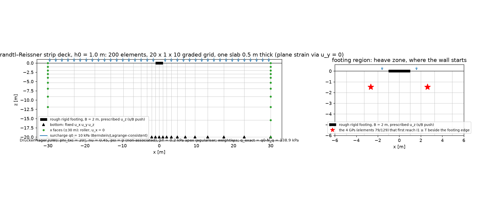
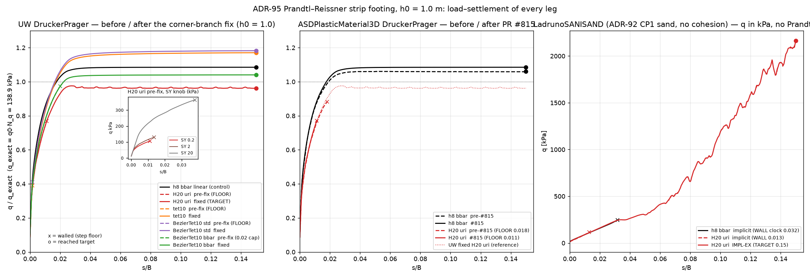
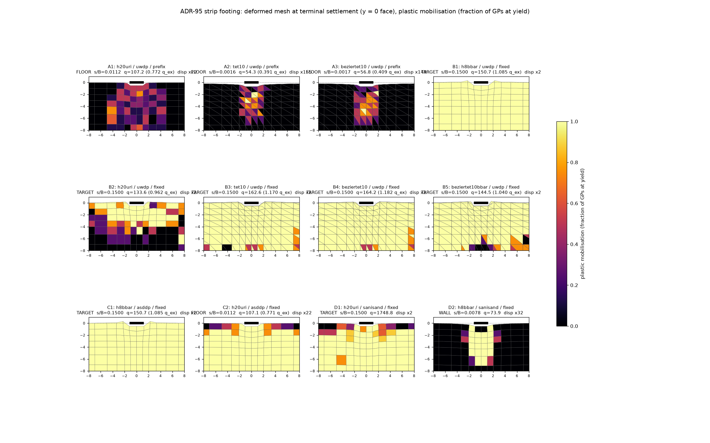
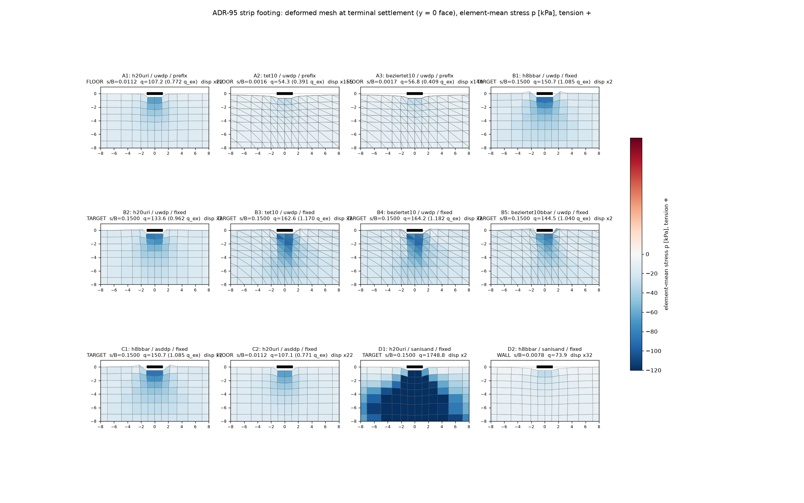
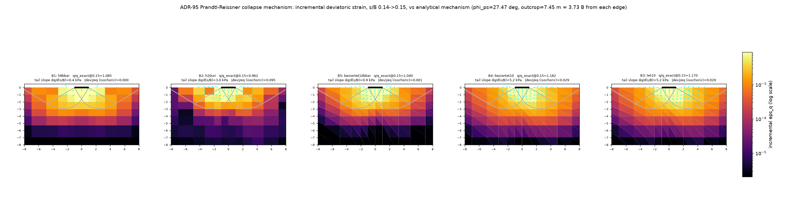

# The Prandtl–Reissner campaign: why every quadratic element walled, and what each material does at the footing edge

**Illustrated report, 2026-09-08.** Companion to the results note `95_prandtl_reissner_quadratic_root_cause.md`
and its phase records; branch `wp/95-prandtl-bezier-root-cause`, PR #803. Figures live in
`Ladruno_files/testbed/hypo_bearing/adr95_*.png`.

## 1. Summary

Two earlier campaigns (notes 81–83) found that every quadratic element in the fork — the 20-node
Lagrange hex, the 10-node Lagrange tet and the Bernstein–Bézier tet — stopped on the step-floor of
the path controller at 30–77 % of the exact Prandtl–Reissner collapse load, while the linear b-bar
hex reached a plateau at the exact answer. Four element-side explanations were tested and
eliminated; dynamic relaxation showed the wall lived in the Newton path; the tangent event that
caused it was never identified.

This campaign identified it. **The wall was a coding defect in the vanilla UW `DruckerPrager`
material's two-surface return map**: the tension-cutoff residual was never assembled, so the first
Gauss points beside the footing edge to reach the cutoff kept an unreturned stress and a
pathological consistent tangent. Only quadratic elements resolve that tensile spot, which is why
only they hit it. With the return map repaired every element in the fork plateaus. The same
physical trigger was then found to expose a different weakness in each of the fork's other two
constitutive models.

| element (h0 = 1.0 m) | before the fix | after the fix (s/B = 0.15) |
|---|---|---|
| LadrunoBrick -bbar (linear, control) | 1.085, plateau | 1.085, plateau, unchanged |
| LadrunoBrick20 -uri (quadratic hex) | floor at s/B 0.011, 0.77 | **0.976**, plateau |
| TenNodeTetrahedron | floor at s/B 0.0016, 0.39 | 1.170, plateau |
| BezierTet10 std | floor at s/B 0.0017, 0.41 | 1.182, plateau |
| BezierTet10 -bbar | 0.97 at its 0.02 cap | **1.040**, plateau |

Ratios are q/q_exact with q_exact = 138.9 kPa. Coarse-mesh over-strength (1.04–1.18 at two elements
across the footing) is the gate's known from-above convergence and is not part of the claim.

## 2. The benchmark

**Problem.** A rough rigid strip footing of width B = 2 m on a weightless, frictional,
cohesionless half-space under a uniform surcharge q0 = 10 kPa, pushed down under displacement
control to s/B = 0.15. Plane strain: one 0.5 m slab with u_y = 0 everywhere, a 60 × 20 m box
(14.5 B clearance each side, 10 B below), bottom fixed, side faces on rollers. The soil is
weightless so the only bearing term is the surcharge term.

**Reference solution (Prandtl 1920, Reissner 1924).** For a weightless frictional soil the exact
collapse load is

    q_u = q0 · N_q,     N_q = e^{π tan φ} · tan²(45° + φ/2).

The mechanism is an active Rankine wedge under the footing with faces at 45° + φ/2, a log-spiral
fan r(θ) = r0 · exp(θ tan φ) centred at each footing edge, and a passive Rankine wedge at
45° − φ/2 reaching the free surface. The material is a Drucker–Prager cone fitted to triaxial
compression at φ_txc = 20°; the plane-strain friction angle that cone implies, which the oracle
uses, is φ_ps = 27.47°. With it N_q = 13.89, **q_exact = 138.9 kPa**, and the mechanism geometry is:
wedge depth (B/2)·tan(58.7°) = 1.65 m, fan radius r0 = 1.93 m, passive outcrop 7.45 m = 3.73 B from
each footing edge.

**Material parameters (UW DruckerPrager).** E = 45 000 kPa, ν = 0.45, φ_txc = 20°, non-associated
with ψ = 0 (isochoric plastic flow), perfect plasticity, σ_y = 0.2 kPa as an apex regulariser (not a
soil property). That last value puts the cone's tension cutoff at I1 = √(2/3)·σ_y/ρ = 0.82 kPa,
essentially zero mean stress.

**Mesh.** A 20 × 1 × 10 graded tensor grid, 200 elements at h0 = 1.0 m, two elements across the
footing, growing geometrically outward and downward. The same grid carries the 8-node and 20-node
hexes; the tet legs use a plane-strain tet10 mesh of the same box (7 749 DOF, 1 200 elements).
The surcharge is applied as consistent nodal loads in each element's own basis — Lagrange for
Lagrange elements, Bernstein (q·A/6 on every face node) for the Bézier tet — after an earlier
finding that Lagrange-consistent loads on Bézier control points put a 190 % oscillation into the
surface stress while reproducing the resultant exactly.

## 3. Campaign design

The plan was pre-registered before any leg ran (`95_prandtl_reissner_quadratic_root_cause_plan.md`).
The question was narrowed to one observable: *what changes at the Gauss points between the last
healthy Newton state and the wall?* Three hypotheses, each with a prediction and a knob:

- **H1, a Drucker–Prager branch switch.** The UW material has two surfaces, the cone and a tension
  cutoff. Prediction: a step change in the number of Gauss points on the cutoff or corner branch at
  the wall, and none in the linear control. Knob: raise σ_y so the cutoff recedes.
- **H2, loss of ellipticity.** Non-associated flow at ν = 0.45. Prediction: the acoustic-tensor
  determinant crosses zero at the wall. Knob: lower ν.
- **H3, Newton algebra alone.** Both of the above smooth; the residual localises at the footing
  edge.

Phases: **P0** instrument the material with a read-only per-Gauss-point response (branch, plastic
multipliers, trial yield values, first invariant, minimum acoustic determinant); **P1** sample it at
every Gauss point along the known trajectory with stations every 5·10⁻⁶ of s/B across the event;
**P2** the confirmatory knob; **P3** transfer the identity to the tet elements; **P4** the fix and
the decisive re-run; then cross-checks on the other two materials, a red/blue adversarial review of
the note, and the full three-resolution gate on the merged branch.

Standing rules: no walled number is quoted as a capacity; controls run first; every conclusion
rests on states at matched settlement, not on loads; every quoted leg is repeated on a second build.

## 4. Materials tested

| material | apex / tension handling | what this deck exposed |
|---|---|---|
| **UW DruckerPrager** (vanilla OpenSees, 2011) | cone + tension cutoff at I1 = T, second multiplier | the cutoff residual arm was unreachable (`Jact(i) == 2` with flags 0/1): multiplier ≡ 0, cutoff never enforced, corner tangent pathological; also the radial-return term divided by the returned instead of the trial deviatoric norm. **Fixed** in this campaign; upstream master still carries both. |
| **ASDPlasticMaterial3D** DruckerPrager (fork, ADR-94) | single cone, apex projection made live by PR #815, region test `p − p_apex ≥ η·q` | its linear control now matches UW to the printed digit (the 2.2 % offset was #815's gradient bug); the quadratic leg still walls at the same station because the Euclidean region test sends zero-dilatancy over-apex states to a flank map that cannot move p. **Open**, an ADR-94 follow-up. |
| **LadrunoSANISAND** (ADR-86/92) | no cohesion, undefined at p ≤ 0, `-Pmin` floor | no apex to return to: the substepper's cost explodes as p → 0 and the implicit legs drown before any point reaches the apex; IMPL-EX finishes with the floor holding the edge points at +0.1 kPa. A **cost** singularity, already floored. |

## 5. Element formulations

| element | nodes / DOF | basis | integration | volumetric relief | fully-plastic rank loss (H4) |
|---|---|---|---|---|---|
| LadrunoBrick -bbar | 8 / 24 | trilinear Lagrange | 2×2×2 | mean-dilatation B-bar | 6 → 7 zero singular values |
| LadrunoBrick20 -uri | 20 / 60 | serendipity Lagrange | 2×2×2 (C3D20R-type) | uniform reduced | 12 → 20 |
| LadrunoBrick20 std | 20 / 60 | serendipity Lagrange | 3×3×3 | none | 6 → 10 |
| TenNodeTetrahedron | 10 / 30 | quadratic Lagrange | 4-point | none | refused (NaN pivot) |
| BezierTet10 std | 10 / 30 | quadratic Bernstein (control values) | 4-point | none | 6 → 10 |
| BezierTet10 -bbar | 10 / 30 | quadratic Bernstein | 4-point | element-wide mean dilatation | 9 → 13 |

The Bernstein tet differs from the Lagrange tet only in its basis: its DOFs are control values,
so Dirichlet data and consistent loads must be expressed in that basis. Everything else that was
suspected of it in earlier campaigns — the constraint ratio, the isochoric span, the tet geometry,
the basis itself — was measured not to be binding. The one element-technology property that this
campaign left standing is rank loss of reduced-integration elements once all their Gauss points
yield (perfect plasticity gives each point a rank-5 tangent): real, measured, secondary, and
visible in the results as a mottled yield field and a 9.5 % spurious volumetric increment in the
H20 uri collapse mechanism.

## 6. What the instrumentation found

Sampling every Gauss point of the H20 uri leg (P1, build with the corrected acoustic-tensor map,
repeated on a second build):

| s/B | q/q_exact | GPs on cone | GPs on cutoff/corner | min normalised det A | σ_min / scale |
|---|---|---|---|---|---|
| 0.0100 | 0.74 | 189 | 0 | −0.067 | 2.3·10⁻⁴ |
| 0.011075 | 0.767 | 174 | 0 | −0.062 | 2.2·10⁻⁴ |
| 0.011125 | 0.769 | 209 | 0 | −0.064 | 2.3·10⁻⁴ |
| 0.0111375 (wall) | 0.769 | 258 | **4** | **−6.6·10⁷** | garbage |

The four corner points sit at x = ±2.64 m, z = −1.5 m, the first element row beside each footing
edge, with I1 = 0.80–0.98 kPa ≥ T = 0.82 kPa and a second plastic multiplier of exactly zero. The
pathological determinant is on exactly those four. The linear control never produced a single
cutoff or corner point over its whole path (I1 min −263 kPa). H2 was dead on arrival: every plastic
Gauss point is non-elliptic in *both* elements at ψ = 0, ν = 0.45, and the linear element completes
the collapse carrying four hundred of them. The forced-accept bailout never fired.

The source review then located the defect (`_adr95_corner_tangent_review.md`), the fix was written
with a central-difference check of the corner tangent in all six Voigt directions, and the decisive
leg went from a floor at s/B 0.011 to a plateau at 0.15. The SY knob on the unfixed material moved
the wall monotonically outward (0.011 → 0.0135 → 0.038 for σ_y 0.2 → 2 → 20 kPa), each wall carrying
the same four corner points; it is consistent with H1 but not an independent falsifier, since it
moves the very quantity the defect triggers on. The fix is the independent confirmation.

## 7. Load–displacement

Left: UW DruckerPrager. Every dashed pre-fix quadratic curve ends in a cross while still rising;
every solid post-fix curve runs to s/B 0.15 and flattens. The inset is the σ_y knob. Middle: ASD-DP,
whose linear control lies on the UW control after #815 while its quadratic leg walls before the
fixed UW curve has begun to bend. Right: SANISAND in kPa, no Prandtl oracle; the two implicit legs
stop while hardening and agree with IMPL-EX to about 4 % where they overlap; the IMPL-EX curve
never plateaus and its late upturn coincides with the `-Pmin` floor saturating.

Canonical plateau metrics on the repaired material (harness tail slope as a fraction of the initial
slope): linear b-bar 0.0004 %, H20 uri −0.0015 %, Bézier b-bar 0.0035 %, tets 0.018 %. Wall times
for the plain push to s/B 0.15 on an idle box: 31 s (linear hex), 8 min (H20 uri, 1 051 failed
attempts around the corner points), 8–12 min (tets, zero failed attempts), 5 min (SANISAND IMPL-EX),
while SANISAND implicit costs fifty times more per attempt and stops at s/B 0.008.

## 8. FEM fields

Deformed meshes at each leg's terminal settlement (displacements scaled so the footing reads
0.5 m), coloured by the fraction of Gauss points at yield. The walled pre-fix legs (top row) show a
narrow plastic column under the footing and an elastic surface beside it: a mechanism cut off at
40–77 % of its load. The repaired legs (middle row) are at yield across the whole near field with
heave beside the footing. The H20 uri field is mottled with unyielded pockets, the reduced-
integration signature; every other element yields uniformly. The ASD quadratic leg (bottom row)
stops in the same state as the unfixed UW leg. The implicit SANISAND linear leg, stopped by cost at
s/B 0.008, shows the same narrow column as the unfixed DP legs.

The element-mean stress field spans −120 kPa under the footing to a few kPa at the far surface; no
element mean reaches tension. The tensile spot that triggers everything is a handful of Gauss
points inside the first element row beside the footing edge, which only the per-point census sees.

The collapse mechanism: incremental deviatoric strain between s/B 0.14 and 0.15 (the velocity
field at the plateau, log colour), the velocity quiver, and the analytical Prandtl mechanism for
φ_ps = 27.47° dotted. Every element collapses by a shear mechanism of the Prandtl extent, out to the
7.5 m passive outcrop. None localises: the strain ridge is two to three elements thick and no leg
draws the fan or the wedge faces, because there are one to two elements across the whole fan at
this resolution. The isochoric check separates the formulations: the two b-bar elements are exactly
isochoric (volumetric-to-deviatoric increment 0.000 and 0.001, as ψ = 0 demands), the standard tets
carry 3 % spurious volumetric increment, and the H20 uri carries 9.5 %.

## 9. Decisions and what remains

- The fix to the vanilla material is in (`31322a47a`), with ledger rows, twenty new tests, and the
  full three-resolution gate green (11/11) on the merged branch. The gate's associated-flow control
  had to be revised: its "must not plateau" premise was the defect itself (dilatant flow reaches
  the cutoff earlier); it now asserts that the two flow rules give distinct answers, which they do
  (1.60 versus 1.085).
- Upstream OpenSees master still carries both DruckerPrager defects: an upstream PR candidate.
- ASD-DP's apex classification needs the elastic-metric test, or a flank-first-then-apex fallback:
  an ADR-94 follow-up with a pre-registered prediction already on record.
- SANISAND has no return-map defect on this deck; its cost singularity at low pressure is floored
  by `-Pmin` and IMPL-EX is the affordable path.
- Not claimed: mesh convergence of the quadratic plateaus, deficit B on more than one mesh pair,
  any shear band (a band on this mesh would be a mesh artefact), and the late SANISAND curve.
- Owed by others: TIMs' Bézier legs re-run on the repaired material; the owner's Zone-A dispatch
  and ready-flip of PR #803.

## 10. Files

Note and records: `95_prandtl_reissner_quadratic_root_cause.md`, `_adr95_p0..p4_results.md`,
`_adr95_corner_tangent_review.md`, `_adr95_h4_rank_results.md`, `_adr95_asd_crosscheck_results.md`,
`_adr95_sanisand_crosscheck_results.md`, `_adr95_mechanism_results.md`,
`reviews/adr95_redblue_review.md`. Harnesses in `Ladruno_files/testbed/hypo_bearing/`:
`quad_path_diag.py`, `tet_path_diag.py`, `asd_path_diag.py`, `sanisand_path_diag.py`,
`deformed_snapshot.py`, `mechanism_snapshot.py`, `p1_plastic_rank.py`, `run_adr95_legs.cmd`.
Tests: `tests/test_adr95_dp_branch_response.py`, `tests/test_adr95_dp_corner_fix.py`,
`tests/test_r3_prandtl_collapse_gate.py`.
