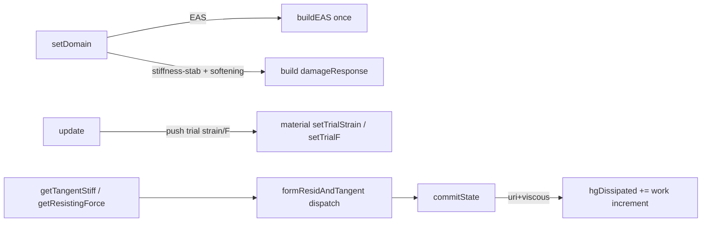

# LadrunoBrick — Theory, Implementation & Usage Reference

> [!abstract] One-paragraph summary
> **`LadrunoBrick`** is the Ladruno fork's *unified* 8-node hexahedral (trilinear)
> solid element. Instead of forcing the analyst to pick a different element
> **class** for each anti-locking trick, it exposes the formulation as a single
> **`-formulation`** selector — `std` (full integration), `bbar` (mean-dilatation
> B-bar), `uri` (1-point reduced integration + hourglass control), `eas`
> (enhanced assumed strain) — and an *orthogonal* **`-geom`** selector for the
> kinematic regime — `linear`, `corot` (large rotation / small strain), `finite`
> (large strain, updated-Lagrangian / F-bar). One class, one `classTag`
> (**33002**), one command. It reproduces the upstream `Brick`/`bbarBrick`/
> `SSPbrick` bit-for-bit where they overlap, adds the missing cheap explicit hex,
> and is carved into three "seams" so large-rotation and large-strain kinematics
> drop in without a kernel rewrite.

**Source:** `SRC/element/ladrunoBrick/{LadrunoBrick.h, LadrunoBrick.cpp, OPS_LadrunoBrick.cpp, CMakeLists.txt}`
**Design plan:** [[09_ladruno_brick]]  ·  **Concrete/softening guide:** [[11_brick_asdconcrete_integration]]  ·  **Geometry layer:** [[solid_transformation_wrapper]]  ·  **Finite-strain materials:** [[09_finite_strain_material_wrapper]]

---

## Table of contents

1. [[#1 · Why this element exists]]
2. [[#2 · The element at a glance]]
3. [[#3 · Continuum & FE foundations]]
4. [[#4 · Volumetric locking and the B-bar cure (`bbar`)]]
5. [[#5 · Reduced integration, hourglass modes and their control (`uri`)]]
6. [[#6 · Assumed-strain stabilization — the `physical` hourglass]]
7. [[#7 · Enhanced Assumed Strain (`eas`)]]
8. [[#8 · The geometry seam — `linear` / `corot` / `finite`]]
9. [[#9 · Damage-scaled stabilization (softening support)]]
10. [[#10 · OpenSees implementation]]
11. [[#11 · Intended use cases & decision guide]]
12. [[#12 · Validation status]]
13. [[#13 · Limitations & roadmap]]
14. [[#14 · References]]

---

## 1 · Why this element exists

The upstream OpenSees 8-node `Brick` (`SRC/element/brick/Brick.cpp`) is a correct
textbook trilinear hexahedron — and it carries the textbook *limitations*. The
fork needed one solid element that is **verifiable**, **explicit-ready**,
**recorder-native**, and **future-proof**. The four motivating gaps:

> [!warning] The four drivers
> 1. **Volumetric locking** near incompressibility ($\nu\to0.5$, $J_2$ plasticity
>    on the isochoric yield surface, saturated/undrained soil). Full integration
>    of the volumetric constraint $\nabla\!\cdot\mathbf u = 0$ over-stiffens the
>    element. The cure (`bbar`) lived in a **separate class** (`bbarBrick`) — you
>    had to rebuild the model to switch.
> 2. **Shear / parasitic-bending locking** in bending-dominated regimes — **not**
>    cured by B-bar. The brick family had no enhanced-strain or reduced-integration
>    hex to fix it.
> 3. **No cheap explicit hex.** Only full $2\times2\times2$ Gauss existed. Explicit
>    dynamics — the fork's direction ([[05_robust_central_difference]]) — wants a
>    1-point hex with hourglass control ($\sim 8\times$ cheaper internal-force
>    evaluation, the LS-DYNA workhorse).
> 4. **A real upstream bug.** `Brick::setParameter` loops `for (i=0;i<4;i++)` over
>    `theDamping[i]`, but that array has **8** entries — damping objects 4–7 never
>    receive the parameter (a copy-paste from the 4-node quad). `LadrunoBrick`
>    does **not** inherit it (loops `i<8`).

### Design rule — one selector, not four booleans

`-formulation` is a *single selector*, not four independent flags. Most boolean
combinations are redundant or contradictory:

- **B-bar $\equiv$ selective ("partial") integration of the volumetric term**
  (Hughes 1980) — the same element stiffness, two derivations. So `bbar`
  *presupposes* a fully-integrated deviatoric part and **cannot** combine with
  `uri` (1-point).
- A selector makes invalid states unrepresentable.

The reward for the bit-for-bit *reproduction* goal: because v1 is small-strain,
the assembled stiffness of `std`/`bbar`/`eas` is **provably identical** to
`Brick`/`bbarBrick`/`SSPbrick`. That overlap is the correctness anchor.

---

## 2 · The element at a glance

### Command

```python
element('LadrunoBrick', eleTag, n1,n2,n3,n4,n5,n6,n7,n8, matTag
        [, '-formulation', <std|bbar|uri|eas>]     # default: std
        [, '-geom',        <linear|corot|finite>]  # default: linear
        [, '-hourglass',   <stiffness|physical|viscous> [, coeff]]  # uri only
        [, '-lumped']                              # diagonal mass (explicit)
        [, '-b', bx, by, bz]                       # body force / unit volume
        [, '-damp', dampTag])                      # std/bbar only
```

Tcl mirror: `element LadrunoBrick $tag $n1 ... $n8 $matTag -formulation bbar ...`
(`LadrunoBrick` and `ladrunoBrick` are both registered.)

### The two orthogonal axes

| Axis | Keyword | Values | Controls |
|---|---|---|---|
| **Formulation** | `-formulation` | `std`, `bbar`, `uri`, `eas` | strain interpolation / anti-locking treatment |
| **Geometry method** | `-geom` | `linear`, `corot`, `finite` | kinematic regime (small / large rotation / large strain) |

> [!note] Supported combinations (parser-enforced)
> - `linear` + any of `{std, bbar, uri, eas}` ✅
> - `corot` + `{std, bbar}` ✅ — `uri`/`eas` under corot are a deferred follow-up.
> - `finite` + `{std (plain F), bbar (F-bar)}` ✅ — requires a `FiniteStrainNDMaterial`
>   (e.g. `nDMaterial LogStrain`); `uri`/`eas` + finite are reserved.
>
> Unsupported combos are rejected **at parse time** with a clear diagnostic
> (`OPS_LadrunoBrick.cpp:206-259`).

### Identity & registration

| Item | Value |
|---|---|
| `classTag` | **`ELE_TAG_LadrunoBrick = 33002`** (`SRC/classTags.h:915`) — Ladruno private band $\ge 33000$, after `BezierTri6=33000`, `BezierTet10=33001`. |
| DOFs | 24 (8 nodes × 3 translational; `ndm=3, ndf=3`) |
| Node ordering | standard Brick: nodes 0–3 on $\zeta=-1$ face, 4–7 on $\zeta=+1$ face |
| Material | one `NDMaterial` (`"ThreeDimensional"`), copied 8× (one per Gauss point) |
| Broker | `FEM_ObjectBrokerAllClasses.cpp`: `ELE_TAG_LadrunoBrick → new LadrunoBrick()` |
| Command | `OpenSeesElementCommands.cpp`: `OPS_LadrunoBrick` |
| Banner | `LadrunoBrick — unified hex (std/bbar/uri/eas + hourglass)` |

---

## 3 · Continuum & FE foundations

This section fixes notation and builds the displacement element up to the point
where the four formulations diverge.

### 3.1 Notation

- **Bold uppercase** = 2nd-order tensors (**F**, **σ**, **C**); **bold lowercase** = vectors (**u**, **x**).
- Capital indices $I,J,K,L$ = reference; lowercase $i,j,k,l$ = spatial.
- Einstein summation. Voigt ordering (as in the code): $\{11,22,33,12,23,31\}$ i.e. $\{xx,yy,zz,xy,yz,zx\}$.
- Engineering shear strain $\gamma_{ij}=2\varepsilon_{ij}$.

### 3.2 Isoparametric trilinear map

The hex is mapped from the bi-unit parent cube $\boldsymbol\xi=(\xi,\eta,\zeta)\in[-1,1]^3$.
With nodal natural coordinates $(\xi_a,\eta_a,\zeta_a)$ the **trilinear shape
functions** are

$$
N_a(\xi,\eta,\zeta)=\tfrac18(1+\xi_a\xi)(1+\eta_a\eta)(1+\zeta_a\zeta),\qquad a=1\dots8 .
$$

Geometry and displacement use the same basis (isoparametric):

$$
\mathbf x=\sum_a N_a\,\mathbf x_a,\qquad \mathbf u=\sum_a N_a\,\mathbf u_a .
$$

The **Jacobian** of the map and its determinant govern the physical gradients:

$$
J_{iJ}=\frac{\partial x_i}{\partial \xi_J}=\sum_a \frac{\partial N_a}{\partial \xi_J}\,x_{ia},
\qquad
\frac{\partial N_a}{\partial x_i}=\frac{\partial N_a}{\partial \xi_J}\,(J^{-1})_{Ji},
\qquad
\mathrm dV=\det\!\mathbf J\;\mathrm d\xi\,\mathrm d\eta\,\mathrm d\zeta .
$$

In the code this is computed by `shp3d(gp, xsj, shp, xl)` which fills
`shp[0..2][a] = ∂N_a/∂{x,y,z}`, `shp[3][a] = N_a`, and returns `xsj = det J`.
Reference nodal coordinates `xl[3][8]` come from `computeBasis()`.

### 3.3 Small-strain kinematics and the **B** matrix

The infinitesimal strain (engineering / Voigt form):

$$
\boldsymbol\varepsilon=\{\varepsilon_{xx},\varepsilon_{yy},\varepsilon_{zz},\gamma_{xy},\gamma_{yz},\gamma_{zx}\}^{\mathsf T}
=\sum_a \mathbf B_a\,\mathbf u_a,
$$

with the $6\times3$ nodal strain–displacement block — **exactly** `computeB()`
(`LadrunoBrick.cpp:1377`):

$$
\mathbf B_a=
\begin{bmatrix}
N_{a,x} & 0 & 0\\
0 & N_{a,y} & 0\\
0 & 0 & N_{a,z}\\
N_{a,y} & N_{a,x} & 0\\
0 & N_{a,z} & N_{a,y}\\
N_{a,z} & 0 & N_{a,x}
\end{bmatrix},
\qquad N_{a,i}\equiv\frac{\partial N_a}{\partial x_i}.
$$

### 3.4 Weak form → stiffness and internal force

The principle of virtual work, in the three notations side-by-side:

| Notation | Internal virtual work |
|---|---|
| Direct | $\displaystyle \int_\Omega \delta\boldsymbol\varepsilon : \boldsymbol\sigma \,\mathrm dV = \delta W_{\text{ext}}$ |
| Index | $\displaystyle \int_\Omega \delta\varepsilon_{ij}\,\sigma_{ij}\,\mathrm dV = \delta W_{\text{ext}}$ |
| Voigt/matrix | $\displaystyle \delta\mathbf u^{\mathsf T}\!\int_\Omega \mathbf B^{\mathsf T}\boldsymbol\sigma\,\mathrm dV = \delta\mathbf u^{\mathsf T}\mathbf f_{\text{ext}}$ |

Discretizing and linearizing with the tangent modulus $\mathbf D=\partial\boldsymbol\sigma/\partial\boldsymbol\varepsilon$ gives the standard pair the element assembles:

$$
\boxed{\;\mathbf f_{\text{int}}=\int_\Omega \mathbf B^{\mathsf T}\boldsymbol\sigma\,\mathrm dV,\qquad
\mathbf K=\int_\Omega \mathbf B^{\mathsf T}\mathbf D\,\mathbf B\,\mathrm dV.\;}
$$

**Full ($2\times2\times2$) integration** evaluates these at 8 Gauss points
$\xi_g=\pm1/\sqrt3$, weights $w_g=1$:

$$
\mathbf K=\sum_{g=1}^{8} \mathbf B_g^{\mathsf T}\mathbf D_g\,\mathbf B_g\,(\det\mathbf J)_g\,w_g .
$$

This is precisely the `std` kernel in `formResidAndTangent()`
(`LadrunoBrick.cpp:941-1027`): per GP it fetches `dd = getTangent()`,
`stress = getStress()`, scales by `dvol = w·det J`, and accumulates
$\mathbf B_J^{\mathsf T}\mathbf D\,\mathbf B_K$ over node pairs. With an
`ElasticIsotropic`/J2 material this is *bit-identical* to upstream `Brick`.

> [!tip] Pseudocode mirror of the `std` kernel
> ```text
> stiff = 0;  resid = 0
> for g in 8 Gauss points:
>     shp3d(gp_g) -> shp, detJ
>     D = mat[g].getTangent() * (w_g*detJ)
>     S = mat[g].getStress()  * (w_g*detJ)
>     for J in 8 nodes:
>         BJ = computeB(J, shp)              # 6x3
>         resid[J] += BJ^T · S
>         for K in 8 nodes:
>             stiff[J,K] += BJ^T · D · computeB(K, shp)
> ```

### 3.5 Mass

Mass is **formulation-independent** — always the full $2\times2\times2$ integral
of $\rho\,\mathbf N^{\mathsf T}\mathbf N$ (`formInertiaTerms()`,
`LadrunoBrick.cpp:663`). Do **not** lump-integrate mass with the URI rule.

- **Consistent** (`massType=0`, default): $M_{ab}=\int_\Omega \rho\,N_aN_b\,\mathrm dV$ (block-diagonal in the 3 translations).
- **Lumped** (`massType=1`, `-lumped`): row-sum $M_{aa}=\int_\Omega \rho\,N_a\,\mathrm dV$. The trilinear hex row-sum lumping is **non-negative** — safe for explicit dynamics (unlike serendipity/higher-order elements). Required for explicit integrators.

---

## 4 · Volumetric locking and the B-bar cure (`bbar`)

### 4.1 What locks, and why

Split strain into deviatoric + volumetric:
$\boldsymbol\varepsilon=\boldsymbol\varepsilon^{\text{dev}}+\tfrac13(\nabla\!\cdot\mathbf u)\,\mathbf I$.
Near incompressibility the bulk modulus $K=\frac{E}{3(1-2\nu)}\to\infty$ as
$\nu\to\tfrac12$, so the volumetric energy $\tfrac12 K(\nabla\!\cdot\mathbf u)^2$
dominates and the element is driven toward the constraint $\nabla\!\cdot\mathbf u=0$.

**The trilinear displacement field cannot satisfy $\nabla\!\cdot\mathbf u=0$
pointwise while still bending.** Full integration *sees* the violation at all 8
Gauss points and penalizes it heavily — the element "locks": displacements come
out far below the analytic answer. This is **volumetric locking**: the
interpolation space is too poor to represent the divergence-free fields the
physics demands.

### 4.2 The mean-dilatation / B-bar fix

Hughes' **B-bar** (selective integration) treatment: keep the deviatoric part
fully integrated, but replace the volumetric part with its **element average** so
the dilatation is *constant* over the element and the over-constraint relaxes.

Define the element-averaged shape gradients (`computeShapeBar()`, `:433`):

$$
\bar N_{a,i}=\frac1V\int_\Omega N_{a,i}\,\mathrm dV
=\frac1V\sum_{g=1}^{8} N_{a,i}(\boldsymbol\xi_g)\,(\det\mathbf J)_g\,w_g .
$$

Then the **B-bar block** (`computeBbar()`, `:1398`) keeps the shear rows
untouched and replaces the three extensional rows with a dilatation built from
the *mean* gradient. For the extensional rows ($i=1,2,3$):

$$
\bar{\mathbf B}_a^{\text{ext}}=\underbrace{\mathbf B_a^{\text{dev,ext}}}_{\text{trace-free}}+\tfrac13
\begin{bmatrix}\bar N_{a,x}&\bar N_{a,y}&\bar N_{a,z}\\ \bar N_{a,x}&\bar N_{a,y}&\bar N_{a,z}\\ \bar N_{a,x}&\bar N_{a,y}&\bar N_{a,z}\end{bmatrix},
$$

where the deviatoric (trace-free) extensional part uses the *local* gradients:

$$
\mathbf B_a^{\text{dev,ext}}=\tfrac13\begin{bmatrix}2N_{a,x}&-N_{a,y}&-N_{a,z}\\ -N_{a,x}&2N_{a,y}&-N_{a,z}\\ -N_{a,x}&-N_{a,y}&2N_{a,z}\end{bmatrix}.
$$

The shear rows (4–6) are the unmodified `computeB` rows. This is exactly the
`bbar` kernel; with an elastic/J2 material it reproduces `bbarBrick` to $\sim10^{-9}$.

> [!note] What B-bar does **not** fix
> B-bar cures **volumetric** locking only. It does nothing for **shear /
> parasitic-bending** locking — for that you need `uri+physical` or `eas`.

---

## 5 · Reduced integration, hourglass modes and their control (`uri`)

### 5.1 The idea and the hazard

**Uniform reduced integration** (`uri`) evaluates the internal force/stiffness at
a **single** Gauss point (the centroid, $\boldsymbol\xi=\mathbf 0$). Benefits:

- **$\sim 8\times$ cheaper** internal-force evaluation — the LS-DYNA explicit workhorse.
- It samples strain only at the centroid, so it does **not** see the parasitic
  shear that the trilinear field invents under bending → **no shear locking**, and
  the dilatation is automatically constant → **no volumetric locking** either.

The hazard: a single point captures only the **6 constant-strain modes** of the
24-DOF element. With 6 rigid-body modes that leaves

$$
24 - 6_{\text{RBM}} - 6_{\text{const strain}} = 12 \text{ hourglass (zero-energy) modes}
$$

that produce **no strain at the centroid** and therefore **no resisting force** —
the mesh can deform in spurious "hourglass" patterns at zero energy cost. These
must be **stabilized**.

### 5.2 Flanagan–Belytschko hourglass base vectors

The 4 base hourglass modes (Belytschko eq. 8.7.25), as nodal patterns `hg0[4][8]`
(`:100`): $\{\eta\zeta,\ \zeta\xi,\ \xi\eta,\ \xi\eta\zeta\}$. Naively these are
*not* orthogonal to the actual linear displacement field on a distorted mesh, so
the raw vectors would spuriously resist constant-strain states. The
**Flanagan–Belytschko correction** projects out the part of each mode that lies
in the span of the centroid gradients $b_{Ci}=N_{a,i}|_{\text{centroid}}$
(`computeGammaHourglass()`, `:1459`):

$$
\gamma_{\alpha a}=\beta\Big(h^0_{\alpha a}-\sum_{i}\,b_{Ci}\,\big(\textstyle\sum_J h^0_{\alpha J}x_{iJ}\big)\Big),
\qquad \alpha=1\dots4 .
$$

The corrected $\gamma_{\alpha a}$ are **orthogonal to all constant-strain and
rigid-body states** — so the hourglass control contributes *exactly zero* for any
linear field (verified in `test_constant_strain_zero_hourglass_energy`). $\beta=1$
for stiffness scaling; $\beta=\tfrac18$ for the physical assumed strain (§6).

### 5.3 The two stabilization flavours (`-hourglass`)

**`stiffness`** (Flanagan–Belytschko, default; implicit-safe). A linear-elastic
hourglass restoring force/stiffness with modulus

$$
\kappa = \texttt{scale}\cdot G \cdot V \cdot \sum_{i,a} b_{Ci\,a}^2,\qquad \texttt{scale}=\texttt{coeff}\ \text{(default 0.05)},
$$

$G$ from the centroid material tangent `dd(3,3)`, $V=8\,\det\mathbf J|_{\text{cent}}$.
Generalized hourglass amplitudes $q_{\alpha i}=\sum_a\gamma_{\alpha a}u_{ia}$ give
the force and (symmetric) stiffness (`:1651`):

$$
f_{ia}=\kappa\sum_\alpha\gamma_{\alpha a}\,q_{\alpha i},\qquad
K_{(ia)(jb)}=\delta_{ij}\,\kappa\sum_\alpha\gamma_{\alpha a}\gamma_{\alpha b}.
$$

**`viscous`** (Flanagan–Belytschko rate form; **explicit-only**). A *damping*
force proportional to hourglass velocity $\dot q_{\alpha i}=\sum_a\gamma_{\alpha a}\dot u_{ia}$
(`getTrialVel()`), with coefficient tied to the dilatational wave speed
$c_d=\sqrt{K/\rho}$ (`:1618`):

$$
c_{\text{visc}}=\varepsilon_V\,\rho\,c_d\,V^{2/3},\qquad
f_{ia}=c_{\text{visc}}\sum_\alpha\gamma_{\alpha a}\,\dot q_{\alpha i}.
$$

> [!danger] `viscous` is explicit-only
> It adds **no hourglass stiffness**, so the element tangent stays rank-deficient
> (12 zero-energy modes) and is **singular under any implicit/eigen solver**. Use
> `stiffness` or `physical` for implicit. It *stores* no energy — instead the work
> done against the damper is integrated over committed steps into `hgDissipated`
> and reported via `"hourglassEnergy"`/`"hgDissipation"`.

**`physical`** (Belytschko–Bindeman assumed strain) — see §6; it is fully
integrated and cures shear locking, so it is the recommended *implicit* default.

---

## 6 · Assumed-strain stabilization — the `physical` hourglass

`physical` is **not** a perturbation knob. It replaces the centroid B with a
**Belytschko–Bindeman assumed-strain** field (`assumedStrainB()`, `:1684`),
integrated at the full $2\times2\times2$ rule (`formPhysical()`, `:1768`). The
normal-strain rows carry the full compatible gradient *plus* the hourglass
spatial gradients; the **shear rows take a mode-subset** of the hourglass terms
(Belytschko eq. 8.7.26) so the stabilization is consistent and tuning-free.

Schematically, with hourglass spatial gradients $g_{\alpha i}$ and selective
shear couplings $g^{(\alpha\beta)}$:

$$
\bar{\mathbf B}_a=
\begin{bmatrix}
b_{x a}+g_{x a} & 0 & 0\\
0 & b_{y a}+g_{y a} & 0\\
0 & 0 & b_{z a}+g_{z a}\\
b_{y a} & b_{x a}+g^{(23)}_{a} & g^{(23)}_{a}\\
g^{(12)}_{a} & b_{z a}+g^{(12)}_{a} & b_{y a}\\
b_{z a}+g^{(13)}_{a} & 0 & b_{x a}+g^{(13)}_{a}
\end{bmatrix}.
$$

> [!important] `physical` is a **shear-locking cure only**
> It converges from below in pure bending (e.g. $0.94\to1.005$ vs. analytic,
> matching `SSPbrick` at $\nu=0$) but it **volumetric-locks as $\nu\to0.5$** — the
> eq-8.7.26 isochoric dev-projection over-softens bending and there is *no fixed
> assumed strain that cures both shear and volumetric across all $\nu$*. The
> general-$\nu$ element is **`eas`** (§7). This finding is recorded in [[LEDGER_quirks]].

Because `physical` works at all 8 GPs with the *true* material at each, it gives
**8 independent damage points** — unlike the other `uri` flavours and `eas`,
which are single-point.

---

## 7 · Enhanced Assumed Strain (`eas`)

### 7.1 The variational idea (Hu–Washizu / Simo–Rifai)

The displacement method assumes only $\mathbf u$. The **three-field Hu–Washizu**
principle treats displacement, strain and stress as *independent*:

$$
\Pi_{HW}(\mathbf u,\boldsymbol\varepsilon,\boldsymbol\sigma)=\int_\Omega\!\Big[\,W(\boldsymbol\varepsilon)-\boldsymbol\sigma:(\boldsymbol\varepsilon-\nabla^s\mathbf u)\Big]\mathrm dV-\Pi_{\text{ext}} .
$$

**Simo–Rifai EAS** enriches the *compatible* strain $\mathbf B\mathbf u$ with an
**enhanced** field $\tilde{\boldsymbol\varepsilon}=\mathbf G\,\boldsymbol\alpha$
(the **incompatible modes**, internal element parameters $\boldsymbol\alpha$),
chosen orthogonal to the stress field so $\boldsymbol\sigma$ drops out:

$$
\boldsymbol\varepsilon=\mathbf B\,\mathbf u+\mathbf G\,\boldsymbol\alpha,\qquad \int_\Omega \mathbf G^{\mathsf T}\boldsymbol\sigma\,\mathrm dV=0 .
$$

The enhanced modes add the missing bending/dilatation kinematics the trilinear
field lacks → cures **both** shear and volumetric locking across **all $\nu$**.
Because $\boldsymbol\alpha$ is element-internal, it is **statically condensed** at
the element level:

$$
\mathbf K_{uu}\,\mathbf u + \mathbf K_{u\alpha}\,\boldsymbol\alpha = \mathbf f,\qquad
\mathbf K_{\alpha u}\,\mathbf u + \mathbf K_{\alpha\alpha}\,\boldsymbol\alpha = \mathbf 0
\;\Rightarrow\;
\boxed{\;\mathbf K^\star=\mathbf K_{uu}-\mathbf K_{u\alpha}\mathbf K_{\alpha\alpha}^{-1}\mathbf K_{\alpha u}.\;}
$$

### 7.2 The Ladruno port — Stabilized Single-Point (SSPbrick)

`LadrunoBrick`'s `eas` is a **verbatim port of `UWelements/SSPbrick::GetStab`**.
It is `bbar` (mean-dilatation constant part `Bnot`) **plus** statically-condensed
EAS (9 enhanced modes). The decisive simplification, confirmed by reading
SSPbrick:

> [!success] The condensation uses the **initial** tangent → `Kstab` is **constant**
> Because the static condensation is built from the **initial elastic** material
> tangent $\mathbf C_0$, the operators `easBnot` ($6\times24$, the mean-dilatation
> $\mathbf B$) and `easKstab` ($24\times24$, the condensed stabilization) are
> **constant** — there is **no per-step $\boldsymbol\alpha$ internal state** to
> commit. So `commitState`/`revertTo*` need nothing new, and `sendSelf` carries
> nothing extra: the operators are deterministic from geometry + initial tangent,
> rebuilt in `setDomain()` on the receive side (`buildEAS()`, `:1895`).

The assembled stiffness and force (`formEAS()`, `:2370`), with damage scale
$s$ (= 1 for non-softening materials, §9):

$$
\mathbf K = s\,\mathbf K_{\text{stab}} + V\,\mathbf B_{\text{not}}^{\mathsf T}\,\mathbf C\,\mathbf B_{\text{not}},\qquad
\mathbf f = s\,\mathbf K_{\text{stab}}\,\mathbf u_{\text{core}} + V\,\mathbf B_{\text{not}}^{\mathsf T}\,\boldsymbol\sigma - \mathbf f_{\text{body}} .
$$

The centroid material (`materialPointers[0]`) carries the constant-strain
constitutive response ($\boldsymbol\varepsilon=\mathbf B_{\text{not}}\mathbf u$,
set in `update()`); `Kstab` stabilizes only the higher-order (bending/dilatation)
modes. **Validation:** for a linear-elastic material the assembled stiffness is
*identical* to `SSPbrick`, so `eas` matches `SSPbrick` tip deflection to
$\sim10^{-6}$ across $\nu\in\{0,0.3,0.45,0.499\}$ and component-wise on a
distorted hex. It is the **general-$\nu$** element: $>0.9$ accuracy at $\nu=0.499$
where `physical` locks $<0.5$.

> [!note] `eas` is single-point for the constitutive response
> It evaluates the material **once** (centroid, slot 0); the other 7 slots are
> output mirrors (§10.7). So it has **1** damage point and **1** material eval per
> element — $8\times$ cheaper than full integration for expensive materials, at
> the cost of fidelity (one damage point).

---

## 8 · The geometry seam — `linear` / `corot` / `finite`

The element is carved into **three seams** (the load-bearing design decision —
[[09_ladruno_brick]], [[solid_transformation_wrapper]]) so large-rotation and
large-strain are *additive*, not a rewrite:

| Seam | Isolates | v1 `linear` behaviour | Larger regimes |
|---|---|---|---|
| **1. Kinematics ledger** | strain measure from $(\mathbf X,\mathbf u,\nabla N)$ at a GP | emits engineering $\boldsymbol\varepsilon=\mathbf B\mathbf u$ | also emits $\mathbf F=\mathbf I+\sum_a\mathbf u_a\otimes\nabla N_a$ |
| **2. Geometry method** | de-rotate-in / re-rotate-out around an oblivious kernel | identity (`linear`) | `corot` (EICR), `finite` (UL) |
| **3. Material adaptor** | element ↔ material boundary | $\boldsymbol\varepsilon\to$`setTrialStrain` | $\mathbf F\to$`setTrialF` (log-strain adaptor) |

The constitutive/integration **core** (the `bbar`/`uri`/`eas` logic) lives
*inside* the seams — it never learns which geometry method wraps it. That
orthogonality is why `-geom corot -formulation bbar` needs **no new kernel code**.
The geometry layer is a separate class family
(`SRC/element/.../SolidTransformation{,Linear,Corot,Finite}`), selected by id:

```cpp
SolidTransformation::METHOD_LINEAR = 0;   // identity
SolidTransformation::METHOD_COROT  = 1;   // EICR small-strain corotational
SolidTransformation::METHOD_FINITE = 2;   // updated-Lagrangian finite strain
```

### 8.1 `linear` (default)

Identity: `localizeDisp`/`globalizeForce`/`globalizeStiff` are pass-throughs.
`computeLocalDisp()` returns the global trial displacement unchanged. Everything
in §§3–7 *is* the linear element.

### 8.2 `corot` (large rotation, small strain)

Element-Independent Corotational (EICR): a polar-style rotation $\mathbf R$
extracted from the deformation removes the rigid-body rotation, the small-strain
kernel runs in the corotated frame, and forces/stiffness are rotated back out
(adding the geometric stiffness $\mathbf K_{\text{geo}}$). Ships **`std`/`bbar`
only**. Works with a small-strain material as long as strains stay small (e.g.
small-strain concrete that merely rotates a lot). Validated by rigid-rotation →
zero stress, FD-tangent match for elastic and J2 (`test_ladrunoBrick_corot.py`).

### 8.3 `finite` (large strain, updated-Lagrangian)

Requires a `FiniteStrainNDMaterial` (driven by `setTrialF(F)`, e.g.
`nDMaterial LogStrain` → [[09_finite_strain_material_wrapper]] / [[project_ladruno_j2]]).
Per GP (`updateFinite()`, `:1160`):

$$
F_{iJ}=\delta_{iJ}+\sum_a u_{ia}\,\frac{\partial N_a}{\partial X_J}\quad(\texttt{deformationGradient()},\;:1094),\qquad
\mathbf F\to\texttt{setTrialF}.
$$

The assembly (`formResidAndTangentFinite()`, `:1233`) is spatial (updated-
Lagrangian): internal force $\int \mathbf B^{\mathsf T}\boldsymbol\sigma\,\mathrm dv$,
material tangent $\int \mathbf B^{\mathsf T}\mathbf c\,\mathbf B\,\mathrm dv$, **plus**
the geometric / initial-stress stiffness $\int \mathbf G^{\mathsf T}\boldsymbol\Sigma\,\mathbf G\,\mathrm dv$.

- `-formulation std` + `finite` → **plain F** element.
- `-formulation bbar` + `finite` → **F-bar** element (de Souza Neto eq. 15.5/15.10),
  the large-strain volumetric-locking cure. `centroidFbar()` (`:1131`) computes
  $J_0=\det\mathbf F_0$ at the centroid and rescales each GP's gradient
  $\mathbf F\leftarrow(J_0/J)^{1/3}\mathbf F$.

> [!danger] F-bar tangent is generally **unsymmetric**
> The F-bar coupling term (dSNPO eq. 15.10) makes the tangent unsymmetric. A
> symmetric solver (`BandSPD`/`ProfileSPD`) silently drops the coupling and breaks
> Newton convergence. The factory emits a one-time advisory to use an unsymmetric
> solver (`FullGeneral`, `UmfPack`, `SparseGEN`).

> [!note] Combined-hardening objectivity limit
> With `finite`, the isotropic spine is exact, but **combined (kinematic)
> hardening is not objective under large rotation** (the backstress doesn't
> co-rotate — dSNPO §14.11 boundary). For `LadrunoJ2`-finite this is pinned as a
> strict xfail; see [[project_ladruno_j2]].

---

## 9 · Damage-scaled stabilization (softening support)

When the material **softens** (ASDConcrete3D: cracking/crushing), the constant
elastic `Kstab` of the single-point stiffness-stabilized forms (`eas`,
`uri+stiffness`) **over-stiffens a cracked element** and blocks crack
localization — the bulk carries $\sim0$ stress but the hourglass/bending modes
keep their elastic stiffness. **Tier-A** fix (PR #101): degrade `Kstab` with the
material's current damage.

$$
\mathbf K_{\text{stab}}\;\leftarrow\;\max\!\big(\texttt{floor},\,1-\max(d_t,d_c)\big)\cdot\mathbf K_{\text{stab}}^{\text{elastic}},\qquad \texttt{floor}=1\%\;(\texttt{HG\_DAMAGE\_FLOOR}).
$$

- $(d_t,d_c)$ from `getAvgDamage()` = `[tension, compression]` damage, read
  **generically** via a cached `materialPointers[0]->setResponse("damage", …)`
  built in `setDomain()` (read by `damageScale()`; cached in `damageResponse`).
- A material with **no `"damage"` channel** → scale $\equiv1.0$ → the *old*
  constant elastic `Kstab`. **Elastic/J2 are bit-for-bit unchanged.**
- For `uri+stiffness`, the modulus is rebased on the **initial** elastic shear
  $G_0$ (not the current secant) before scaling, so `floor·Kstab` is a real
  nonzero residual rather than $\sim0$.
- `uri+viscous` is damping (not stiffness) → **not** degraded (you *want* full
  hourglass damping in the cracked band).
- `std`/`bbar`/`uri+physical` have no separable `Kstab` → not applicable.

This is automatic and material-driven (no flag). The full concrete/softening
workflow — characteristic-length handshake, mesh objectivity, the
`hourglassEnergy` monitoring dial, solver recipes — is in
[[11_brick_asdconcrete_integration]].

---

## 10 · OpenSees implementation

### 10.1 Class & files

```
SRC/element/ladrunoBrick/
├── LadrunoBrick.h          # class decl, Formulation/Hourglass enums, seams
├── LadrunoBrick.cpp        # ~3000 lines: kernels, state cycle, I/O
├── OPS_LadrunoBrick.cpp    # Tcl+Python factory, parse + validation guards
└── CMakeLists.txt
```

`class LadrunoBrick : public Element`. Two enums:
`Formulation{STD,BBAR,URI,EAS}` and `Hourglass{VISCOUS,STIFFNESS,PHYSICAL}`.

### 10.2 Key data members (`LadrunoBrick.h:140-189`)

| Member | Role |
|---|---|
| `nodePointers[8]`, `connectedExternalNodes` | topology |
| `materialPointers[8]` | one `NDMaterial` copy per GP (`getCopy("ThreeDimensional")`) |
| `formulation`, `hourglassType`, `hourglassCoeff` | the selectors |
| `theGeom` (`SolidTransformation*`) | seam 2/3; rebuilt from id in `recvSelf` |
| `easBnot` (6×24), `easKstab` (24×24), `easVol` | `eas` constant operators (rebuilt in `setDomain`) |
| `damageResponse` (`Response*`) | cached `"damage"` query for Tier-A (rebuilt in `setDomain`; not serialized) |
| `hgDissipated`, `uPrevCommit[24]`, `hgPrevValid` | viscous-hourglass dissipation accumulator (committed, serialized) |
| `massType`, `b[3]`, `theDamping[8]` | mass / body force / element damping |

### 10.3 State cycle



- **`setDomain()`** (`:234`): cache nodes; `buildEAS()` if `eas`; build
  `damageResponse` for stiffness-stabilized + softening materials.
- **`update()`** (`:755`): compute trial strain and push to the material. Routes
  to `updateFinite()` (finite), the EAS `Bnot·u` path, the URI centroid/assumed
  path, or the std/bbar per-GP path. **`isSinglePoint()`** (`:744`) short-circuits
  EAS/uri-stiffness/uri-viscous to evaluate slot 0 only.
- **`getTangentStiff()`/`getResistingForce()`** → `formResidAndTangent()` (`:894`)
  dispatches to `formUri`/`formEAS`/`formResidAndTangentFinite`/`formPhysical` or
  the local std/bbar kernel.
- **`commitState()`** (`:329`): commit materials/damping; for `uri+viscous`
  accumulate `viscousHourglassIncrement()` into `hgDissipated` and reseed
  `uPrevCommit`. `revertToStart()` zeroes the accumulator.

### 10.4 Dispatch map (`formResidAndTangent`)

| `-geom` | `-formulation` | Routine | Integration |
|---|---|---|---|
| linear | `std` | local std kernel (`:941`) | 2×2×2, `computeB` |
| linear | `bbar` | local bbar kernel (`:941`) | 2×2×2 dev + mean-dilatation, `computeBbar` |
| linear | `uri`+`stiffness`/`viscous` | `formUri` (`:1490`) | 1-pt + FB hourglass |
| linear | `uri`+`physical` | `formPhysical` (`:1768`) | 2×2×2 assumed strain |
| linear | `eas` | `formEAS` (`:2370`) | `Kstab + V·BnotᵀCBnot` |
| finite | `std`/`bbar` | `formResidAndTangentFinite` (`:1233`) | 2×2×2 spatial + geometric K |

### 10.5 Single-point material-eval optimization

`isSinglePoint()` is true for `eas`, `uri+stiffness`, `uri+viscous`. For those the
constitutive model is evaluated **once** at the centroid (slot 0); slots 1–7 are
**output mirrors**. This turns the $8\times$ redundant return-maps (a serious cost
for ASDConcrete3D+IMPLEX) into $1\times$. `std`/`bbar`/`uri+physical`/`finite`
genuinely use all 8 GPs. Verified by `test_ladrunoBrick_singlepoint_output.py`
(mirror present for single-point; **absent** for std under bending).

### 10.6 Output tree — `setResponse()`/`getResponse()`

| Response string | ID | Returns |
|---|---|---|
| `force`/`forces` | 1 | 24 nodal forces |
| `stiff`/`stiffness` | 2 | 24×24 tangent |
| `stresses` | 3 | `Vector(48)` = 6 stress comp × 8 GP (mirrored if single-point) |
| `strains` | 4 | `Vector(48)` = 6 strain comp × 8 GP |
| `stress3D6` | 6 | `Vector(6)` averaged stress (vtkhdf) |
| `strain3D6` | 7 | `Vector(6)` averaged strain |
| `hourglassEnergy`/`hgEnergy`/`hgDissipation` | 8 | `Vector(1)`: stored ($\tfrac12 u^{\mathsf T}K_{\text{stab}}u$ for eas/uri-stiffness) **or** committed dissipated (uri+viscous); `0` for std/bbar/physical |
| `material`/`integrPoint` $N$ | — | delegates to `materialPointers[slot]` (slot $=N-1$, or 0 if single-point) |

Single-point output mirrors slot 0 onto all 8 GP blocks; `material N` for any GP
routes to the centroid.

### 10.7 Serialization (`sendSelf`/`recvSelf`)

`sendSelf` (`:2446`) packs material/node tags, the element tag, the Rayleigh flag,
damping tags, and a **packed selector word**
`idData(28) = formulation + 10·massType + 100·hourglassType + 1000·geomMethodID`;
`dData` carries the Rayleigh coefficients, `b[3]`, `hourglassCoeff`, and the
`hgDissipated` accumulator. **Not serialized** (deterministically rebuilt in
`setDomain` on the receive side): `easBnot`, `easKstab`, `damageResponse`,
`theGeom` (rebuilt from the id in `recvSelf`).

### 10.8 The fixed damping bug

`setParameter` (`:3027`) loops `for (i=0; i<8; i++)` over `theDamping[i]` — the
upstream `Brick` loops `i<4` over an 8-entry array (objects 4–7 silently miss the
parameter). `LadrunoBrick` does not inherit it. Material-`setParameter` for a GP
honours `isSinglePoint()` (routes to slot 0).

### 10.9 Factory validation (`OPS_LadrunoBrick.cpp`)

Beyond parsing, the factory **rejects unsupported combinations at construction**:
`finite` requires `std`/`bbar` **and** a `FiniteStrainNDMaterial` (else error);
`corot` requires `std`/`bbar`; `-damp` is dropped (with a warning) for non-std/bbar
formulations; the `-hourglass <type> [coeff]` parse reads the optional coefficient
as a **number** (`OPS_GetDoubleInput` + `OPS_ResetCurrentInputArg(-1)`) so a Python
float reaches the kernel and `-hourglass stiffness -lumped` still parses.

---

## 11 · Intended use cases & decision guide

> [!tip] One-liner
> **Implicit → `bbar`** (or **`eas`** for $\nu\to0.5$ / coarse bending).
> **Explicit → `uri+physical`** (8 damage points) **or `eas`** (cheapest).
> Single-point `Kstab` now damage-scales, so `eas`/`uri+stiffness` are usable
> under softening — but full integration stays the most robust.

| Analysis | Recommended | Why |
|---|---|---|
| **Implicit quasi-static** (push-over, capacity) | **`bbar`** (default), `std` if low-$\nu$ & no bending | full 2×2×2 → 8 independent damage points, **no hourglass**, best-conditioned Newton tangent; `bbar` also cures volumetric locking |
| **Near-incompressible** ($\nu\to0.5$, undrained soil, J2 at yield) or **coarse bending** | **`eas`** | cures shear + volumetric across all $\nu$; well-conditioned tangent; `Kstab` now damage-scales |
| **Explicit dynamics** (impact/blast, snap-back fallback) | **`uri+physical`** (8 damage pts) or **`eas`** (1 eval, cheapest) | both need `-lumped`; `uri+viscous` is rate damping |
| **Large rotation, small strain** (rotating member) | `-geom corot` + `std`/`bbar` | EICR; small-strain material OK if strains stay small |
| **Large strain** (forming, soft soil, hyperelastic) | `-geom finite` + `std` (plain F) / `bbar` (F-bar) | needs `FiniteStrainNDMaterial` (LogStrain); unsymmetric solver for F-bar |
| **Concrete / softening** | see [[11_brick_asdconcrete_integration]] | `bbar`/`std` most robust; `eas`/`uri` usable (damage-scaled `Kstab`), **monitor `hourglassEnergy` < 5–10%** |

**Worked starting recipes:**

```python
# Implicit quasi-static (recommended baseline)
ops.element('LadrunoBrick', 101, *nodes, matTag, '-formulation', 'bbar')

# Near-incompressible / coarse bending
ops.element('LadrunoBrick', 102, *nodes, matTag, '-formulation', 'eas')

# Explicit dynamic
ops.element('LadrunoBrick', 201, *nodes, matTag,
            '-formulation', 'uri', '-hourglass', 'physical', '-lumped')
ops.integrator('CentralDifferenceLadruno')
dt = 0.9 * ops.criticalTimeStep()

# Large strain (with a finite-strain material)
ops.nDMaterial('LogStrain', 9, baseJ2Tag)
ops.element('LadrunoBrick', 301, *nodes, 9, '-formulation', 'bbar', '-geom', 'finite')
# ... system FullGeneral / UmfPack (F-bar tangent is unsymmetric)
```

---

## 12 · Validation status

> [!success] Proven (Zone-A + adversarial sweep; 47 tests across 12 files)
> - **Bit-for-bit anchors:** `std`↔`Brick`, `bbar`↔`bbarBrick`, `eas`↔`SSPbrick`
>   to $\sim10^{-9}$/$10^{-6}$ (distorted hex; disp+stress+force), incl. **J2**
>   step-for-step (`test_ladrunoBrick_nonlinear.py`).
> - **Patch test** (constant strain) + **rank / 6-RBM** for all formulations;
>   `uri` 12 hourglass modes stabilized back to rank 18 with **zero** spurious
>   energy on linear fields.
> - **Locking:** volumetric relief (`bbar`/`uri`/`eas`); shear cure
>   (`physical`/`eas`); `physical`'s $\nu\to0.5$ limitation pinned;
>   `eas`↔`SSPbrick` across $\nu\in\{0,0.3,0.45,0.499\}$.
> - **Hourglass energy** = 0 on constant strain; viscous dissipation monotone /
>   bounded / exactly 0 for rigid & constant-velocity motion.
> - **`corot`/`finite` seams:** rigid-rotation objectivity, FD-tangent match
>   (elastic + J2), small-strain reduction, linear-bit-identity.
> - **Concrete:** lch handshake / mesh-objectivity (energy ratio ≈4 not 8), Tier-A
>   damage-scaled `Kstab`, gmsh-meshed SENB bend (Zone-B) — see
>   [[11_brick_asdconcrete_integration]].
> - **Recorder round-trip** + body-force / self-weight reactions for all formulations.

> [!caution] Not yet exercised
> - Real partitioned (`sendSelf`/`recvSelf`) run is reasoned but METIS-blocked in
>   this repo.
> - `uri`/`eas` under *strongly* inelastic response beyond the J2/concrete suites.
> - Higher-order (20/27-node) siblings do not exist.

---

## 13 · Limitations & roadmap

- **`physical` volumetric-locks** at $\nu\to0.5$ (use `bbar`/`eas`).
- **`uri+viscous`** is **explicit-only** (rank-deficient tangent).
- **F-bar** (`bbar`+`finite`) has an **unsymmetric** tangent — needs an
  unsymmetric solver.
- **Finite-strain combined hardening** is non-objective under large rotation
  (dSNPO §14.11) — pinned xfail for `LadrunoJ2`-finite.
- `uri`/`eas` under `corot`/`finite` are **reserved** (deferred follow-ups).
- 7 phantom material instances are still *allocated* for single-point forms
  (cheap state-rolls; a memory-only optimization remains).

**Roadmap:** higher-order (20N serendipity / 27N Lagrange) siblings; `uri`/`eas`
under `corot`; the §14.11 backstress-corotation finite-J2 v2 ([[project_ladruno_j2]]).

---

## 14 · References

**Code:** `SRC/element/ladrunoBrick/` · `SRC/element/brick/{Brick,BbarBrick,shp3d}.cpp`
(baseline) · `SRC/element/UWelements/SSPbrick.cpp` (`eas` blueprint) ·
`SRC/element/.../SolidTransformation*` (geometry layer) ·
`SRC/classTags.h:915` (`33002`).

**Companion notes:** [[09_ladruno_brick]] (design plan) ·
[[11_brick_asdconcrete_integration]] (concrete/softening + user handout) ·
[[solid_transformation_wrapper]] (geometry seams) ·
[[09_finite_strain_material_wrapper]] (LogStrain / `setTrialF`) ·
[[project_ladruno_j2]] (flagship finite-strain material) · [[LEDGER_quirks]].

**Theory:**
- Hughes, T.J.R. (1980) — *Generalization of selective integration procedures
  for anisotropic and nonlinear media* (B-bar ≡ mean dilatation).
- Flanagan, D.P. & Belytschko, T. (1981) — *A uniform strain hexahedron … with
  orthogonal hourglass control*.
- Belytschko, Liu, Moran & Elkhodary — *Nonlinear Finite Elements for Continua
  and Structures*, §8.6–8.7 (hourglass, assumed strain eq. 8.7.25/8.7.26).
- Simo, J.C. & Rifai, M.S. (1990) — *A class of mixed assumed strain methods and
  the method of incompatible modes* (EAS).
- de Souza Neto, Perić & Owen — *Computational Methods for Plasticity*, §15.1
  (F-bar), §15.2 (EAS), §14 (finite-strain plasticity, multiplicative split).
- Belytschko §8.4 / Felippa AFEM Ch. 11–14 (Hu–Washizu, incompatible modes).

---

> [!info] Maintenance
> This is a *living reference*. When a formulation/seam changes, update here and
> in [[09_ladruno_brick]] (plan), [[LEDGER_implementations]] (the 33002 row), the
> banner (`Ladruno_scripts/banner_features.txt`), and the test battery. Keep the
> bit-for-bit oracles (`Brick`/`bbarBrick`/`SSPbrick`) as the correctness anchor.
