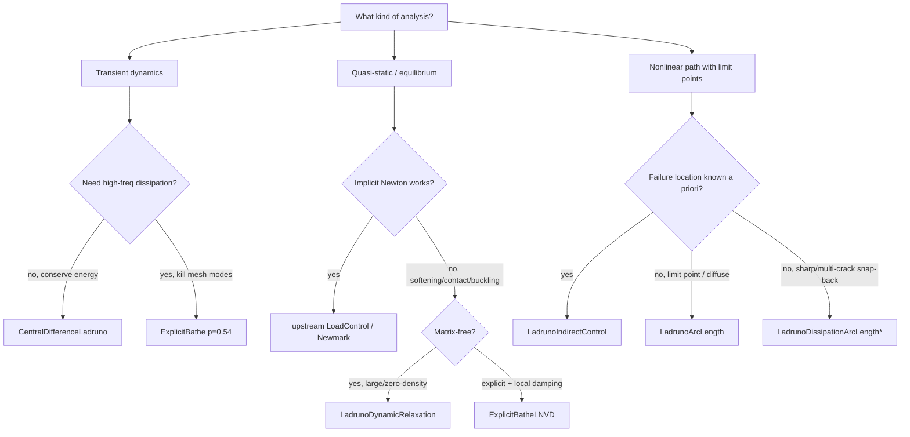

# Ladruno Integrators — a developer & user guide

This is the single reference for every **time/path integrator the Ladruno fork
adds on top of vanilla OpenSees**. For each one it covers the four things a
reader needs: the **theory** (the scheme and its equations), the
**architectural decisions** (why it is shaped the way it is), the
**implementation** (where the math lives in the code), and the **intended use
cases** (when to reach for it, with exact command syntax).

> [!info] Scope
> Only **fork-authored** integrators are documented here. Upstream integrators
> (`Newmark`, `HHT`, `ArcLength`, `DisplacementControl`, `StagedNewmark`,
> `StagedLoadControl`, …) are unchanged and out of scope. The companion
> ledgers are [[LEDGER_implementations]] (new code) and
> [[LEDGER_vanilla_files]] (edits to upstream files).

Related deep-dives: [[05_robust_central_difference]],
[[04_explicit_dynamics_and_energy_balance]], [[central_difference_ladruno_guide]],
[[explicit_bathe_integrators_guide]], [[20_ladruno_arclength_stabilized_adr]],
[[21_ladruno_dynamic_relaxation_adr]], [[22_ladruno_dissipation_arclength_adr]].

---

## 1. The family at a glance

The fork ships **two families** of integrator plus a shared utility:

- **Explicit transient** — for dynamics and explicit quasi-statics:
  `CentralDifferenceLadruno`, `ExplicitBathe`, `ExplicitBatheLNVD`,
  `LadrunoDynamicRelaxation`.
- **Static path-following** — for nonlinear equilibrium paths with limit
  points / snap-back: `LadrunoArcLength`, `LadrunoIndirectControl`
  (+ the scoped-but-unbuilt `LadrunoDissipationArcLength`).
- **Shared machinery** — `CriticalTimeStep`, the per-element $\Delta t_{cr}$
  estimator behind the `criticalTimeStep()` query.

| Integrator | classTag | Base class | Family | Status |
|---|---|---|---|---|
| `ExplicitBathe` | **33000** | `TransientIntegrator` | explicit dynamics | shipped |
| `ExplicitBatheLNVD` | **33002** | `TransientIntegrator` | explicit quasi-static | shipped |
| `CentralDifferenceLadruno` | **33003** | `TransientIntegrator` | explicit dynamics | shipped |
| `LadrunoArcLength` | **33004** | `StaticIntegrator` | static path-following | shipped |
| `LadrunoDynamicRelaxation` | **33005** | `TransientIntegrator` | quasi-static (matrix-free) | shipped |
| `LadrunoIndirectControl` | **33006** | `StaticIntegrator` | static path-following | shipped |
| `LadrunoDissipationArcLength` | **33007** | `StaticIntegrator` | static path-following | *scoped, no code* |
| `CriticalTimeStep` | — | utility | dt_cr estimator | shipped |

> [!note] Class-tag bands are per-registry
> All Ladruno integrators live in the private band $\geq 33000$ (see
> [[LEDGER_implementations]]). The same number can appear in another registry
> (e.g. `ELE_TAG_LadrunoIMKBeam2d = 33004`) with **no collision** — tag bands
> are per-registry (Element / nDMaterial / uniaxial / Integrator / Recorder).

---

## 2. Shared foundations

Three design decisions recur across the explicit integrators. Understanding
them once avoids repeating them per-integrator.

### 2.1 The explicit recipe (what the user must set)

Every explicit integrator needs a **trivial mass solve** and **exactly one
solve per step**:

```python
ops.mass(...)                 # lumped/diagonal element or nodal mass
ops.system('Diagonal')        # M⁻¹ is trivial — NOT a sparse factorization
ops.algorithm('Linear')       # exactly ONE SOE solve per step
ops.numberer('Plain')
ops.constraints('Transformation')
ops.integrator(...)           # one of the explicit integrators below
ops.analysis('Transient')
```

The integrators enforce the single-solve rule: a second `update()` in a step
is a hard error.

### 2.2 Mass-only LHS, lagged damping

All explicit schemes set the LHS to mass alone:

```cpp
// formEleTangent
this->zeroTangent();
this->addMtoTang();          // LHS = M only, no C, no K
```

Viscous/Rayleigh damping is **lagged at the known half-step velocity**
$\mathbf{v}_{n-1/2}$ (LS-DYNA style) so it enters the *residual*, never the
LHS — keeping the method genuinely explicit. Modal damping enters through
`IncrementalIntegrator::addModalDampingForce` at `setB()`.

> [!warning] The βK trap
> For Rayleigh damping $\mathbf{C}=\alpha\mathbf{M}+\beta\mathbf{K}$ the
> stiffness-proportional term gives modal damping $\xi_i = \beta\omega_i/2$, so
> at $\omega_{\max}$ the stable step **collapses quadratically**:
> $\Delta t_{cr}\approx 2/(\beta\,\omega_{\max}^2)$. **Use mass-proportional
> $\alpha\mathbf{M}$ for explicit analysis.** The integrators detect this
> (damped step $<0.9\times$ undamped) and warn once; `-cflAbort` is the hard
> guard.

### 2.3 `CriticalTimeStep` — the shared dt_cr estimator

`CriticalTimeStep.{h,cpp}` is the single estimator used by all explicit
integrators and exposed via `ops.criticalTimeStep()`.

**Theory.** It solves the **per-element** generalized eigenproblem

$$
\mathbf{K}^{(e)}\boldsymbol\phi = \lambda\,\mathbf{M}^{(e)}\boldsymbol\phi,
\qquad \omega^{(e)}_{\max}=\sqrt{\lambda_{\max}},
$$

and uses the bound $\omega_{\max}\le \max_e \omega^{(e)}_{\max}$ to report the
governing (smallest) step and the binding element. The undamped limit is
$\Delta t_e = 2/\omega^{(e)}_{\max}$; damping shrinks it by the LS-DYNA factor

$$
\Delta t_{cr} = \frac{2}{\omega_{\max}}\left(\sqrt{1+\xi^2}-\xi\right),
\qquad \xi=\frac{\alpha_M}{2\omega_{\max}}+\frac{\beta_K\,\omega_{\max}}{2}.
$$

**Robustness decisions (hard-won — see [[project_zonea_link_blocker]]):**

- **`DSYGVX` (largest eigenvalue only) with a `DGGEV` fallback.** `DSYGV` is
  *not shipped* in the bundled reference LAPACK subset — using it links on
  Windows/MKL but fails the Linux Zone-A build. `DSYGVX` (`RANGE='I'`,
  `IL=IU=n`) is bundled and ~2× faster; `DGGEV` handles indefinite/singular
  pencils (massless DOFs).
- **Relative-β threshold** $|\beta|>10^{-12}\beta_{\max}$ to discard spurious
  near-infinite eigenvalues of massless modes — fixes a silent bug where a
  near-massless DOF drove $\Delta t_{cr}\to 0$ and aborted a stable run.
- **Copy mass *before* fetching stiffness** — many elements hand back a
  reference to a *shared static matrix*; reading K first aliases M and reported
  $\Delta t_{cr}=\infty$ on every distributed-mass model (the D8 aliasing fix).
- **MPI** — `MPI_Allreduce(MPI_MIN)` reduces both damped and undamped minima
  across ranks in the parallel build.

**Lumping choice (`-lump`):**

| Mode | Definition | Good for | Caveat |
|---|---|---|---|
| `rowsum` | $M_{ii}\leftarrow\sum_j M_{ij}$ | translational DOFs (bars, solids) | rotational row-sums $\approx0$ → non-conservative on beams/shells |
| `diagonal` | $M_{ii}$ taken directly | rotational DOFs (strictly $>0$) | not mass-conserving ($\sum M_{ii}\neq m_e$) |

> [!tip] Query before you analyze
> `criticalTimeStep()` is valid **before** the first `analyze()` because the
> estimate runs in `domainChanged()` (its own eigensolve, not the global SOE).
> Drive sub-stepping from it:
> ```python
> dt_cr = ops.criticalTimeStep()
> n = max(1, ceil(dt / (0.9 * dt_cr)))   # LS-DYNA TSSFAC = 0.9
> ops.analyze(n, dt/n)
> ```

**Inherited caveats:** ignores `equalDOF` / rigid diaphragms / MP constraints
and pure nodal mass; treat $\Delta t_{cr}$ as a strong guide, not a guarantee,
on beam/shell models (prefer `-lump diagonal` there).

**Shared flags** (all explicit integrators accept these):

| Flag | Effect |
|---|---|
| `-cfl` / `-criticalTimestep` | per-step $\Delta t_{cr}$ reporting |
| `-cflAbort` | hard-stop if $\Delta t >$ the stability limit |
| `-tangent` | size $\Delta t_{cr}$ from current tangent K (not initial) |
| `-recompute N` | refresh $\Delta t_{cr}$ every N steps (implies `-tangent`) |
| `-lump rowsum\|diagonal` | element-mass lumping |
| `-verbose` | per-step $\Delta t$ / max-acceleration report |
| `-divergence f` | abort if KE grows by factor `f` in one step |

---

## 3. `CentralDifferenceLadruno` — explicit leap-frog (classTag 33003)

### 3.1 Theory

Standard central difference (Newmark $\beta=0$, $\gamma=\tfrac12$) cast as a
leap-frog. Per step:

$$
\begin{aligned}
\mathbf{a}_n &= \mathbf{M}^{-1}\!\left(\mathbf{P}_n - \mathbf{C}\,\mathbf{v}_{n-1/2} - \mathbf{F}_{\text{int}}(\mathbf{u}_n)\right) \\
\mathbf{v}_{n+1/2} &= \mathbf{v}_{n-1/2} + \Delta t\,\mathbf{a}_n \\
\mathbf{u}_{n+1} &= \mathbf{u}_n + \Delta t\,\mathbf{v}_{n+1/2}
\end{aligned}
$$

- **Second-order accurate**, **zero algorithmic dissipation** (resolved-mode
  amplitudes preserved exactly).
- **Stability:** undamped $\Delta t < 2/\omega_{\max}$ (stability factor 1.0 —
  no Noh–Bathe bonus); damped per the §2.3 formula.

**First-step correctness** is the key differentiator over the legacy
`CentralDifference` (which warns "assuming $U_{t-1}=U_t$" and loses accuracy at
step 1 whenever $\mathbf{v}_0\neq 0$ or $\mathbf{a}_0\neq 0$). On the first
`newStep()` Ladruno computes a proper back-half-step starter:

$$
\mathbf{a}_0=\mathbf{M}^{-1}(\mathbf{P}_0-\mathbf{C}\mathbf{v}_0-\mathbf{F}_{\text{int}}(\mathbf{u}_0)),
\qquad
\mathbf{v}_{-1/2}=\mathbf{v}_0-\tfrac12\Delta t\,\mathbf{a}_0 .
$$

### 3.2 Architecture

- `TransientIntegrator`, classTag **33003**.
- **Single explicit scheme** — no coupled/implicit-damped variant (that already
  exists as `NewmarkExplicit(0.5)`; don't rebuild it).
- **Two velocities kept distinct:** `getVel()` returns the *lagged* half-step
  $\mathbf{v}_{n-1/2}$ (the damping/residual hook), while the node/recorder gets
  the clean *full-step* $\mathbf{v}_n=\tfrac12(\mathbf{v}_{n-1/2}+\mathbf{v}_{n+1/2})$ —
  fixing the legacy half-step output bug.
- **`-lump diagonal` default** (robust on rotational DOFs).

### 3.3 Implementation

Files: `SRC/analysis/integrator/CentralDifferenceLadruno.{h,cpp}` + shared
`CriticalTimeStep`. State vectors: `Ut`, `Vhalf` ($\mathbf{v}_{n-1/2}$, primary),
`Aprev` ($\mathbf{a}_n$), `Vfull` (output), `Azero` (persistent zero accel to
suppress inertia in the residual).

- `domainChanged()` — allocate/seed state, run the $\Delta t_{cr}$ eigensolve
  unconditionally (so the query is valid pre-analyze).
- `newStep(dt)` — first call runs the starter; then advance
  `Vhalf += dt*Aprev; Ut += dt*Vhalf`, set trial response with zero accel,
  optional $\Delta t_{cr}$ refresh/abort.
- `update(U)` — `U` is the solved $\mathbf{a}_{n+1}$; form `Vfull`, push
  $(\mathbf u,\mathbf v,\mathbf a)$ to nodes, run NaN/Inf + KE circuit breakers,
  carry `Aprev = U`. Guarded at `updateCount > 1`.

### 3.4 Use cases & syntax

**Reach for it when:** wave propagation, energy/momentum conservation,
energy-balance studies, or any model with nonzero initial conditions where
correct $\mathbf{a}_0$ matters. **Avoid when** spurious high-frequency mesh
modes ring badly — use `ExplicitBathe` for controllable dissipation.

```python
ops.integrator('CentralDifferenceLadruno')                                  # minimal
ops.integrator('CentralDifferenceLadruno', '-cflAbort', '-lump', 'diagonal')
ops.integrator('CentralDifferenceLadruno', '-cfl', '-tangent', '-recompute', 5,
               '-verbose', '-divergence', 2.0)
```

No positional argument. Validated by the CDL-1…10 battery
(`tests/test_centralDifferenceLadruno_integrator.py`): order ≈ 2, stability
boundary at $\omega\Delta t = 2$, damped decay, wave speed $\sqrt{E/\rho}$,
rigid-body momentum, first-step correctness, βK collapse, ~1% energy closure.

---

## 4. `ExplicitBathe` — Noh–Bathe composite (classTag 33000)

### 4.1 Theory

A two-sub-step composite explicit scheme (Noh & Bathe, 2013) that splits each
step $[t,t+\Delta t]$ at $t+p\Delta t$, giving **frequency-selective,
monotone high-frequency dissipation** while staying 2nd-order accurate for
resolved modes.

**Sub-step 1** ($\tau_1=p\Delta t$):
$$
\mathbf{u}_{t+p\Delta t}=\mathbf{u}_t+\tau_1\dot{\mathbf u}_t+\tfrac12\tau_1^2\ddot{\mathbf u}_t,\qquad
\dot{\mathbf u}_{t+p\Delta t}=\dot{\mathbf u}_t+\tfrac12\tau_1(\ddot{\mathbf u}_t+\ddot{\mathbf u}_{t+p\Delta t}).
$$

**Sub-step 2** ($\tau_2=(1-p)\Delta t$) with a **3-point velocity update**:
$$
\dot{\mathbf u}_{t+\Delta t}=\dot{\mathbf u}_{t+p\Delta t}+\tau_2\!\left[q_0\ddot{\mathbf u}_t+(\tfrac12+q_1)\ddot{\mathbf u}_{t+p\Delta t}+q_2\ddot{\mathbf u}_{t+\Delta t}\right].
$$

Each sub-step does a **mass-only solve**
$\mathbf{M}\ddot{\mathbf u}=\mathbf{P}-\mathbf{C}\dot{\mathbf u}^{*}-\mathbf{F}_{\text{int}}$.
The weights are fixed by $p$:
$$
q_1=\frac{1-2p}{2p(1-p)},\quad q_2=\tfrac12-p\,q_1,\quad q_0=\tfrac12-q_1-q_2.
$$

- **Default $p=0.54$** (near-optimal Noh–Bathe): 2nd-order low-frequency,
  high modes killed within a few steps. At $p=\tfrac12$ it collapses to two
  equal central-difference half-steps (zero dissipation).
- **Stability:** conservative reference $2/\omega_{\max}$; the Noh–Bathe
  advantage allows up to $\approx 4/\omega_{\max}$
  (`EB_NB_STABILITY_FACTOR = 2.0`). Two solves/step ⇒ roughly the same solves
  per unit time as CD, but with built-in dissipation.

### 4.2 Architecture

`TransientIntegrator`, classTag **33000**. Mass-only LHS; **two structurally
identical mass-only solves per step**, differing only in predictor and velocity
update. **Advance-then-solve**: `newStep()` builds the sub-step-1 predictor and
sets the trial state; the framework solves; `update()` applies the trapezoidal
correction, builds the sub-step-2 predictor, and does the **second solve
internally**, then the 3-point velocity update. `updateCount` is guarded to
exactly 2.

### 4.3 Implementation

Files: `ExplicitBathe.{h,cpp}` + shared `CriticalTimeStep`. Three time levels of
state (`U_t/V_t/A_t`, `U_tpdt/…`, `U_tdt/…`) plus a `V_fake` trial velocity.
Coefficients `a0..a7` are derived from $p$ and $\Delta t$. `getVel()` returns the
committed $\mathbf{v}_t$; `getCriticalTimeStep()` returns the conservative
$2/\omega_{\max}$ and the per-step report also prints the $2\times$ NB limit.

### 4.4 Use cases & syntax

**Reach for it when:** impact/blast/collapse, SSI, or any explicit run where
you want to damp spurious mesh modes while keeping the physical response
2nd-order accurate — and you value the ~2× larger stable step (cost: one extra
mass-only solve/step).

```python
ops.integrator('ExplicitBathe', 0.54)                                  # p (default 0.54)
ops.integrator('ExplicitBathe', 0.54, '-cflAbort', '-lump', 'diagonal')
ops.integrator('ExplicitBathe', 0.54, '-verbose', '-tangent', '-recompute', 10)
```

Positional `p` $\in(0,1)$ controls dissipation. See
[[explicit_bathe_integrators_guide]] and the 9/9 numerical battery
(`tests/test_explicitBathe_integrator.py`).

---

## 5. `ExplicitBatheLNVD` — Noh–Bathe + local damping (classTag 33002)

### 5.1 Theory

`ExplicitBathe` plus **FLAC-style Local Non-Viscous Damping** for dynamic
relaxation / quasi-static solving. Before each solve the residual is modified:

$$
r_i \;\leftarrow\; r_i - \alpha\,|r_i|\,\operatorname{sign}(v_i).
$$

This force always opposes motion (bleeds kinetic energy toward equilibrium),
**self-scales per DOF** (frequency/mass/stiffness independent), and **vanishes
at equilibrium** ($v\to0$ and $r\to0$) — so, unlike viscous damping, it does
**not bias the final static solution**. The FLAC coefficient $\alpha\approx\pi D$
(D = fraction of critical); default $\alpha=0.8\approx 25\%$ critical.

### 5.2 Architecture & implementation

`TransientIntegrator`, classTag **33002**, inherits ExplicitBathe's state. The
unique seam is a **`formUnbalance()` override** that applies the FLAC term
symmetrically to *both* sub-steps (sub-step 1 via the framework, sub-step 2 via
the integrator's internal solve), entering through `setB()`. Extra state:
`alpha_flac` and `lastUnbalanceNorm`. `getUnbalanceNorm()` exposes
$\lVert r\rVert_\infty$ at the last solve as a convergence indicator.

### 5.3 Use cases & syntax

**Reach for it when:** you need *static equilibrium* but implicit static solvers
fail — snap-through buckling, near-singular tangents, softening materials,
self-weight settling of large models. Drive the model to rest with explicit
machinery without polluting the static answer.

```python
ops.integrator('ExplicitBatheLNVD', 0.54, 0.8)            # p, alpha
ops.integrator('ExplicitBatheLNVD', 0.54, 0.8, '-verbose')

while ops.getUnbalanceNorm() > tol:                       # watch convergence
    ops.analyze(n, dt/n)
```

Two positional args: `p` (default 0.54) and `alpha` (default 0.8).

> [!warning] Quasi-static only
> Use LNVD **only** for dynamic relaxation / quasi-statics. The local damping
> corrupts a true transient dynamic response.

---

## 6. `LadrunoDynamicRelaxation` — matrix-free quasi-static (classTag 33005)

### 6.1 Theory

Dynamic relaxation (DR) drives a model to static equilibrium by integrating a
**fictitious** damped transient to rest:

$$
\mathbf{M}^{*}\ddot{\mathbf u}+\mathbf{C}^{*}\dot{\mathbf u}+\mathbf{F}_{\text{int}}(\mathbf u)=\mathbf{F}_{\text{ext}}.
$$

When $\dot{\mathbf u}=\ddot{\mathbf u}=0$ what survives is static equilibrium
$\mathbf{F}_{\text{int}}=\mathbf{F}_{\text{ext}}$. The tangent stiffness is
**never assembled or factorized** — so DR sails through the limit points and
indefinite tangents that defeat implicit Newton (LoadControl,
DisplacementControl).

**Fictitious mass (Gershgorin, scale-free, default):**

$$
m_i = \frac{\Delta t^2}{4}\sum_j |K_{ij}|.
$$

The $\Delta t^2/4$ factor tunes every DOF to $\omega\Delta t\approx 2$ —
**critically stable by construction**, so $\Delta t=1$ is safe with this mode.
The row-sum of stiffness magnitudes is computed SOE-free by a one-time element
probe in `domainChanged()`. Crucially $\mathbf{M}^*$ is the integrator's own
diagonal — it is **never** taken from `Element::getMass()`, which returns zero
on zero-density research models (the "ADR-20 blocker").

**Kinetic damping (Cundall, parameter-free, default):** track
$\text{KE}=\tfrac12\mathbf v^\top\mathbf M^*\mathbf v$ (mass-weighted, matching
[[project_energy_balance_feature|EnergyBalanceRecorder]]) and **zero all
velocities at each KE peak** ($\text{KE}_n<\text{KE}_{n-1}$). No damping knob to
guess; provably robust through softening and limit points.

**Convergence (dual test):** declare static rest when both the *true* residual
$\lVert\mathbf F_{\text{ext}}-\mathbf F_{\text{int}}\rVert_\infty/\lVert\cdot\rVert_{\text{ref}}<\text{tol}_R$
**and** the KE-peak decay $<\text{tol}_{KE}$.

### 6.2 Architecture

- `TransientIntegrator`, classTag **33005** — *not* `StaticIntegrator`. A static
  integrator never owns the loop, can't inject mass into the LHS, and has no
  velocity plumbing; DR needs all three. `CentralDifferenceLadruno` is the
  existence proof of a `TransientIntegrator` running matrix-free quasi-static,
  and DR reuses ~70% of that skeleton.
- **The fictitious-mass seam:** `formTangent()` zeroes the SOE matrix and pokes
  the cached $\mathbf M^*$ diagonal directly via
  `Ladruno::addDiagonalToSOE(...)`, so `solve()` degenerates to
  $\mathbf M^{*-1}\mathbf R$ — bypassing the `getMass()` zero-density trap
  entirely. This is the one genuinely new mechanic over the CD skeleton.

### 6.3 Implementation

Files: `LadrunoDynamicRelaxation.{h,cpp}`, `LadrunoFictitiousMass.h`. State:
leap-frog `Ut/Vhalf/Aprev/Vfull/Azero` plus the cached `Mstar`.

- `buildFictitiousMass()` — Gershgorin diagonal with the $\Delta t^2/4$
  prefactor; floor zero/negative entries to $m_{\max}\!\times\!10^{-8}$ so
  $\mathbf M^*$ stays invertible on free DOFs.
- `newStep()` — leap-frog advance with first-step starter; optional refresh
  every `-recompute N`.
- `update(U)` — true residual norm $\lVert\mathbf M^*\!\cdot\!U\rVert_\infty$;
  KE-peak detection → zero velocities (and auto-refresh $\mathbf M^*$ in
  Gershgorin mode, safe because velocities are zero); NaN/Inf + divergence
  breakers.
- Optional viscous mode rescales $\mathbf M^*$ by $1/s^2$,
  $s=\sqrt{1+\zeta^2}-\zeta$, and lags $c_{\text{visc}}\mathbf v_{n+1/2}$.

### 6.4 Use cases & syntax

**Reach for it when:** severe softening/degradation (indefinite $\mathbf K_T$),
snap-through / limit-point buckling, contact or large geometric nonlinearity,
very large models (O(n)/step, no factorization), form-finding / cable
structures, or zero-density research models.

```python
ops.system('Diagonal'); ops.algorithm('Linear')          # required driver
ops.integrator('LadrunoDynamicRelaxation',
               '-mass', 'gershgorin',                     # or 'lumped' s / 'unity'
               '-dt', 1.0,
               '-recompute', 0,
               '-damping', 'kinetic',                     # or 'viscous' zeta
               '-verbose')
ops.analysis('Transient')
```

| Option | Default | Meaning |
|---|---|---|
| `-mass gershgorin\|lumped $s\|unity` | gershgorin | fictitious-mass construction |
| `-dt $dt` | 1.0 | pseudo time step (1.0 safe with gershgorin) |
| `-recompute $N` | 0 | refresh $\mathbf M^*$ every N steps (use for strong softening) |
| `-damping kinetic\|viscous $zeta` | kinetic | Cundall zeroing vs mass-proportional viscous |
| `-noAutoRefresh` | off | disable $\mathbf M^*$ refresh at KE peaks |
| `-divergence $f` | 0 (off) | abort if KE grows by factor f in a step |
| `-verbose` | off | per-step max\|a\|, RES, KE |

**Script-owned relax loop** (the stock transient driver has no convergence
early-exit, so termination is script-owned — mirrors LadrunoArcLength's Layer B):

```python
def relax_to_static(chunk=100, dt=1.0, maxIter=200000, tolR=1e-5, tolKE=1e-4):
    while done < maxIter:
        ops.analyze(chunk, dt)
        if ops.getResponse('residualNorm') < tolR and \
           ops.getResponse('kineticEnergy') < tolKE:
            return True
        done += chunk
    return False
```

**Limits:** pseudo-time is fictitious; global KE zeroing is blunt on
heterogeneous models (per-region KE is a follow-up); DR finds *static
equilibria*, it is not a path-follower (use arc-length for true snap-back
paths). See [[21_ladruno_dynamic_relaxation_adr]].

---

## 7. `LadrunoArcLength` — adaptive / stabilized arc-length (classTag 33004)

### 7.1 Theory

A strict superset of upstream `ArcLength`. The cylindrical constraint per step:

$$
\Delta\mathbf u^\top\Delta\mathbf u + \alpha^2\,\Delta\lambda^2 = \ell^2 .
$$

**Predictor:** solve $\mathbf K_T\hat{\mathbf u}=\hat{\mathbf p}$, then
$\Delta\lambda^{(1)}=\pm\ell/\sqrt{\hat{\mathbf u}^\top\hat{\mathbf u}+\alpha^2}$
(sign from the last step). **Corrector:** quadratic in $\delta\lambda$ with the
positive-$\theta$ root; a negative discriminant signals a limit-point
breakdown, which two optional layers address.

**Layer A — Ramm adaptive radius.** Before each step,
$$
\ell \leftarrow \operatorname{clamp}\!\left(\ell\,(J_d/J_{\text{last}})^{p},\ \ell_{\min},\ \ell_{\max}\right),
$$
$J_d$ = desired iterations/step, $J_{\text{last}}$ = the last step's corrector
count, exponent $p\in\{1,0.5\}$ (1 = LoadControl-style, 0.5 = gentler
Crisfield).

**Viscous stabilization** (`-stabilize f`, *mutually exclusive* with the
arc-length quadratic). The integrator becomes viscous-regularized incremental
load control: append an artificial dashpot
$\mathbf f_v=(c/\Delta t)\mathbf M^{*}\Delta\mathbf u$ and add
$(c/\Delta t)\mathbf M^{*}$ to $\mathbf K_T$, regularizing it to
positive-definite through limit points so ordinary Newton converges. $c$ is
auto-calibrated from a target dissipated-energy fraction $f$ (Abaqus default
$2\times10^{-4}$) or set via `-cVisc`. **Does not follow true snap-back.**

### 7.2 Architecture

- `StaticIntegrator`, classTag **33004**. With no flags it is **bit-identical to
  stock `ArcLength`**.
- Layer A (adaptive radius) and **Layer B** (script-driven cut-and-retry) are
  independent. Stabilized mode and arc-length-constraint mode are disjoint code
  paths.
- The artificial $\mathbf M^*$ is a **unity-density lumped mass built in
  `domainChanged()`**, *not* element `getMass()` (zero on zero-density models —
  the ADR-20 blocker, same lesson as DR).

### 7.3 Implementation

Files: `LadrunoArcLength.{h,cpp}`. State mirrors stock ArcLength
(`deltaUhat/deltaUbar/deltaU/deltaUstep/phat/deltaLambdaStep/currentLambda/…`)
plus Layer-A (`adapt, Jd, ellMin, ellMax, pExp, numIncrLastStep`),
stabilization (`stabilize, fTarget, cVisc, dtPseudo, Mstar, dissipVisc, …`) and
a Layer-B snapshot. Key methods: `newStep()` (Ramm-adapt then predictor),
`update()` (quadratic corrector or stabilized accumulate), `formTangent()`
(add the dashpot in stabilized mode), `formUnbalance()` (subtract $\mathbf f_v$,
record the *true* pre-$f_v$ norm), `commit()` (snapshot + calibrate $c$),
`revertToLastStep()` (restores the snapshot **except** `arcLength2`, so a script
`reduceStep` actually shrinks the radius).

### 7.4 Use cases & syntax

**Reach for it when:** a structure has a single limit point / snap-through, or
diffuse damage-softening where the elastic bulk dominates the displacement
norm; or you want industry-standard adaptive-radius path-following.

```tcl
integrator LadrunoArcLength $arc $alpha                          ;# == stock ArcLength
integrator LadrunoArcLength $arc $alpha -adapt $Jd $ellMin $ellMax -p 0.5
integrator LadrunoArcLength $arc $alpha -stabilize 2.0e-4 -adaptStab
integrator LadrunoArcLength $arc $alpha -stabilize 2e-4 -mass unity   ;# unity|lumped s|gershgorin
```

```python
ops.integrator('LadrunoArcLength', arc, alpha)
ops.integrator('LadrunoArcLength', arc, alpha, '-adapt', Jd, ellMin, ellMax, '-p', 0.5)
ops.integrator('LadrunoArcLength', arc, alpha, '-stabilize', 2.0e-4, '-adaptStab')
```

**Layer-B cut-and-retry** (script owns the loop):

```python
ok = ops.analyze(1)
while ok != 0 and tries < maxTries:
    ops.integrator('LadrunoArcLength', 'reduceStep', 0.5)   # halve the radius
    ok = ops.analyze(1); tries += 1
```

**Limits:** `-stabilize` and the quadratic are mutually exclusive; stabilized
solutions are step-size dependent and the convergence test sees the
$f_v$-polluted residual (tighten tolerance relative to $f$); does **not**
follow true snap-back. See [[20_ladruno_arclength_stabilized_adr]].

---

## 8. `LadrunoIndirectControl` — weighted multi-DOF control (classTag 33006)

### 8.1 Theory

Generalizes upstream `DisplacementControl` from a single nodal DOF to a
**weighted multi-DOF control quantity** $\zeta=\mathbf c^\top\mathbf U$ that
stays **monotone through snap-back** even when individual DOFs reverse. The
constraint is $\mathbf c^\top\Delta\mathbf U=\Delta\zeta$ with the participation
vector $\mathbf c$ (e.g. crack-mouth-opening $u_A-u_B \Rightarrow
\mathbf c=[+1,-1,0,\dots]$).

**Predictor:** $\Delta\lambda^{(1)}=\Delta\zeta/(\mathbf c^\top\delta\mathbf u_f)$.
**Corrector** (linear in $\delta\lambda$, no quadratic discriminant):
$$
\delta\lambda = -\frac{\mathbf c^\top\delta\mathbf u_r}{\mathbf c^\top\delta\mathbf u_f}.
$$
Optional Ramm adaptation (`-iter`) scales $\Delta\zeta$ by $N_d/N_{\text{last}}$
within $[\Delta\zeta_{\min},\Delta\zeta_{\max}]$.

### 8.2 Architecture & implementation

`StaticIntegrator`, classTag **33006**. Mirrors `DisplacementControl`
bookkeeping, replacing the single scalar $\dot u_a$ with the dot product
$\mathbf c^\top(\cdot)$ via a `controlDot()` helper that skips
fixed/constrained DOFs. `domainChanged()` resolves the user's (node, DOF, coef)
triples into global equation numbers and errors out if every control DOF is
constrained. The denominator $\mathbf c^\top\delta\mathbf u_f$ is guarded
against vanishing (control DOFs not excited by the reference load).

### 8.3 Use cases & syntax

**Reach for it when:** snap-back with a **pre-identified** control location —
a crack mouth, a relative displacement between two points, a weighted nodal
average (De Borst indirect displacement control). Requires a-priori knowledge
of where the failure localizes.

```tcl
integrator LadrunoIndirectControl $incr -dof $node $dof $coef
integrator LadrunoIndirectControl $incr -dof $nA $dA 1.0 -dof $nB $dB -1.0     ;# CMOD
integrator LadrunoIndirectControl $incr -dof $nA $dA 1.0 -dof $nB $dB -1.0 \
                                        -iter $numIter $dmin $dmax
```

```python
ops.integrator('LadrunoIndirectControl', incr,
               '-dof', nA, dA, 1.0, '-dof', nB, dB, -1.0,
               '-iter', numIter, dmin, dmax)
```

**Limits:** one control quantity per integrator (no competing-crack switching);
needs the failure location chosen up front.

---

## 9. `LadrunoDissipationArcLength` — energy-release control (classTag 33007, *scoped*)

> [!warning] Not yet implemented
> classTag 33007 is **reserved** by [[22_ladruno_dissipation_arclength_adr]] but
> no code is shipped. Documented here so the design and the tag are on record.

### 9.1 Theory

The state-of-the-art answer to **sharp localization and multi-crack snap-back**.
The constraint controls the **incremental dissipation** (Gutiérrez 2004):

$$
\phi^{D}=\tfrac12\!\left(\lambda_n\,\mathbf u_{n+1}^\top-\lambda_{n+1}\,\mathbf u_n^\top\right)\hat{\mathbf f}-\Delta\tau=0,
$$

linear in $\delta\lambda$. Because elastic unloading dissipates nothing, the
constraint is insensitive to the elastic bulk — it follows the fracturing
region while the rest of the structure unloads elastically. A **mandatory
phase-1 force-control start** avoids the cold-start singularity at
$\mathbf u_0=0$, switching to dissipation control once
$\Delta\tau^D>a\,\Delta\tau^U$ (default $a=0.1$). The bordered corrector is
solved with two ordinary symmetric solves (no assembled border, no
non-symmetric solver).

### 9.2 Design highlights

`StaticIntegrator`, classTag **33007**, a standalone sibling of
`LadrunoArcLength` (~70% reuse by copy, not inheritance — the linear
dissipation corrector is algebraically disjoint from the quadratic arc-length
corrector). v1 scope: **damage materials**, a **one-way force→dissipation
latch** (clean-fails to a `reduceStep` retry on elastic reload rather than
producing NaN). Plasticity/cohesive dissipation (Verhoosel 2009) is deferred.

Proposed syntax:

```python
ops.integrator('LadrunoDissipationArcLength', dTau)          # auto-switch after phase 1
ops.integrator('LadrunoDissipationArcLength', dTau, '-a', 0.05)
```

---

## 10. Choosing an integrator



| If you want… | Use | Why |
|---|---|---|
| zero dissipation, waves, energy/momentum | `CentralDifferenceLadruno` | 2nd-order, exact energy balance, correct first step |
| controllable high-freq dissipation, ~2× step | `ExplicitBathe` 0.54 | Noh–Bathe frequency-selective damping |
| static equilibrium via explicit + local damping | `ExplicitBatheLNVD` 0.54 0.8 | FLAC damping vanishes at equilibrium |
| matrix-free quasi-static through softening | `LadrunoDynamicRelaxation` | no $\mathbf K_T$ factorization, auto-tuned $\mathbf M^*$ |
| coupled implicit-damped central difference | upstream `NewmarkExplicit(0.5)` | already exists — don't rebuild |
| limit point / snap-through path | `LadrunoArcLength` | adaptive radius + viscous stabilization |
| snap-back with a known control DOF | `LadrunoIndirectControl` | monotone $\mathbf c^\top\mathbf U$ |
| sharp / multi-crack snap-back | `LadrunoDissipationArcLength`* | energy-release control (*not built*) |

---

## 11. Quick command reference

```python
# --- explicit transient ---
ops.integrator('CentralDifferenceLadruno' [, flags])
ops.integrator('ExplicitBathe', p [, flags])                  # p∈(0,1), default 0.54
ops.integrator('ExplicitBatheLNVD', p, alpha [, flags])       # alpha default 0.8
ops.integrator('LadrunoDynamicRelaxation' [, '-mass', m, '-dt', dt,
                '-recompute', N, '-damping', d, '-divergence', f, '-verbose'])

# shared explicit flags:
#   -cfl  -cflAbort  -tangent  -recompute N  -lump rowsum|diagonal
#   -verbose  -divergence f

# --- static path-following ---
ops.integrator('LadrunoArcLength', arc, alpha
                [, '-adapt', Jd, ellMin, ellMax, '-p', 1|0.5]
                [, '-stabilize', f, '-adaptStab', '-cVisc', c, '-mass', m])
ops.integrator('LadrunoIndirectControl', incr,
                '-dof', node, dof, coef [, '-dof', ...]
                [, '-iter', numIter, dmin, dmax])

# --- queries ---
ops.criticalTimeStep()     # all explicit integrators (valid pre-analyze)
ops.getUnbalanceNorm()     # ExplicitBatheLNVD
ops.getResponse('residualNorm'), ops.getResponse('kineticEnergy')  # DR loop
```

---

## 12. Provenance & cross-references

- **Ledger rows / class tags:** [[LEDGER_implementations]], `SRC/classTags.h`
  (band $\geq 33000$), `SRC/analysis/integrator/`.
- **Tcl/Python parsing:** `SRC/interpreter/OpenSeesCommands.cpp`,
  `SRC/tcl/commands.cpp`; broker registration in
  `SRC/runtime/runtime/TclPackageClassBroker.cpp` and
  `FEM_ObjectBrokerAllClasses.cpp`.
- **Tests:** `tests/test_centralDifferenceLadruno_integrator.py`,
  `tests/test_explicitBathe_integrator.py`,
  `tests/test_explicitBatheLNVD_integrator.py`.
- **ADRs / guides:** [[05_robust_central_difference]],
  [[04_explicit_dynamics_and_energy_balance]],
  [[central_difference_ladruno_guide]], [[explicit_bathe_integrators_guide]],
  [[20_ladruno_arclength_stabilized_adr]],
  [[21_ladruno_dynamic_relaxation_adr]],
  [[22_ladruno_dissipation_arclength_adr]].
- **Build gotcha:** the `dt_cr` LAPACK story (`dsygv_` absent →
  `dsygvx_`) is in [[project_zonea_link_blocker]] and [[LEDGER_quirks]].
